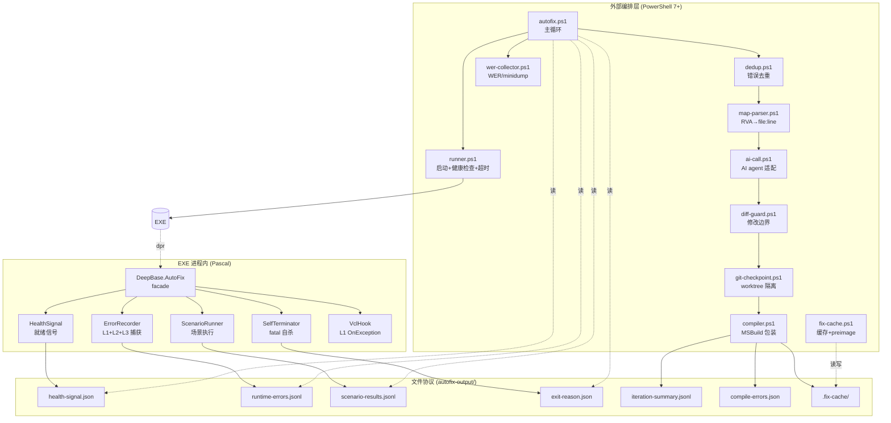

# 设计文档：DeepBase AutoFix 运行时错误自动修复系统

**版本**: v2.0
**适用 requirements**: `.kiro/specs/autofix-runtime-errors/requirements.md`（v2.0，15 个需求）
**目标编译器**: Delphi 13.1 Florence (BDS 37.0, CompilerVersion = 37)
**编译门禁**: `cmd /c compile_test.bat`，退出码 0 即通过

---

## Changelog

| 版本 | 日期 | 主要变更 |
| --- | --- | --- |
| v1.0 | (initial) | 第一稿：单层 PowerShell 编排 + 简单 reset --hard 回滚 |
| v2.0 | 当前 | 第二轮 12 项强制变更：①RVA 替代绝对地址 ②run_id 防过期 ③git worktree 替代 reset --hard ④AI 修改边界白/黑名单 ⑤Fix_Cache 加 preimage_hash + git apply --check ⑥强制振荡检测 ⑦scenario timeout 退出码 ⑧PowerShell 严格模式 ⑨MSBuild 错误结构化 ⑩WER/minidump 回退 ⑪stack 多帧 RVA 数组 ⑫文档统一 v2.0 |

---

## 1. Overview

DeepBase AutoFix 是一个跨进程、双层架构的自动修复系统。

**核心循环**：
```
启动 EXE (--autofix-mode) → 写 health-signal → 执行 scenario → 捕获运行时异常 →
写 runtime-errors.jsonl → fatal 时 Halt(2) + exit-reason.json →
外部 PowerShell 解析 .map → 去重聚合 → 查 Fix_Cache → AI 修复（受白/黑名单约束）→
git worktree 提交/丢弃 → MSBuild 编译 → 重新启动 → 直到 0 错误 / max_iter / 振荡
```

**两层架构**：
- **DeepBase 内置（Delphi/Pascal，进程内）**：`Core/DeepBase.AutoFix.*.pas` 共 6 个单元，作为 Core 包的可选组件。零侵入：未带 `--autofix-mode` 时完全休眠。
- **外部编排（PowerShell 7+，跨进程）**：`scripts/autofix/*.ps1` 共 9 个脚本，负责生命周期、地址解析、缓存、AI 调用、git 隔离、编译。

**与现有 DeepBase 系统的关系**：
- 与 `DeepBase.AIErrorHandler` 共存：autofix-mode 抑制其对话框，二者写不同输出文件。
- 不依赖 JCL / MadExcept，仅用 RTL `System.ExceptProc` + `Winapi.Windows.GetModuleHandleEx`。
- 包归属：所有 `DeepBase.AutoFix.*` 单元属于 **DeepBaseCore 运行时包**（包顺序 Core → Services → Persistence → Features → FMX → VCL）。VCL 适配器单元另设，归 DeepBaseVCL。

**设计目标**：
1. 内置部分零额外依赖、零侵入、低运行时开销
2. 外部部分纯文本协议（JSON / JSONL），任意 AI agent 可对接
3. RVA 地址化使日志在不同机器/不同基址上可重现
4. run_id + iteration 防止读到上一次的过期日志
5. git worktree 隔离让失败修复不污染主工作树
6. preimage_hash + `git apply --check` 让缓存修复在源文件漂移后自动作废

---

## 2. Architecture

### 2.1 总体组件图



### 2.2 主循环时序

```mermaid
sequenceDiagram
    participant User
    participant Loop as autofix.ps1
    participant Git as git-checkpoint.ps1
    participant Run as runner.ps1
    participant EXE
    participant AI as ai-call.ps1
    participant Comp as compiler.ps1

    User->>Loop: invoke
    Loop->>Git: create worktree
    Git-->>Loop: workspace path
    loop iteration < max_iter
        Loop->>Loop: 生成 run_id (UUID v4)
        Loop->>Run: --autofix-mode --autofix-run-id=X --autofix-iteration=N
        Run->>EXE: spawn
        EXE-->>Run: health-signal.json (run_id=X)
        Run->>Run: 启动 scenario timeout
        EXE-->>Run: 运行场景, 写 runtime-errors.jsonl
        EXE-->>Run: exit-reason.json + Halt(2/0/1/3)
        Run-->>Loop: exit_code, run_id
        Loop->>Loop: 校验所有日志 run_id == X (丢弃过期)
        alt exit_code == 0 且 0 错误
            Loop-->>User: success
        else exit_code 非零且无 exit-reason.json
            Loop->>Loop: wer-collector → synthetic error
        end
        Loop->>Loop: dedup + map-parser
        Loop->>Loop: 检测振荡（同 dedup_key 反复出现）
        Loop->>Loop: fix-cache 查询 + preimage_hash + git apply --check
        alt 缓存命中
            Loop->>Git: apply patch
        else 缓存未命中
            Loop->>AI: 提供错误 + 受限上下文
            AI-->>Loop: diff
            Loop->>Loop: diff-guard (allowed/blocked/max_lines)
            Loop->>Git: apply patch
        end
        Loop->>Comp: msbuild
        alt 编译失败
            Loop->>AI: 反馈 compile-errors.json (一次重试)
            alt 仍失败
                Loop->>Git: discard
            end
        end
        Loop->>Git: commit (成功) / discard (失败)
        Loop->>Loop: append iteration-summary.jsonl
    end
```

### 2.3 包与文件位置

| 单元 | 文件 | 包归属 | 说明 |
| --- | --- | --- | --- |
| `DeepBase.AutoFix.ErrorRecorder` | `Core/DeepBase.AutoFix.ErrorRecorder.pas` | DeepBaseCore | 已有骨架，需补齐 |
| `DeepBase.AutoFix.SelfTerminator` | `Core/DeepBase.AutoFix.SelfTerminator.pas` | DeepBaseCore | 已有骨架，需补齐 |
| `DeepBase.AutoFix.HealthSignal` | `Core/DeepBase.AutoFix.HealthSignal.pas` | DeepBaseCore | 已有骨架，需补齐 |
| `DeepBase.AutoFix.ScenarioRunner` | `Core/DeepBase.AutoFix.ScenarioRunner.pas` | DeepBaseCore | 已有骨架，需补齐 |
| `DeepBase.AutoFix` (facade) | `Core/DeepBase.AutoFix.pas` | DeepBaseCore | **新增**：单一 `AutoFix.Install` / `AutoFix.RegisterScenario` 入口 |
| `DeepBase.AutoFix.StackWalker` | `Core/DeepBase.AutoFix.StackWalker.pas` | DeepBaseCore | **新增**：`RtlCaptureStackBackTrace` 多帧 RVA 数组 |
| `DeepBase.AutoFix.VclHook` | `VCL/DeepBase.AutoFix.VclHook.pas` | DeepBaseVCL | **新增**：`Application.OnException` L1 hook |
| `autofix.ps1` 等 9 个 | `scripts/autofix/*.ps1` | (脚本) | **新增**：外部编排层 |
| `compile_test.bat` | (已有) | (脚本) | 复用既有门禁 |

---

## 3. Components and Interfaces

### 3.1 ErrorRecorder（已有骨架，需补齐）

**职责**：三层异常捕获 + 多帧 RVA stack + JSONL 增量写入。

**捕获层**：
- **L1**: `Application.OnException`（VCL 主线程）— 由 `DeepBase.AutoFix.VclHook` 调用 `WriteRecord`
- **L2**: `System.ExceptProc`（全局未捕获，所有线程）— 已实现，需补 stack 数组
- **L3**: SafeRun / 自管理线程 — 通过 `RecordFromSafeRun` API

**关键接口（补齐后）**：
```pascal
TAutoFixErrorRecorder = class
public
  class procedure Install;                              // 已有
  class procedure WriteRecord(E: Exception;
    AExceptAddr: Pointer; const AContext, AThread: string;
    const AParams: string = ''; const AState: string = '');  // 扩展：params/state
  class function CaptureStack(ASkip: Integer = 1): TArray<TStackFrame>;  // 新增
  class function ResolveModule(AAddr: Pointer; out AModuleName: string;
    out AModuleBase: NativeUInt; out ARva: NativeUInt): Boolean;  // 扩展：补 module_base
  class property Active: Boolean;                       // 已有
  class property RunId: string;                         // 已有
  class property OutputDir: string;                     // 已有
  class property TotalErrors: Integer;                  // 新增（被 SelfTerminator 读取）
end;

TStackFrame = record
  ModuleName: string;
  ModuleBase: NativeUInt;
  Rva: NativeUInt;
end;
```

**run_id 生成策略**（v2.0 修订，对齐 Req 1.3）：
- 优先使用 `--autofix-run-id=` 命令行（外部编排传入）
- 缺失时由内部 `CreateGUID` 生成 UUID v4 字符串
- 任何写入文件的记录都必须包含 run_id，外部 Loop 据此过滤过期日志

**栈展开**（Req 1.4 / 1.5）：
- 使用 `Winapi.Windows.RtlCaptureStackBackTrace` 抓取最多 64 帧地址
- 对每个地址调用 `ResolveModule` 得到 `{module_name, module_base, rva}`
- 截断到前 20 帧，超过则附 `truncated: true`

**重入保护**：保留现有 `threadvar GInHandler` 模式。

### 3.2 SelfTerminator（已有骨架，需补齐）

**职责**：fatal 异常时 3 秒内写 exit-reason.json 并 Halt(2)。

**Fatal 判定**（Req 2.1）：`EAccessViolation | EOutOfMemory | EStackOverflow | EExternalException`

**退出码语义**（Req 2.3 / 2.4）：

| Exit Code | 含义 | 触发条件 |
| --- | --- | --- |
| 0 | 成功，无错误 | 所有 scenario pass 且 TotalErrors = 0 |
| 1 | 非 fatal 错误 | scenario 全部完成但 TotalErrors > 0 |
| 2 | fatal 异常自杀 | SelfTerminator.HandleFatal |
| 3 | 超时 | scenario 超过 `--autofix-scenario-timeout` |

`ScenarioRunner.Run` 末尾的 `Halt(0)` 需改为依据 `TAutoFixErrorRecorder.TotalErrors` 选择 0/1。

**exit-reason.json 字段**（v2.0 修订，对齐 Req 2.2）：
```json
{
  "run_id": "uuid",
  "exit_code": 2,
  "reason": "fatal_exception",
  "fatal_class": "EAccessViolation",
  "fatal_msg": "Access violation at 0x0040ABCD ...",
  "module_name": "DeepBaseRun.exe",
  "rva": "$0000ABCD",
  "stack": [
    {"module_name":"...","module_base":"$00400000","rva":"$0000ABCD"},
    ...
  ],
  "total_errors": 7,
  "scenario": "scan",
  "timestamp": "2025-..."
}
```

字段命名修订：原 `class` → `fatal_class`，原 `msg` → `fatal_msg`（避免与运行时错误的 `class`/`msg` 混淆）。

### 3.3 HealthSignal（已有骨架，需补齐）

**职责**：EXE 完全初始化后写 health-signal.json，外部 Runner 据此确认就绪。

**字段**（v2.0 修订，对齐 Req 3.1）：
```json
{
  "run_id": "uuid",
  "ready": true,
  "pid": 12345,
  "timestamp": "...",
  "version": "DeepBase 2.0.x",         // 新增
  "autofix_mode": true,
  "scenarios": ["scan","reload",...]
}
```

`version` 字段的来源：从 EXE 自身的 VersionInfo 资源读取（`GetFileVersionInfo`），失败时填 `"unknown"`。

### 3.4 ScenarioRunner（已有骨架，需补齐）

**职责**：解析 `--autofix-scenario=name1,name2`，按序执行注册的 callback，写 scenario-results.jsonl。

**API**（已有 + 补齐）：
```pascal
procedure AutoFixRegisterScenario(const AName: string; AProc: TScenarioProc);

TAutoFixScenarioRunner = class
public
  class procedure RegisterScenario(const AName: string; AProc: TScenarioProc);
  class procedure Run;
  class procedure MarkCurrentFatal(const AClass: string);
  class property CurrentScenario: string;
  // 新增：
  class property TimeoutMs: Integer;     // --autofix-scenario-timeout=
end;
```

**完成后退出策略**（Req 2.3 修订）：
```pascal
// Run 方法末尾改为
var LCode := if TAutoFixErrorRecorder.TotalErrors > 0 then 1 else 0;
TAutoFixHealthSignal.WriteFinalSummary(LCode);
Halt(LCode);
```

**超时实现**（Req 2.4）：
- ScenarioRunner 内不主动计时（避免与外部 runner.ps1 重复实现）
- runner.ps1 监控 EXE 实际运行时间，超时则 `Stop-Process`，退出码记为 3
- ScenarioRunner 仅在收到外部信号或 EXE 被强杀时由 OS 决定退出码

### 3.5 DeepBase.AutoFix facade（新增）

**职责**：唯一公共入口，简化用户集成。

```pascal
unit DeepBase.AutoFix;
interface
type
  AutoFix = class sealed
  public
    class procedure Install;                                   // 调用 ErrorRecorder.Install + ScenarioRunner.Initialize
    class procedure RegisterScenario(const AName: string; AProc: TScenarioProc);
    class procedure NotifyShellShown;                          // 用户在 AfterShellShown 调用 → 写 HealthSignal + 启动 ScenarioRunner.Run
    class function Active: Boolean;                            // 转发 ErrorRecorder.Active
  end;
```

**用户集成（.dpr）**：
```pascal
program DeepBaseRun;
uses
  Vcl.Forms, DeepBase.AutoFix, DeepBase.AutoFix.VclHook, ...;
begin
  AutoFix.Install;                  // L2 ExceptProc + 命令行解析
  TAutoFixVclHook.Install;          // L1 Application.OnException
  Application.Initialize;
  Application.CreateForm(TFormMain, FormMain);
  // FormMain.AfterShellShown 中调用 AutoFix.NotifyShellShown
  Application.Run;
end.
```

### 3.6 StackWalker（新增）

**职责**：封装 `RtlCaptureStackBackTrace`，返回 RVA 数组。

```pascal
unit DeepBase.AutoFix.StackWalker;
interface
uses Winapi.Windows;
type
  TStackFrame = record
    ModuleName: string;
    ModuleBase: NativeUInt;
    Rva: NativeUInt;
  end;

function CaptureStack(ASkip: Integer = 1; AMaxFrames: Integer = 20;
  out ATruncated: Boolean): TArray<TStackFrame>;
```

实现要点：
- `RtlCaptureStackBackTrace(ASkip, 64, @Buf, nil)` 抓 64 帧
- 截断到 `AMaxFrames`（默认 20），实际帧数 > AMaxFrames 时 ATruncated := True
- 每帧调 `ResolveModule` 得到 `{module_name, module_base, rva}`

### 3.7 VclHook（新增）

**职责**：VCL 项目的 L1 `Application.OnException` 钩子。

```pascal
unit DeepBase.AutoFix.VclHook;
interface
type
  TAutoFixVclHook = class
  public
    class procedure Install;
    class procedure Uninstall;
  end;
```

实现：保存原 `Application.OnException`，安装新事件转调 `TAutoFixErrorRecorder.WriteRecord(E, ExceptAddr, '<vcl-onexception>', 'main')`，再链式调用旧事件。

**与 AIErrorHandler 共存**（Req 14.4）：
- VclHook 检测到 `TAIErrorHandler` 已安装时，仅记录但不触发其对话框
- 通过 `if TAutoFixErrorRecorder.Active` 旁路分支，自动抑制 UI

### 3.8 外部脚本组件

#### 3.8.1 autofix.ps1（主循环）

**入参**：
```
-Project <path-to-dproj>
-Scenarios <name1,name2>
-MaxIterations 10
-MaxIterSeconds 600
-AllowedPaths <glob-list-file>
-BlockedPaths <glob-list-file>
-AiBackend claude|openai|cli
-OutputDir autofix-output
-Verbose
```

**核心循环（伪代码）**：
```powershell
Set-StrictMode -Version Latest
$ErrorActionPreference = 'Stop'

$wt = git-checkpoint.ps1 -Action create -Branch "autofix/$(Get-Date -Format yyyyMMdd-HHmmss)"
for ($i = 1; $i -le $MaxIterations; $i++) {
  $runId = [guid]::NewGuid().ToString()
  & runner.ps1 -Exe $exe -RunId $runId -Iteration $i -Timeout $sec -Scenarios $Scenarios
  $exitCode = $LASTEXITCODE
  $errors = Get-RuntimeErrors -RunId $runId  # 过滤过期 run_id
  if (-not $errors -and $exitCode -ne 0) {
    $errors = & wer-collector.ps1 -Pid $pid -ExitCode $exitCode
  }
  if (-not $errors) { Write-Success; break }
  $grouped = & dedup.ps1 -Errors $errors
  $resolved = & map-parser.ps1 -Map $mapFile -Frames $grouped
  if (Detect-Oscillation $resolved $history) { Mark-Unfixable; continue }
  foreach ($e in $resolved) {
    $cached = & fix-cache.ps1 -Action lookup -Key $e.dedup_key
    if ($cached -and (Test-Preimage $cached) -and (git apply --check $cached.patch)) {
      git apply $cached.patch
    } else {
      $diff = & ai-call.ps1 -Error $e -Context (Build-Context $e)
      & diff-guard.ps1 -Diff $diff -Allowed $AllowedPaths -Blocked $BlockedPaths
      git apply $diff
    }
  }
  $compileResult = & compiler.ps1 -Project $Project
  if (-not $compileResult.Success) {
    $diff = & ai-call.ps1 -Error $compileResult.Errors -Context $diff
    & diff-guard.ps1 -Diff $diff
    git apply $diff
    $compileResult = & compiler.ps1 -Project $Project
  }
  if ($compileResult.Success) {
    & git-checkpoint.ps1 -Action commit -Message "iter $i fixed: $($grouped.Count) errors"
    & fix-cache.ps1 -Action store ...
  } else {
    & git-checkpoint.ps1 -Action discard
  }
  Append-IterationSummary $i $errors $compileResult
}
```

#### 3.8.2 runner.ps1

**职责**：spawn EXE、轮询 health-signal.json、超时 kill。

**关键参数**：`-Exe -RunId -Iteration -Scenarios -Timeout -StartupTimeout(30s)`

**超时枚举**：
- StartupTimeout (默认 30s)：health-signal.json 在此时间内必须出现且 run_id 匹配
- ScenarioTimeout (默认 600s)：从 ready 起算，超时则 `Stop-Process` 并写合成 exit-reason，退出码 3

#### 3.8.3 map-parser.ps1

**职责**：读 Delphi 生成的 `.map`，把 `{module_name, rva}` 解析为 `{file, line, function}`。

**.map 格式（Delphi）**：
```
Detailed map of segments
 0001:00001000 00000A20 C=CODE     S=.text    G=(none)   M=System  ACBP=A9
 ...
Detailed map of public symbols
 0001:00001234       SystemError
 ...
Line numbers for System(System.pas) segment .text
   123 0001:00002000   125 0001:00002010   ...
```

**解析步骤**：
1. 解析 Segments 表，得到每个 segment 的起始 RVA
2. 解析 Public symbols，得到每个函数的入口 RVA
3. 解析 Line numbers，得到每个 (segment_offset → file:line) 映射
4. 给定 RVA：
   - segment_offset = rva - segment_start
   - 在 line numbers 中找最大的 ≤ segment_offset 的条目 → file:line
   - 在 public symbols 中找最大的 ≤ rva 的条目 → function
5. 失败回退：`function` → `segment` → `module:rva`（Req 6.2）

#### 3.8.4 compiler.ps1

**职责**：调用 BDS 37.0 的 MSBuild 编译，把错误结构化。

```powershell
Set-StrictMode -Version Latest
$ErrorActionPreference = 'Stop'
& "$env:DELPHI_ENV_BAT"  # delphi-13.1.bat
$out = msbuild $Project /t:Build /p:Config=Debug /p:Platform=Win64 /v:normal 2>&1
$errors = $out | Select-String -Pattern '\((\d+),(\d+)\) (Error|Fatal) (E\d+):'
# 转结构化对象写入 compile-errors.json
```

#### 3.8.5 git-checkpoint.ps1

**职责**：worktree 隔离工作区。

```powershell
# create
git worktree add "$WorktreePath" -b "$BranchName"
# commit
pushd $WorktreePath; git add -A; git commit -m $Message; popd
# discard
pushd $WorktreePath; git reset --hard HEAD; git clean -fd; popd
# merge-back
git merge --ff-only $BranchName
# cleanup
git worktree remove $WorktreePath; git branch -d $BranchName
```

**绝不调用** `git reset --hard` 在主工作树上（Req 7.1）。

#### 3.8.6 diff-guard.ps1

**职责**：在 `git apply` 之前校验 diff 的修改边界。

**检查项**：
1. 解析 diff 头，提取所有 `+++ b/<path>` 文件名
2. 每个文件必须匹配 `AllowedPaths` 任一 glob
3. 每个文件不得匹配 `BlockedPaths` 任一 glob
4. 累计 `+/-` 行数 ≤ `MaxDiffLines`（默认 200）
5. 不允许新增二进制文件
6. 不允许修改 `.dproj`/`.dpk`/`.res` 等结构性文件（除非显式列入 AllowedPaths）

**默认 BlockedPaths**：
```
Core/DeepBase.AutoFix.*.pas
scripts/autofix/**
.kiro/**
*.dpk
*.dproj
*.res
*.bdsproj
```

**默认 AllowedPaths**：调用方必须显式提供（无默认通过任意路径）。

#### 3.8.7 fix-cache.ps1

**职责**：以 `(error_class + msg_prefix_80 + top_stack_rva + scenario)` 为键缓存 diff。

**缓存条目结构**：
```json
{
  "key": "EAccessViolation|access violation at 0x...|MyUnit.pas:$1234|scan",
  "diff_patch": "<git-format diff text>",
  "preimage_files": [
    {"path":"Core/Foo.pas","preimage_hash":"sha256:..."}
  ],
  "metadata": {
    "created": "2025-...",
    "ai_backend": "claude",
    "iteration_solved": 3,
    "version_solved": "DeepBase 2.0.5"
  }
}
```

**lookup 流程**（Req 9.2 / 9.3 / 9.4）：
1. 按 key 查找
2. 不存在 → miss
3. 存在 → 对每个 `preimage_files[i].path` 计算当前 SHA-256，与 `preimage_hash` 比对
4. 任一不匹配 → 删除条目，return miss
5. 全部匹配 → `git apply --check <diff_patch>`
6. apply --check 失败 → 删除条目，return miss
7. 全部通过 → return hit

**过期清理**（Req 9.5）：lookup 时检查 `created` > 7 天则删除；提供 `-Action prune` 手动清理。

**存储位置**：`autofix-output/.fix-cache/<sha1(key)>.json`

#### 3.8.8 dedup.ps1

**职责**：把 N 条原始错误聚合为 M 个唯一错误组。

**dedup_key**: `error_class + "|" + (msg.substring 0..80) + "|" + top_stack_rva + "|" + scenario`

**输出 group**：
```json
{
  "dedup_key": "...",
  "level": "fatal|error|warning",
  "count": 5,
  "first_ts": "...",
  "last_ts": "...",
  "stack_depth": 7,
  "representative": { "...原始错误..." }
}
```

**排序**（Req 5.2）：`level (fatal=0, error=1, warning=2)` 升序 → `stack_depth` 升序 → `count` 降序

#### 3.8.9 wer-collector.ps1

**职责**：进程异常退出且无 exit-reason.json 时，从 WER 抓取硬崩溃信息。

**步骤**（Req 13）：
1. 检查 `%LOCALAPPDATA%\CrashDumps\<exe-name>.<pid>.dmp` 是否存在
2. 用 `cdb.exe`（Debugging Tools for Windows）执行 `!analyze -v` 提取异常码与栈顶模块
3. 失败时仅写 `hard_crash` 类型的合成记录（class="HardCrash", msg=ExitCode + duration）
4. 写入到 `runtime-errors.jsonl`，带当前 run_id

#### 3.8.10 ai-call.ps1

**职责**：抽象 AI backend，统一输入输出。

**输入**：
- 错误组（dedup 后）
- 解析后的 source location
- 受限的源代码片段（仅 AllowedPaths 内、错误位置 ±50 行）
- AllowedPaths / BlockedPaths 描述（写入 system prompt）

**输出**：标准 unified diff（git format），仅修改 AllowedPaths 内文件。

**Backend 实现**：可插拔 `claude` / `openai` / `cli`（外部命令行 AI 工具）。Backend 配置从 `.env` 或参数读取，**禁止**硬编码密钥。

---

## 4. Data Models

### 4.1 health-signal.json（每次 EXE 启动一次）
```json
{
  "run_id": "550e8400-e29b-41d4-a716-446655440000",
  "ready": true,
  "pid": 12345,
  "timestamp": "2025-01-15T10:30:00.123+08:00",
  "version": "DeepBase 2.0.5",
  "autofix_mode": true,
  "scenarios": ["scan", "reload"]
}
```

### 4.2 runtime-errors.jsonl（每异常一行 append）
```json
{
  "run_id": "...",
  "iteration": 3,
  "ts": "...",
  "level": "fatal|error|warning",
  "class": "EAccessViolation",
  "msg": "...",
  "module_name": "DeepBaseRun.exe",
  "module_base": "$00400000",
  "rva": "$0000ABCD",
  "stack": [
    {"module_name":"DeepBaseRun.exe","module_base":"$00400000","rva":"$0000ABCD"},
    {"module_name":"rtl370.bpl","module_base":"$70000000","rva":"$00012345"}
  ],
  "stack_truncated": false,
  "context": "TFooController.RunScan",
  "params": "{\"target\":\"abc\"}",
  "state": "{\"items\":12}",
  "thread": "main",
  "scenario": "scan",
  "dedup_key": "EAccessViolation|...|DeepBaseRun.exe:$0000ABCD|scan"
}
```

### 4.3 scenario-results.jsonl（每场景一行 append）
```json
{
  "run_id": "...",
  "name": "scan",
  "status": "running|pass|fail|fatal|skipped",
  "ts": "...",
  "duration_ms": 1234,
  "error_class": "EFooBar",
  "error_msg": "first 200 chars"
}
```

### 4.4 exit-reason.json（每次 EXE 退出一次）
见 §3.2 schema。

### 4.5 iteration-summary.jsonl（外部 Loop 每轮一行）
```json
{
  "iteration": 3,
  "ts_start": "...",
  "ts_end": "...",
  "duration_sec": 87,
  "run_id": "...",
  "exit_code": 2,
  "errors_found": 5,
  "errors_unique": 2,
  "errors_fixed": 1,
  "errors_remaining": 1,
  "compile_success": true,
  "ai_calls": 1,
  "cache_hits": 0,
  "rollback": false,
  "oscillation_detected": [],
  "result": "progress|success|stalled|oscillation|max-iter|abort"
}
```

### 4.6 compile-errors.json（外部 compiler.ps1 写）
```json
{
  "ts": "...",
  "success": false,
  "duration_sec": 23,
  "errors": [
    {
      "file": "Core/Foo.pas",
      "line": 42,
      "column": 7,
      "code": "E2003",
      "message": "Undeclared identifier: 'Bar'"
    }
  ],
  "warnings": [
    { "file":"...", "line":13, "code":"H2077", "message":"..." }
  ]
}
```

### 4.7 fix-cache 条目
见 §3.8.7。

### 4.8 错误码映射表

| Exit Code | 来源 | 含义 |
| --- | --- | --- |
| 0 | EXE | 全部 scenario pass 且 0 错误 |
| 1 | EXE | scenario 完成但有非 fatal 错误 |
| 2 | EXE (SelfTerminator) | fatal 异常自杀 |
| 3 | runner.ps1 | scenario 超时 |
| 100 | autofix.ps1 | 主循环参数错误 |
| 101 | autofix.ps1 | git worktree 创建失败 |
| 102 | autofix.ps1 | 编译环境（BDS）不可用 |
| 103 | autofix.ps1 | AI backend 调用失败 |
| 110 | autofix.ps1 | max-iter 达到，仍有错误 |
| 111 | autofix.ps1 | 振荡检测中止 |
| 130 | autofix.ps1 | Ctrl-C 中断 |

---

## 5. Correctness Properties

> **属性（Property）的定义**：一个属性是一种应当对系统所有合法执行都成立的特征或行为——本质上是关于"系统应该做什么"的形式化陈述。属性是人类可读规约与机器可验证正确性保证之间的桥梁。
>
> 本文档采用**属性驱动测试（Property-Based Testing, PBT）**，每条属性必须含显式"对所有/对任意"的全称量化语句，并被一个 PBT 测试实现，每个测试至少 100 次随机迭代。

### 5.1 属性清单（基于 Prework 分析整合）

#### Property 1: ErrorRecorder JSONL 字段完整性

*对任意* 在 autofix-mode 下抛出的 `Exception` 子类（包括主线程 VCL 与后台线程），写入 `runtime-errors.jsonl` 的对应行解析后必须包含 `run_id`, `iteration`, `ts`, `level`, `class`, `msg`, `module_name`, `module_base`, `rva`, `stack`, `context`, `thread`, `dedup_key` 字段，且 `level` ∈ {fatal, error, warning}，`class` 等于异常类名，`thread` 等于触发线程标识。

**Validates: Requirements 1.1, 1.2, 1.6**

#### Property 2: run_id 是合法 UUID v4 且跨文件一致

*对任意* EXE 启动（无论是否传入 `--autofix-run-id`），`TAutoFixErrorRecorder.RunId` 必须是合法的 UUID v4 字符串，且 `health-signal.json`、`runtime-errors.jsonl`、`scenario-results.jsonl`、`exit-reason.json` 中的 `run_id` 字段值必须与该启动的 RunId 完全一致；不同启动的 RunId 互不相同。

**Validates: Requirements 1.3, 3.1, 3.2**

#### Property 3: 栈帧 RVA 正确性

*对任意* 由 `CaptureStack` 返回的栈帧 frame，`frame.module_base + frame.rva` 必须等于该帧抓取时的绝对地址，且 `GetModuleHandleEx` 由该绝对地址查得的模块名等于 `frame.module_name`。

**Validates: Requirements 1.4, 6.4**

#### Property 4: 栈帧数量与截断标志

*对任意* 实际调用深度 `D` 触发的异常，写入的 `stack` 数组长度满足 `len(stack) == min(D, 20)`，且 `stack_truncated == (D > 20)`。

**Validates: Requirements 1.5**

#### Property 5: 退出码与错误状态一致性

*对任意* EXE 在 autofix-mode 下完成执行的运行：
- 若 `TotalErrors == 0` 且无 fatal 异常，则 Halt 入参为 0
- 若 `TotalErrors > 0` 且无 fatal 异常，则 Halt 入参为 1
- 若发生 fatal 异常（`EAccessViolation | EOutOfMemory | EStackOverflow | EExternalException`），则 SelfTerminator 调用 Halt(2) 且 `exit-reason.json` 已生成

**Validates: Requirements 2.3, 4.3, 11.2**

#### Property 6: Fatal 路径完整性

*对任意* 触发 fatal 异常的执行，写入的 `exit-reason.json` 解析后必须包含全部 10 个字段：`run_id`, `exit_code`, `reason`, `fatal_class`, `fatal_msg`, `module_name`, `rva`, `stack`, `total_errors`, `timestamp`，且 `exit_code == 2`，`fatal_class` 等于异常类名。

**Validates: Requirements 2.1, 2.2**

#### Property 7: HealthSignal 字段完整且与 RunId 一致

*对任意* `TAutoFixHealthSignal.Emit` 调用，写入的 `health-signal.json` 必须包含 7 个字段：`run_id`, `ready` (== true), `pid`, `timestamp`, `version`, `autofix_mode`, `scenarios`，且 `pid == GetCurrentProcessId()`，`run_id == TAutoFixErrorRecorder.RunId`。

**Validates: Requirements 3.1**

#### Property 8: ScenarioRunner 顺序与结果记录

*对任意* 注册的场景集合 `S` 与命令行中的请求序列 `R = [r1, r2, ..., rn]`（其中每个 `ri ∈ keys(S)`），ScenarioRunner 按 `R` 的顺序调用对应 callback；执行后 `scenario-results.jsonl` 中的终态记录序列与 `R` 顺序一致；若 callback 抛出非 fatal 异常则该场景终态为 `fail` 且 `error_class` 等于异常类名，未抛出则为 `pass`。

**Validates: Requirements 4.1, 4.2, 4.4**

#### Property 9: dedup 分组完整性与排序

*对任意* 输入错误列表 `E`，dedup 输出 `G` 必须满足：
- `G` 中每个 group 的 `dedup_key` 唯一
- `Σ group.count` 等于 `|E|`（无丢失）
- 每个 group 的 `count` 等于 `E` 中匹配该 dedup_key 的条数
- 每个 group 的 `first_ts == min(ts)` 且 `last_ts == max(ts)`
- `G` 按 `(level_priority, stack_depth)` 字典序升序排列（fatal=0, error=1, warning=2）

**Validates: Requirements 5.1, 5.2, 5.3**

#### Property 10: .map 解析正确性与 RVA 输入不变性

*对任意* 合法的 Delphi `.map` 文本 `M` 与 `M` 的 line numbers 段中的精确条目 `(rva, file, line)`：
- `parse(M, rva)` 返回 `(file, line, function)`
- `parse(M, rva, module_base=B1)` 与 `parse(M, rva, module_base=B2)` 结果一致（仅 rva 决定输出，绝对地址不参与）
- 若 `rva` 不在 line numbers 中但在 public symbols 中 → 返回 function 名（detail level 降一级）
- 若 `rva` 仅在 segment 内 → 返回 segment 名
- 否则 → 返回 raw `module:rva`

**Validates: Requirements 6.1, 6.2, 6.4**

#### Property 11: diff-guard 边界守卫

*对任意* 候选 diff `D` 与配置 `(allowed, blocked, max_lines)`：
- guard 通过 ⇔ `D` 触及的所有文件都匹配 `allowed` 任一 glob，且都不匹配 `blocked` 任一 glob，且 `D` 的累计 +/- 行数 ≤ `max_lines`
- guard 拒绝时 `git status` 与调用前一致（无副作用）
- guard 拒绝时写入的违规记录可被解析为 `{ts, reason, files, lines}` 结构

**Validates: Requirements 8.1, 8.2, 8.3, 8.4, 8.5**

#### Property 12: Fix_Cache 失败即作废

*对任意* 缓存条目 `C` 与当前源代码状态 `S`：
- `lookup(C.key)` 返回 hit 当且仅当 `(∀ f ∈ C.preimage_files: sha256(S[f.path]) == f.preimage_hash)` 且 `git apply --check C.diff_patch` 退出 0
- 任一条件失败 → 返回 miss 且条目从缓存中删除
- 删除后再次 `lookup(C.key)` 必为 miss
- 任意 `C.created < now - 7 days` 的条目 → 必 miss 且删除

**Validates: Requirements 9.1, 9.2, 9.3, 9.4, 9.5**

#### Property 13: 编译错误解析结构化

*对任意* 形如 `<file>(<line>,<col>) Error <code>: <msg>` 的 MSBuild 错误行（`code` 形如 `E\d+` 或 `F\d+`），`compiler.ps1` 的解析器返回的对象必须满足 `file` 非空、`line` 与 `col` 是正整数、`code` 匹配 `^[EFWH]\d+$`、`message` 非空。对随机生成的 N 条错误行，输出对象数 == N 且各字段保序。

**Validates: Requirements 10.2**

#### Property 14: max-iter 不变量与振荡终止

*对任意* 主循环执行：
- 实际迭代次数 ≤ `MaxIterations`
- 若同一 `dedup_key` 在历史 `oscillation_window` 轮中出现次数 ≥ 3，则该 dedup_key 在后续迭代中不再被纳入 fix 列表，且 `iteration-summary.result` 含 `oscillation`

**Validates: Requirements 11.3, 11.4**

#### Property 15: iteration-summary 完整性

*对任意* 主循环完成的 N 次迭代，`iteration-summary.jsonl` 必须含恰好 N 行；每行解析后必须包含 `iteration`, `errors_found`, `errors_fixed`, `compile_success`, `duration_sec`, `ai_calls`, `rollback`, `result` 字段；`iteration` 字段单调递增且无缺号。

**Validates: Requirements 11.5**

#### Property 16: PowerShell 严格模式失败传播

*对任意* `scripts/autofix/*.ps1` 脚本 `S` 中的命令调用，若该命令以非零退出，则 `S` 的最终退出码必为非零。等价地：脚本不会因为忘记检查 `$LASTEXITCODE` 而吞掉错误。

**Validates: Requirements 12.2**

#### Property 17: WER/合成记录保底

*对任意* 监控的 EXE 进程，若其以非零退出码终止且未写出 `exit-reason.json`，则 `runtime-errors.jsonl` 中必至少存在一条带当前 `run_id` 的合成记录（`class` ∈ {`HardCrash`, `WerExtracted`}），其 `exit_code` 等于实际进程退出码。

**Validates: Requirements 13.1, 13.3**

#### Property 18: Install 幂等性与注册唯一性

*对任意* `TAutoFix.Install` 的多次调用，最终系统状态等价于单次调用的状态（`FInstalled` 标志保护，且 `System.ExceptProc` 替换次数恰好 1 次）。*对任意* 同名 scenario 的多次 `RegisterScenario` 调用，FScenarios 字典中该名称对应的 callback 等于最后一次调用传入的 callback。

**Validates: Requirements 14.1, 14.2**

#### Property 19: 非 autofix-mode 零 I/O

*对任意* 未带 `--autofix-mode` 命令行参数的 EXE 启动，无论后续抛出多少异常或注册多少 scenario，`autofix-output/` 目录下任何文件不会被本系统打开或写入（`Active == False` 时所有 I/O 路径短路）。

**Validates: Requirements 14.3**

### 5.2 不可测项目说明

以下需求项被 prework 判定为不可作为 PBT 属性，需通过其他手段验证：
- **Req 1.6（不依赖 JCL/MadExcept）**：通过 `uses` 子句静态扫描验证（lint）
- **Req 7.1（worktree 而非 reset --hard）**：`grep -E "reset --hard"` 静态扫描 `git-checkpoint.ps1` 验证
- **Req 12.1（严格模式 header）**：扫描 `*.ps1` 前 5 行强制匹配 `Set-StrictMode` + `$ErrorActionPreference = 'Stop'`
- **Req 15（文档版本与 changelog）**：人工审核
- **Req 2.4 / 3.3 / 7.2-7.5 / 10.1 / 10.3 / 10.4 / 11.1 / 12.1 / 12.3 / 13.2 / 14.4**：作为 example 测试或 e2e dry-run 覆盖

---

## 6. Error Handling

### 6.1 进程内错误处理（Pascal）

| 场景 | 处理策略 |
| --- | --- |
| ErrorRecorder 自身写文件失败 | `OutputDebugString` 静默 + 不重抛（绝不能让记录器自己抛异常导致级联崩溃） |
| `ResolveModule` 失败（地址无效） | 返回 false，`module_name = '<unknown>'`, `rva = 0`，仍写入记录 |
| `RtlCaptureStackBackTrace` 异常 | 返回空数组 + `stack_truncated = true`，记录仍写入 |
| `ScenarioRunner.Run` 中 callback 抛非 fatal | 捕获 + 标记 fail + 继续下一 scenario |
| `ScenarioRunner.Run` 中 callback 抛 fatal | 标记 fatal + Break 循环 + 让 SelfTerminator 接管 |
| `HealthSignal.Emit` 失败 | 静默（外部 runner 会因超时检测到） |
| `SelfTerminator.HandleFatal` 写文件失败 | 静默（仍调 Halt(2)，外部 wer-collector 会兜底） |
| 重入异常（异常处理器自身抛异常） | `threadvar GInHandler` 防止递归 |

### 6.2 外部脚本错误处理（PowerShell）

所有 `scripts/autofix/*.ps1` 必须以下列两行起头：
```powershell
Set-StrictMode -Version Latest
$ErrorActionPreference = 'Stop'
```

**异常翻译表**：

| 失败位置 | 退出码 | 行为 |
| --- | --- | --- |
| 参数缺失 | 100 | stderr 描述缺失项 + 显示用法 |
| `git worktree add` 失败 | 101 | stderr 输出 git stderr + 中止 |
| BDS 环境批处理找不到 | 102 | 提示检查 `D:\_Progs\02Business\scripts\env\delphi-13.1.bat` |
| AI backend 通信失败（HTTP 错/超时/无效响应） | 103 | 重试 1 次，仍失败则跳过本错误并标记为 unfixable |
| max-iter 达到 | 110 | 写最终 `iteration-summary.result = "max-iter"` |
| 振荡检测中止 | 111 | 写 `iteration-summary.result = "oscillation"` + 列出受影响 dedup_key |
| Ctrl-C | 130 | 调用 git-checkpoint discard + 清理 worktree |
| 任何未捕获异常 | 1 | `try/catch` 写日志 + rethrow |

### 6.3 跨进程错误处理

- **EXE 不可启动**：runner.ps1 在 startup_timeout 内未见 health-signal.json → kill + 写 hard_crash 合成记录 + 退出码 3
- **EXE 卡死（health 后无活动）**：runner.ps1 监控 scenario-results.jsonl 长时间无新行 → 触发 scenario_timeout
- **过期日志**：autofix.ps1 读 jsonl 时强制按 `run_id == 当前期望` 过滤，过滤后无任何记录视为 hard_crash 路径
- **日志竞争写**：jsonl 文件由 EXE 进程独占写，外部 Loop 仅在 EXE 退出后读

---

## 7. Testing Strategy

### 7.1 双层测试方法

**单元测试 + 属性测试**：单元测试覆盖具体示例、边界、错误条件；属性测试覆盖通用不变量。两者互补必须同时存在。

### 7.2 测试框架与库

**Pascal 部分**：
- **DUnitX**（已在仓库 `Tests/` 目录使用）作为单元测试框架
- **属性测试**：使用 `Spring4D.Reactive` 或自实现轻量 PBT helper（DUnitX 不内置 PBT）。本项目选用现有 `Tests/Test.PBT.Common.pas`（如已存在）或新增 `Tests/AutoFix/Test.PBT.Helpers.pas`：提供 `RunProperty(name, iterations, generator, predicate)` API，每属性 ≥ 100 次随机迭代

**PowerShell 部分**：
- **Pester 5+** 作为单元 + 属性测试框架
- 属性测试：自定义 `Invoke-Property` helper（Pester 不内置 PBT），同样 ≥ 100 次迭代

**测试文件位置**：
- Pascal 测试：`Tests/AutoFix/Test.DeepBase.AutoFix.<Unit>.pas`
- PowerShell 测试：`Tests/AutoFix/<script>.Tests.ps1`

### 7.3 单元测试覆盖

**核心单元测试列表**：
- `Test.DeepBase.AutoFix.ErrorRecorder.pas`：命令行解析的具体示例（含/不含各参数）、JSON 转义边界（含 `\`, `"`, 换行, Tab, Unicode）、未 active 时不开文件
- `Test.DeepBase.AutoFix.SelfTerminator.pas`：fatal 判定具体类、字符串截断 200 字符
- `Test.DeepBase.AutoFix.ScenarioRunner.pas`：未注册 scenario 走 fail 分支、空 scenario 列表 → 直接 Halt(0)
- `map-parser.Tests.ps1`：典型 .map 段落片段 → 已知 RVA 解析结果固定值
- `dedup.Tests.ps1`：单条错误 → 单 group / 同 key 多条 → 合并 / 边界 ts 处理
- `diff-guard.Tests.ps1`：典型 allowed/blocked 配置下的几个 diff 拒绝/通过案例
- `fix-cache.Tests.ps1`：缓存条目 store/lookup/expire 的具体步骤

### 7.4 属性测试规范

**配置要求**：
- 每个 PBT 测试 ≥ 100 次迭代
- 每个测试用注释标记其对应的 design property
- 标记格式：`Feature: autofix-runtime-errors, Property N: <property_text>`
- 每条 design property 对应**且仅对应**一个 PBT 测试

**Pascal 标记示例**：
```pascal
// Feature: autofix-runtime-errors, Property 1: ErrorRecorder JSONL 字段完整性
procedure TTestErrorRecorder.Property_JsonlFieldsComplete;
begin
  RunProperty('jsonl-fields', 100,
    function: TGenInput begin
      Result := TGenInput.RandomException;
    end,
    function (const Input: TGenInput): Boolean begin
      // ... 触发 + 解析 + 字段断言
    end);
end;
```

**PowerShell 标记示例**：
```powershell
# Feature: autofix-runtime-errors, Property 9: dedup 分组完整性与排序
Describe 'dedup.ps1 grouping invariants' {
  It 'groups by dedup_key with correct count and sort' {
    Invoke-Property -Iterations 100 -Generator { New-RandomErrorList } -Predicate {
      param($errors)
      $g = & dedup.ps1 -Errors $errors
      # 断言 ...
    }
  }
}
```

### 7.5 端到端 dry-run 验证

提供一个独立的 e2e 测试目标（不进入 PBT 范畴）：

- **目标**：`Tests/AutoFix/e2e-dry-run.ps1`
- **流程**：构造一个最小 dproj（含一个故意抛 EAccessViolation 的 scenario）→ 跑完整 autofix.ps1 一轮（mock AI 返回固定修补）→ 验证生成的 5 类 JSON 文件结构正确 + worktree 被清理
- **判据**：脚本退出 0 + 6 类断言点（health/runtime-errors/scenario-results/exit-reason/iteration-summary/git status）全通过
- **运行入口**：手工触发，不纳入默认 CI（依赖 BDS 37.0 与 git）

### 7.6 编译门禁

- 任何 Pascal 代码改动后必须运行 `cmd /c compile_test.bat`（编译 `Tests/DeepBaseTests.dproj`）
- Exit code 0 即通过
- `compile_output.txt` 包含完整 msbuild 输出（如有警告/错误）

### 7.7 静态规则检查（lint）

针对 prework 标记 "no" 的需求项，提供独立 lint 脚本：

- `scripts/autofix/lint-pascal-deps.ps1`：扫描 Pascal `uses` 不含 JCL/MadExcept（Req 1.6）
- `scripts/autofix/lint-powershell-strict.ps1`：扫描所有 ps1 头部含 `Set-StrictMode` + `$ErrorActionPreference = 'Stop'`（Req 12.1）
- `scripts/autofix/lint-no-reset-hard.ps1`：扫描 `git-checkpoint.ps1` 不含主工作树 `reset --hard` 模式（Req 7.1）

这些 lint 在 e2e 测试中作为前置检查项调用一次。

---

## 8. 设计决策与权衡

### 8.1 为什么用 RtlCaptureStackBackTrace 而不是 JCL？
- RTL 内置，零额外依赖
- 仅给地址，需要自行 RVA 化与 .map 解析；但这正好对齐"内置部分零侵入"目标
- 缺失的"行号"由外部 .map parser 补回，分层清晰

### 8.2 为什么 run_id 由外部生成优先 + 内部回退？
- 外部 Loop 是状态机的真正主导者，run_id 是其请求标识，传入更可靠
- 但 EXE 也可能被开发者直接手动跑（带 `--autofix-mode` 但不带 `--autofix-run-id`）做调试，此时仍需要合法 UUID 防止外部读到时崩
- 二者互补

### 8.3 为什么用 git worktree 而不是 stash + branch？
- worktree 是真正的物理隔离，主工作树永远不会被触碰
- stash 在多次失败堆栈中容易丢失，且操作主工作树
- worktree 的代价：磁盘占用翻倍；通过会话结束 `worktree remove` 清理可控

### 8.4 为什么 preimage_hash 必须 + git apply --check 双保险？
- preimage_hash 仅校验"补丁起源文件"未变；无法检测周边文件的语义漂移
- `git apply --check` 是 git 自身的 patch 兼容性检查，能捕获文本上下文变化（即使目标行没变，上下文变了 patch 也无法应用）
- 二者并用：hash 防快路径错配，apply --check 防慢路径冲突

### 8.5 为什么 ScenarioRunner 不内置 timeout？
- 进程内 timeout 不可靠（被 fatal 异常或死循环锁住时根本走不到检查点）
- 外部 runner.ps1 用 OS 级别 `Stop-Process` 是唯一可靠的兜底
- 单一职责：内置只关心"我做完了/我崩了"，外部关心"我是否还活着"

### 8.6 为什么使用 jsonl 而非 json 数组？
- jsonl 支持 append-only，进程崩溃时已写部分仍可解析
- 多线程写时只要原子追加单行即可，无需读改写整个数组
- 解析方按行流式处理，内存友好

---

