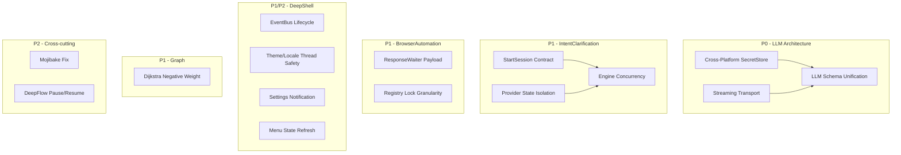

# Design Document: DeepBase Bug Fixes P0/P1/P2

## Overview

本设计文档覆盖 DeepBase Delphi 13.1 架构库剩余 15 项 P0/P1/P2 缺陷修复。修复按模块分组，每组独立可验证，最终通过 `compile_test.bat` 编译门禁。

设计原则：
- 最小侵入：只修改必要代码，不做无收益的大规模重构
- 向后兼容：保留旧 API 作为 deprecated wrapper，不破坏下游编译
- Delphi 13.1 语法：inline var、条件表达式、`{$IF CompilerVersion >= 37}`
- 线程安全：所有共享状态使用 `TCriticalSection` 或 `TInterlocked`

## Architecture



## Components and Interfaces

### 1. LLM Schema Unification (LLM-001)

**修改文件**: `Core/DeepBase.LLM.Manager.pas`, `Core/DeepBase.Schema.pas`

**方案**: 将 `sql/llm_prompts_init.sql` 中的表定义合并到 `DeepBase.Schema.pas` 的 tier2 初始化中。`TLLMManager.Initialize` 不再假设外部 SQL 已执行，而是调用统一的 schema 确保方法。

```pascal
// Core/DeepBase.Schema.pas - 新增 LLM canonical tables
procedure EnsureLLMSchema(const AConnection: IInterface);
// 创建所有 LLM 表: LLMConfig, LLMCalls, LLMPrompts, LLMApiKeys,
// Prompts, PromptVersions, PromptMeta, PromptMetaBinding
// 使用 CREATE TABLE IF NOT EXISTS，幂等执行

// Core/DeepBase.LLM.Manager.pas - 修改 Initialize
procedure TLLMManager.Initialize(const AConnection: IInterface);
begin
  EnsureLLMSchema(AConnection);  // 统一入口
  // ... 后续初始化
end;
```

**LLMCalls 字段统一**: 移除旧版字段写入路径，只保留 canonical 字段集 (model, provider, prompt_id, input_tokens, output_tokens, duration_ms, status, error)。

### 2. Cross-Platform SecretStore (LLM-002)

**新增文件**: `Core/DeepBase.Security.SecretStore.pas`

**接口设计**:

```pascal
type
  ISecretStore = interface
    ['{A1B2C3D4-...}']
    function TryGet(const AKey: string; out AValue: string): Boolean;
    procedure Put(const AKey: string; const AValue: string);
    procedure Delete(const AKey: string);
    function IsAvailable: Boolean;
  end;

  TSecretStoreFactory = class
  public
    class function CreatePlatformStore: ISecretStore;
    // Windows: Credential Manager
    // macOS: Keychain (via Security framework)
    // Linux: libsecret / Secret Service D-Bus
    // Fallback: fail-closed (raises ESecretStoreUnavailable)
  end;
```

**平台实现**:
- Windows: `CredWrite`/`CredRead`/`CredDelete` (已有 `Core/DeepBase.Security.pas` 中的 Credential Manager 基础)
- macOS: `{$IF DEFINED(MACOS)}` 使用 Security framework `SecItemAdd`/`SecItemCopyMatching`
- Linux: `{$IF DEFINED(LINUX)}` 使用 libsecret `secret_password_store_sync`
- 无可用后端: 抛出 `ESecretStoreUnavailable`，除非显式设置 `DEEPBASE_INSECURE_DEV_MODE` 环境变量

**LLM 集成**: `Features/DeepBase.LLM.Config.pas` 移除 `TSimpleCrypto.Encrypt(..., '@DeepBase.LLM.Key')`，改为调用 `ISecretStore.Put/TryGet`。

### 3. Streaming Transport (LLM-006)

**修改文件**: `Features/DeepBase.Net.Transport.pas`, `Features/DeepBase.LLM.HTTP.pas`

**新增接口**:

```pascal
type
  TStreamChunkEvent = reference to procedure(const AChunk: string; var ACancel: Boolean);

  ICancellationToken = interface
    ['{...}']
    function IsCancelled: Boolean;
    procedure Cancel;
  end;

  IDeepBaseStreamingTransport = interface(IDeepBaseHttpTransport)
    ['{...}']
    function SendStreaming(const ARequest: TDeepBaseHttpTransportRequest;
      AOnChunk: TStreamChunkEvent;
      const ACancelToken: ICancellationToken): TDeepBaseHttpTransportResponse;
  end;
```

**实现**: `TDeepBaseSystemNetTransport` 实现 `IDeepBaseStreamingTransport`，使用 `THTTPClient.OnReceiveData` 事件按行分割 SSE 数据并回调。

**LLM_HTTP 修改**: `SendStream` 方法改为调用 `IDeepBaseStreamingTransport.SendStreaming`，每收到 `data:` 行即解析并回调。旧的 buffered 方法重命名为 `SendBuffered` 并标记 `deprecated`。

### 4. IntentClarification StartSession Contract (IC-002)

**修改文件**: `Features/DeepBase.IntentClarification.Engine.pas`

**方案**: `StartSession` 方法消费 `TStartSessionRequest` 的所有字段：

```pascal
procedure TClarificationEngine.StartSession(const ARequest: TStartSessionRequest);
begin
  FLock.Enter;
  try
    var LSession := CreateSession(ARequest);
    // 消费 InitialInput
    if ARequest.InitialInput <> '' then
      LSession.History.Add(THistoryEntry.UserInput(ARequest.InitialInput));
    // 消费 Template
    if ARequest.Template <> '' then
      LSession.ApplyTemplate(ARequest.Template);
    // 消费 BudgetOverride
    var LBudget := if ARequest.HasBudgetOverride
      then ARequest.BudgetOverride
      else TBudgetConfig.Default;
    LSession.SetBudget(LBudget);
    FSessions.AddOrSetValue(LSession.Id, LSession);
  finally
    FLock.Leave;
  end;
end;
```

### 5. IntentClarification Engine Concurrency (IC-003)

**修改文件**: `Features/DeepBase.IntentClarification.Engine.pas`

**方案**:
- 为 `FProviders`、`FHistory`、`FTokenUsage` 添加 `TCriticalSection` 保护
- 每个 session 增加 per-session lock，`SubmitInput` 对同一 session 串行化
- Provider 注册在引擎启动后拒绝（类似 IoC Freeze 模式）

```pascal
type
  TClarificationEngine = class
  private
    FGlobalLock: TCriticalSection;      // 保护 FSessions, FProviders
    FSessionLocks: TDictionary<string, TCriticalSection>;  // per-session 串行化
    FProvidersFrozen: Boolean;
  end;
```

### 6. IntentClarification Provider State Isolation (IC-007)

**修改文件**: `Features/DeepBase.IntentClarification.Provider.L2.pas`, `Features/DeepBase.IntentClarification.Provider.L3.pas`

**方案**: 将 provider 实例级状态移到 session context：

```pascal
// Provider.L2 - 移除 FDeniedHypotheses 实例字段
// 改为从 session context 读写
function TL2Provider.GetDeniedHypotheses(const ASessionId: string): TArray<string>;
begin
  Result := ASessionContext.GetState<TArray<string>>('l2.denied_hypotheses');
end;

// Provider.L3 - 移除 FCurrentExpert/FExpertSelected 实例字段
// 改为从 session context 读写
```

### 7. BrowserAutomation ResponseWaiter (BROWSER-006)

**修改文件**: `Features/DeepBase.Browser.ResponseWaiter.pas`

**方案**:
1. **消息解析**: `Get_WebMessageAsJson` 对 JS string 返回 JSON string literal (如 `"hello"`)。解析时先检查是否为 `TJSONString`，如果是则 unwrap 后再解析为 object。
2. **Waiting flag 时序**: 在 `ExecuteScript` 之前设置 waiting=true，失败时回滚。
3. **多 waiter 复用**: 在 postMessage payload 中加入 waiter ID 字段，message handler 按 ID 分发。

```pascal
procedure TResponseWaiter.HandleWebMessage(const AJson: string);
begin
  var LValue := TJSONObject.ParseJSONValue(AJson);
  try
    // WebView2 wraps string postMessage as JSON string literal
    var LObj: TJSONObject := nil;
    if LValue is TJSONString then
      LObj := TJSONObject.ParseJSONValue(TJSONString(LValue).Value) as TJSONObject
    else if LValue is TJSONObject then
      LObj := TJSONObject(LValue);
    if LObj = nil then Exit;
    // Multiplex by waiter ID
    var LWaiterId := LObj.GetValue<string>('_waiterId', '');
    DispatchToWaiter(LWaiterId, LObj);
  finally
    LValue.Free;
  end;
end;
```

### 8. BrowserAutomation Registry Lock (BROWSER-004)

**修改文件**: `Features/DeepBase.Browser.Registry.pas`

**方案**: Discover 和 CreateSession 在锁内只复制 snapshot，锁外执行慢操作：

```pascal
procedure TBrowserRegistry.Discover;
begin
  var LSnapshot: TArray<TBackendEntry>;
  FLock.Enter;
  try
    LSnapshot := FBackends.ToArray;  // 快速复制
  finally
    FLock.Leave;
  end;
  // 锁外执行 availability checks
  for var LEntry in LSnapshot do
    LEntry.Available := LEntry.IsAvailableFunc();
  // 写回结果
  FLock.Enter;
  try
    for var LEntry in LSnapshot do
      UpdateAvailability(LEntry.Id, LEntry.Available);
  finally
    FLock.Leave;
  end;
end;
```

### 9. DeepShell EventBus Lifecycle (DSHELL-003)

**修改文件**: `VCL/DeepBase.VCL.DeepShell.Events.pas`, `VCL/DeepBase.VCL.DeepShell.Intf.pas`

**方案**: 扩展 `IShellEventBus` 接口和 `TShellEventBus` 实现：

```pascal
// Intf.pas - 扩展接口
IShellEventBus = interface
  // ... existing methods ...
  procedure Shutdown;  // 拒绝新 publish，等待 queued handlers 完成
  procedure SetOnDispatchError(AHandler: TProc<Exception, string>);
end;

// Events.pas - 实现
TShellEventBus = class
private
  FShutdown: Boolean;
  FOnDispatchError: TProc<Exception, string>;
end;

procedure TShellEventBus.Publish(const AEvent: TDeepShellEvent);
begin
  if FShutdown then
    raise EInvalidOperation.Create('EventBus has been shut down');
  // ... existing logic ...
end;

procedure TShellEventBus.DispatchInline(...);
begin
  try
    ASub.Handler(AEvent);
  except
    on E: Exception do
      if Assigned(FOnDispatchError) then
        FOnDispatchError(E, ASub.Token);
  end;
end;
```

### 10. DeepShell Theme/Localization Thread Safety (DSHELL-009)

**修改文件**: `VCL/DeepBase.VCL.DeepShell.Theme.pas`, `VCL/DeepBase.VCL.DeepShell.Localization.pas`

**方案**: 在 `ApplyTheme`/`SetLocale` 的 subscriber 通知循环中检查当前线程，非主线程时使用 `TThread.Queue` 派发：

```pascal
procedure TShellDefaultThemeService.ApplyTheme(const AThemeId: string);
var
  LSnapshot: TArray<TSub>;
begin
  // ... lock, update FCurrent, snapshot subs ...
  var LIsMain := TThread.CurrentThread.ThreadID = MainThreadID;
  for var I := 0 to High(LSnapshot) do
  begin
    var LHandler := LSnapshot[I].Handler;
    var LId := AThemeId;
    if LIsMain then
      try LHandler(LId) except end
    else
      TThread.Queue(nil,
        procedure
        begin
          try LHandler(LId) except end;
        end);
  end;
end;
```

### 11. Graph Dijkstra Negative Weight Rejection (EDGE-015)

**修改文件**: `Features/DeepBase.Graph.pas`

**方案**:
1. `ShortestPath` (Dijkstra) 在执行前扫描边权重，遇到负权抛出 `EGraphNegativeWeight`
2. `GetNeighbors` 返回 `TArray<T>` 副本而非内部 list 引用

```pascal
type
  EGraphNegativeWeight = class(Exception);

function TGraph<T>.ShortestPath(const AFrom, ATo: T): TArray<T>;
begin
  // 检查负权边
  for var LEdge in FEdges do
    if LEdge.Weight < 0 then
      raise EGraphNegativeWeight.Create(
        'Dijkstra does not support negative edge weights. Use BellmanFord instead.');
  // ... existing Dijkstra implementation ...
end;

function TGraph<T>.GetNeighbors(const ANode: T): TArray<T>;
begin
  FLock.Enter;
  try
    if FAdjacency.ContainsKey(ANode) then
      Result := FAdjacency[ANode].ToArray  // 返回副本
    else
      Result := [];
  finally
    FLock.Leave;
  end;
end;
```

### 12. Mojibake Encoding Fix (FR-011)

**方案**: 编写一个 batch/PowerShell 脚本扫描所有 `.pas` 和 `.md` 文件，检测 GBK-to-UTF8 损坏模式（`\xEF\xBF\xBD` 即 U+FFFD，或 `锟斤拷` 序列）。对每个损坏文件：
- 尝试以 GBK 重新解码恢复原始中文
- 无法恢复的替换为 `// TODO: restore original comment`
- 最终保存为 UTF-8 with BOM

**不修改编译逻辑**，只修复源文件内容。

### 13. DeepFlow Pause/Resume (FR-016)

**修改文件**: `Features/DeepBase.DeepFlow.Engine.pas`

**方案**:
1. **Pause/Resume**: 添加 `FPaused: Boolean` 和 `FPauseEvent: TEvent`。任务调度循环在取下一个任务前检查 `FPaused`，如果暂停则 `WaitForSingleObject(FPauseEvent)`。
2. **优先队列**: 将 `InsertSorted` 的线性扫描替换为二分查找插入：

```pascal
procedure TDeepFlowEngine.InsertSorted(const ATask: TFlowTask);
var
  LLow, LHigh, LMid: Integer;
begin
  LLow := 0;
  LHigh := FQueue.Count - 1;
  while LLow <= LHigh do
  begin
    LMid := (LLow + LHigh) div 2;
    if FQueue[LMid].Priority >= ATask.Priority then
      LLow := LMid + 1
    else
      LHigh := LMid - 1;
  end;
  FQueue.Insert(LLow, ATask);
end;
```

### 14. DeepShell Settings Notification (DSHELL-010)

**修改文件**: `VCL/DeepBase.VCL.DeepShell.Settings.pas`, `VCL/DeepBase.VCL.DeepShell.Intf.pas`

**方案**: 新增 `IShellNotification` 接口，Settings 通过注入使用：

```pascal
// Intf.pas
IShellNotification = interface
  ['{...}']
  procedure ShowInfo(const AMessage: string);
  procedure ShowError(const AMessage: string);
  function Confirm(const AMessage: string): Boolean;
end;

// Settings.pas - 替换所有 ShowMessage 调用
procedure TShellSettings.NotifyError(const AMsg: string);
begin
  if Assigned(FNotification) then
    FNotification.ShowError(AMsg)
  else if Assigned(FBus) then
    FBus.Publish(TDeepShellEvent.Create(sekLogAdded, AMsg));
end;
```

### 15. DeepShell Menu State Refresh (DSHELL-011)

**修改文件**: `VCL/DeepBase.VCL.DeepShell.Commands.pas`, `VCL/DeepBase.VCL.DeepShell.MainForm.pas`

**方案**: `UpdateCommandState` 在更新字典后发布 `sekCommandStateChanged` 事件（新增事件类型），MainForm 订阅该事件并增量更新对应菜单项：

```pascal
// Commands.pas
procedure TShellCommandManager.UpdateCommandState(...);
begin
  FLock.Enter;
  try
    // ... update dictionary ...
  finally
    FLock.Leave;
  end;
  // 发布状态变更事件
  if Assigned(FBus) then
  begin
    var LEvent: TDeepShellEvent;
    LEvent.Kind := sekCommandStateChanged;
    LEvent.Data := ACommandId;
    FBus.Publish(LEvent);
  end;
end;

// MainForm.pas - 订阅并增量刷新
procedure TShellMainForm.HandleCommandStateChanged(const AEvent: TDeepShellEvent);
begin
  var LMenuItem := FindMenuItemByCommandId(AEvent.Data);
  if LMenuItem <> nil then
  begin
    var LCmd: TShellCommand;
    if FCommands.TryGetCommand(AEvent.Data, LCmd) then
    begin
      LMenuItem.Enabled := LCmd.Enabled;
      LMenuItem.Visible := LCmd.Visible;
    end;
  end;
end;
```

## Data Models

### LLM Canonical Schema

```sql
-- 统一 LLM 表结构 (CREATE TABLE IF NOT EXISTS)
CREATE TABLE IF NOT EXISTS LLMConfig (
  key TEXT PRIMARY KEY,
  value TEXT NOT NULL,
  updated_at TEXT DEFAULT (datetime('now'))
);

CREATE TABLE IF NOT EXISTS LLMApiKeys (
  provider TEXT PRIMARY KEY,
  key_ref TEXT NOT NULL,  -- SecretStore reference, not plaintext
  created_at TEXT DEFAULT (datetime('now'))
);

CREATE TABLE IF NOT EXISTS LLMCalls (
  id INTEGER PRIMARY KEY AUTOINCREMENT,
  session_id TEXT,
  model TEXT NOT NULL,
  provider TEXT,
  prompt_id TEXT,
  input_tokens INTEGER DEFAULT 0,
  output_tokens INTEGER DEFAULT 0,
  duration_ms INTEGER DEFAULT 0,
  status TEXT DEFAULT 'ok',
  error TEXT,
  created_at TEXT DEFAULT (datetime('now'))
);

CREATE TABLE IF NOT EXISTS Prompts (
  id TEXT PRIMARY KEY,
  category TEXT,
  name TEXT NOT NULL,
  description TEXT,
  created_at TEXT DEFAULT (datetime('now'))
);

CREATE TABLE IF NOT EXISTS PromptVersions (
  id INTEGER PRIMARY KEY AUTOINCREMENT,
  prompt_id TEXT NOT NULL REFERENCES Prompts(id),
  version INTEGER NOT NULL,
  content TEXT NOT NULL,
  is_production INTEGER DEFAULT 0,
  created_at TEXT DEFAULT (datetime('now'))
);
```

### SecretStore Key Naming

```
deepbase.llm.apikey.<provider>    -- LLM API keys
deepbase.llm.config.encryption    -- LLM config encryption key (if needed)
```

### ICancellationToken

```pascal
type
  TCancellationToken = class(TInterfacedObject, ICancellationToken)
  private
    FCancelled: Integer;  // 0 or 1, atomic
  public
    function IsCancelled: Boolean;
    procedure Cancel;
  end;
```


## Correctness Properties

*A property is a characteristic or behavior that should hold true across all valid executions of a system — essentially, a formal statement about what the system should do. Properties serve as the bridge between human-readable specifications and machine-verifiable correctness guarantees.*

### Property 1: LLM Schema Initialization Completeness

*For any* database in a valid initial state (empty or Core-only tier2), after `TLLMManager.Initialize` completes, all canonical LLM tables (LLMConfig, LLMCalls, LLMPrompts, LLMApiKeys, Prompts, PromptVersions, PromptMeta, PromptMetaBinding) SHALL exist and be queryable.

**Validates: Requirements 1.1**

### Property 2: LLMCalls Canonical Field Set

*For any* LLM call record written by `TLLMManager`, the record SHALL contain exactly the canonical field set (model, provider, prompt_id, input_tokens, output_tokens, duration_ms, status, error, created_at) and no legacy-only fields.

**Validates: Requirements 1.4**

### Property 3: Streaming Chunk Delivery

*For any* valid SSE response containing N data events, the streaming transport SHALL invoke the chunk callback exactly N times, and each callback SHALL fire before the final response object is returned.

**Validates: Requirements 3.1, 3.2**

### Property 4: Streaming Cancellation

*For any* in-progress streaming response, when the cancellation token is triggered, no further chunk callbacks SHALL be invoked after the cancellation is acknowledged.

**Validates: Requirements 3.3, 3.5**

### Property 5: Streaming FirstTokenMs

*For any* streaming response that delivers at least one chunk, FirstTokenMs SHALL be greater than 0 and less than or equal to the total response duration.

**Validates: Requirements 3.4**

### Property 6: StartSession Field Consumption

*For any* `TStartSessionRequest` with non-default InitialInput, Template, and BudgetOverride fields, after `StartSession` completes, the session state SHALL reflect all provided values: history contains InitialInput, configuration matches Template, and budget equals BudgetOverride.

**Validates: Requirements 4.1, 4.2, 4.3**

### Property 7: IC Engine Concurrent Turn Serialization

*For any* set of N concurrent `SubmitInput` calls to the same session, after all calls complete, the session history SHALL contain exactly N turns with no data loss or corruption.

**Validates: Requirements 5.1, 5.2, 5.3**

### Property 8: IC Provider Session State Isolation

*For any* two concurrent sessions on the same engine, modifying provider state (denied hypotheses in L2, selected expert in L3) in one session SHALL NOT affect the state visible to the other session.

**Validates: Requirements 6.1, 6.2**

### Property 9: ResponseWaiter Message Parsing

*For any* valid JSON value (string literal or object) received via WebView2 `Get_WebMessageAsJson`, the ResponseWaiter SHALL correctly extract the payload object regardless of whether the original `postMessage` argument was a string or an object.

**Validates: Requirements 7.1, 7.2**

### Property 10: ResponseWaiter Multi-Waiter Isolation

*For any* set of N concurrent waiters on the same session, each waiter SHALL only receive messages tagged with its own waiter ID, and no message SHALL be delivered to the wrong waiter.

**Validates: Requirements 7.4**

### Property 11: EventBus Shutdown Drains Queue

*For any* set of events published from background threads before `Shutdown` is called, all corresponding queued handlers SHALL have completed execution by the time `Shutdown` returns.

**Validates: Requirements 9.1**

### Property 12: EventBus Rejects After Shutdown

*For any* event published after `Shutdown` has been called, the `Publish` method SHALL raise an exception or return a failure indication.

**Validates: Requirements 9.2**

### Property 13: EventBus Error Callback

*For any* handler that raises an exception during dispatch, the `OnDispatchError` callback SHALL be invoked with the exception instance and the subscription token.

**Validates: Requirements 9.3**

### Property 14: Theme/Locale Thread-Correct Dispatch

*For any* call to `ApplyTheme` or `SetLocale` from a non-main thread, all UI subscriber callbacks SHALL execute on the main thread (ThreadID = MainThreadID).

**Validates: Requirements 10.1, 10.2**

### Property 15: Dijkstra Rejects Negative Weights

*For any* graph containing at least one edge with weight < 0, calling `ShortestPath` (Dijkstra) SHALL raise `EGraphNegativeWeight`.

**Validates: Requirements 11.1**

### Property 16: GetNeighbors Returns Independent Snapshot

*For any* graph and node, the array returned by `GetNeighbors` SHALL be independent of the graph's internal state: modifying the returned array SHALL NOT affect subsequent `GetNeighbors` calls or graph algorithms.

**Validates: Requirements 11.2**

### Property 17: Encoding Fix Produces Valid UTF-8

*For any* `.pas` or `.md` file processed by the encoding fix, the output file SHALL be valid UTF-8 (with BOM for `.pas`) and SHALL NOT contain mojibake sequences (U+FFFD replacement characters or 锟斤拷 patterns).

**Validates: Requirements 12.2**

### Property 18: DeepFlow Pause/Resume Round-Trip

*For any* running DeepFlow engine with pending tasks, calling `Pause` followed by `Resume` SHALL result in all pending tasks eventually completing (no tasks permanently lost).

**Validates: Requirements 13.1, 13.2**

### Property 19: DeepFlow Priority Queue Sort Invariant

*For any* sequence of task insertions with arbitrary priorities, the priority queue SHALL maintain descending priority order at all times (highest priority first).

**Validates: Requirements 13.3**

### Property 20: Settings Error Routing

*For any* error condition in DeepShell Settings (apply failure, defaults failure), the error message SHALL be delivered through the injected `IShellNotification` interface (or status event if no interface is injected), never through a direct `ShowMessage` call.

**Validates: Requirements 14.2**

### Property 21: Command State Change Event

*For any* call to `UpdateCommandState` that changes a command's Enabled or Visible property, a `sekCommandStateChanged` event SHALL be published on the EventBus with the command ID in the Data field.

**Validates: Requirements 15.1**

### Property 22: Menu Item Reflects State

*For any* `sekCommandStateChanged` event received by MainForm, the corresponding menu item's Enabled and Visible properties SHALL match the command's current state within one main-thread message cycle.

**Validates: Requirements 15.2**

## Error Handling

| 场景 | 处理策略 |
|------|----------|
| SecretStore 平台后端不可用 | 抛出 `ESecretStoreUnavailable`，不降级到明文 |
| LLM Schema migration 失败 | 抛出 `ELLMSchemaError`，不部分创建表 |
| Streaming transport 网络中断 | 回调 `ACancel := True`，返回 partial response with error status |
| IC Engine 并发 SubmitInput 超时 | per-session lock 使用 `TryEnter` + timeout，超时返回 busy error |
| Graph 负权边 | 抛出 `EGraphNegativeWeight`，不返回错误结果 |
| EventBus handler 异常 | 调用 `OnDispatchError`，继续派发后续 handler |
| ResponseWaiter JSON 解析失败 | 忽略该消息，不影响其他 waiter |
| DeepFlow Pause 时引擎已停止 | 静默返回，不抛异常 |
| Settings notification 接口未注入 | 降级到 EventBus status event |
| Encoding fix 无法恢复原文 | 替换为 TODO placeholder，不删除文件 |

## Testing Strategy

### 测试框架

- **单元测试**: DUnitX (已有 `Tests/DeepBaseTests.dpr`)
- **属性测试**: DUnitX + 自定义 property-based testing harness (参考 `Tests/Governance/ConfigRegistrarPBT.dpr` 模式)
- **编译门禁**: `compile_test.bat` (Exit code: 0)

### 双重测试方法

**单元测试** 覆盖：
- 具体示例和边界条件
- 平台特定行为 (Windows Credential Manager)
- Legacy schema migration
- 错误条件和异常路径

**属性测试** 覆盖：
- 所有 22 个 Correctness Properties
- 每个属性测试最少 100 次迭代
- 每个测试标注对应的设计属性编号

### 属性测试标注格式

```pascal
// Feature: deepbase-bug-fixes-p0p1p2, Property 15: Dijkstra rejects negative weights
procedure TestDijkstraRejectsNegativeWeights;
```

### 测试分组

| 分组 | 覆盖范围 | 运行方式 |
|------|----------|----------|
| LLM.Schema | Property 1-2, migration examples | 主 CI |
| LLM.Streaming | Property 3-5, fake transport | 主 CI |
| IC.Engine | Property 6-8, concurrency harness | 主 CI |
| Browser.ResponseWaiter | Property 9-10, JSON fixtures | 主 CI |
| Shell.EventBus | Property 11-13, lifecycle | 主 CI |
| Shell.Theme | Property 14, thread affinity | 主 CI |
| Graph.Correctness | Property 15-16, random graphs | 主 CI |
| Encoding.Fix | Property 17, file fixtures | 主 CI |
| DeepFlow.Engine | Property 18-19, task scheduling | 主 CI |
| Shell.Settings | Property 20, notification routing | 主 CI |
| Shell.Commands | Property 21-22, menu state | 主 CI |

### 验证命令

```batch
cmd /c compile_test.bat
```

编译通过后运行测试：
```powershell
powershell.exe -NoProfile -ExecutionPolicy Bypass -File Scripts\run_tests.ps1 -Type Unit -CI
```
