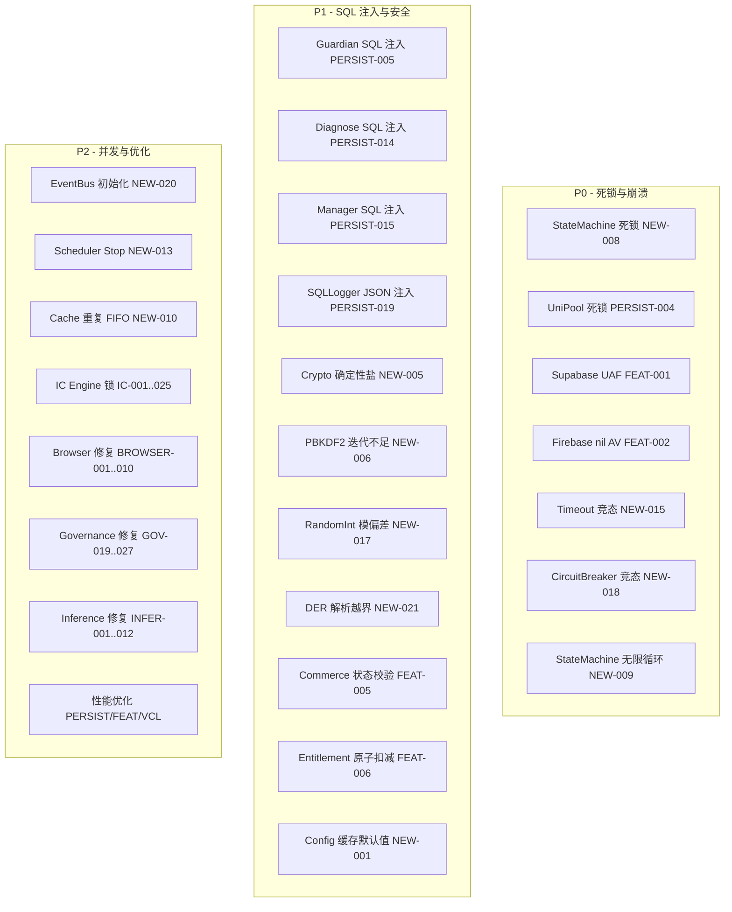

# Design Document: DeepBase Round 2 Fixes

## Overview

本设计文档覆盖 DeepBase 第二轮代码审阅（better2.md）发现的 139 项问题，按优先级分为：
- **P0**（7 项）：死锁、UAF、崩溃 — 必须立即修复
- **P1**（11 项）：SQL 注入、数据完整性、安全 — 高优先级
- **P2**（121 项）：优化、代码质量 — 可延后

设计原则：
- 最小侵入：只修改触发 bug 的代码块，不做全文件重写
- Delphi 13.1 语法：inline var、条件表达式、`{$IF CompilerVersion >= 37}`
- 线程安全：`TMonitor`（可重入）替代 `TCriticalSection`（不可重入）用于可能递归的场景；`TInterlocked` 用于原子标志
- 不引入 `with` 语句
- 编译门禁：`cmd /c compile_test.bat` Exit code 0

## Architecture



## Components and Interfaces

### P0 修复组件设计

#### 1. StateMachine 死锁修复 (NEW-008)

**修改文件**: `Core/DeepBase.StateMachine.pas`

**问题**: `FireIfInState` 在持有 `TCriticalSection` 时调用 handler，handler 内部可能再次调用 `FireIfInState`，导致死锁（TCriticalSection 不可重入）。

**方案**: 将 `FLock: TCriticalSection` 替换为 `FLock: TObject`（使用 `TMonitor`，可重入）。

```pascal
// Before: FLock: TCriticalSection
// After: 使用 TMonitor (可重入)
procedure TStateMachine.FireIfInState(const AState: string; const AEvent: string);
begin
  TMonitor.Enter(FLock);
  try
    if FCurrentState = AState then
      DoTransition(AEvent);  // handler 可安全递归调用
  finally
    TMonitor.Exit(FLock);
  end;
end;
```

#### 2. StateMachine 循环检测 (NEW-009)

**修改文件**: `Core/DeepBase.StateMachine.pas`

**方案**: `IsInState` 遍历父子层级时加入深度计数器，超过 `CMaxHierarchyDepth = 64` 时终止并返回 False。

```pascal
function TStateMachine.IsInState(const AState: string): Boolean;
const
  CMaxHierarchyDepth = 64;
begin
  TMonitor.Enter(FLock);
  try
    var LCurrent := FCurrentState;
    var LDepth := 0;
    while LCurrent <> '' do
    begin
      if LCurrent = AState then
        Exit(True);
      Inc(LDepth);
      if LDepth > CMaxHierarchyDepth then
        Exit(False);  // 检测到循环或过深层级
      LCurrent := GetParentState(LCurrent);
    end;
    Result := False;
  finally
    TMonitor.Exit(FLock);
  end;
end;
```

#### 3. Timeout 竞态修复 (NEW-015, NEW-016)

**修改文件**: `Core/DeepBase.Resilience.Timeout.pas`

**方案**:
- 结果变量 `FCompleted`、`FErrorClass`、`FErrorMsg` 使用 `TInterlocked` 或 `TMonitor` 保护
- 超时后取消后台 `TTask`

```pascal
type
  TTimeoutResult = record
    Completed: Boolean;
    ErrorClass: string;
    ErrorMsg: string;
  end;

  TTimeout = class
  private
    FResultLock: TObject;
    FResult: TTimeoutResult;
    FTask: ITask;
    procedure SetResult(ACompleted: Boolean; const AErrClass, AErrMsg: string);
    function GetResult: TTimeoutResult;
  public
    function Execute(AProc: TProc; ATimeoutMs: Cardinal): TTimeoutResult;
  end;

function TTimeout.Execute(AProc: TProc; ATimeoutMs: Cardinal): TTimeoutResult;
begin
  FTask := TTask.Run(
    procedure
    begin
      try
        AProc();
        SetResult(True, '', '');
      except
        on E: Exception do
          SetResult(False, E.ClassName, E.Message);
      end;
    end);
  if not FTask.Wait(ATimeoutMs) then
  begin
    FTask.Cancel;  // 取消后台任务防止资源泄漏
    SetResult(False, 'ETimeout', 'Operation timed out');
  end;
  Result := GetResult;
end;
```

#### 4. CircuitBreaker 原子状态转换 (NEW-018)

**修改文件**: `Core/DeepBase.Resilience.CircuitBreaker.pas`

**方案**: `AllowRequest` + `RecordSuccess/RecordFailure` 在同一锁内完成，避免 TOCTOU 竞态。

```pascal
function TCircuitBreaker.Execute(AAction: TFunc<TValue>): TValue;
begin
  TMonitor.Enter(FLock);
  try
    if not DoAllowRequest then  // 锁内检查
      raise ECircuitBreakerOpen.Create('Circuit is open');
  finally
    TMonitor.Exit(FLock);
  end;
  try
    Result := AAction();
    TMonitor.Enter(FLock);
    try
      DoRecordSuccess;  // 锁内记录
    finally
      TMonitor.Exit(FLock);
    end;
  except
    on E: Exception do
    begin
      TMonitor.Enter(FLock);
      try
        DoRecordFailure;  // 锁内记录
      finally
        TMonitor.Exit(FLock);
      end;
      raise;
    end;
  end;
end;
```

#### 5. UniPool 死锁修复 (PERSIST-004)

**修改文件**: `Persistence/DeepBase.DB.Pool.pas`

**问题**: `Initialize` 内部调用 `Warmup`，`Warmup` 也尝试获取同一 `TCriticalSection`。

**方案**: 提取 `DoWarmup`（无锁内部方法），`Initialize` 和 `Warmup` 都调用它，但只在外层加锁。

```pascal
procedure TUniPool.Initialize;
begin
  FLock.Enter;
  try
    // ... 初始化逻辑 ...
    DoWarmup;  // 内部方法，不再获取锁
  finally
    FLock.Leave;
  end;
end;

procedure TUniPool.Warmup;  // 公开方法
begin
  FLock.Enter;
  try
    DoWarmup;
  finally
    FLock.Leave;
  end;
end;

procedure TUniPool.DoWarmup;  // 私有，调用者已持锁
begin
  for var I := 1 to FMinPoolSize do
    FPool.Add(CreateConnection);
end;
```

#### 6. SupabaseAdapter UAF 修复 (FEAT-001)

**修改文件**: `Features/DeepBase.Commerce.Adapter.Supabase.pas`

**方案**: 使用 `Extract` 从数组中取出对象所有权，再释放数组。

```pascal
function TSupabaseAdapter.SingleOrNull(const AResponse: string): TJSONObject;
begin
  var LArr := TJSONObject.ParseJSONValue(AResponse) as TJSONArray;
  if LArr = nil then
    Exit(nil);
  try
    if LArr.Count = 0 then
      Exit(nil);
    Result := LArr.Items[0].Clone as TJSONObject;  // Clone 避免 UAF
  finally
    LArr.Free;
  end;
end;
```

#### 7. FirebaseAdapter nil 检查 (FEAT-002)

**修改文件**: `Features/DeepBase.Commerce.Adapter.Firebase.pas`

**方案**: ParseJSONValue 结果先检查 nil 再 cast。

```pascal
function TFirebaseAdapter.ParseResponse(const AJson: string): TJSONObject;
begin
  var LValue := TJSONObject.ParseJSONValue(AJson);
  if not (LValue is TJSONObject) then
  begin
    LValue.Free;
    Exit(nil);
  end;
  Result := TJSONObject(LValue);
end;
```

### P1 修复组件设计

#### 8. Guardian SQL 注入防护 (PERSIST-005)

**修改文件**: `Persistence/DeepBase.DB.Guardian.pas`

**方案**: 白名单验证 checkpoint mode。

```pascal
const
  CValidCheckpointModes: TArray<string> = ['PASSIVE', 'FULL', 'RESTART', 'TRUNCATE'];

procedure TGuardian.Checkpoint(const AMode: string);
begin
  var LUpper := AMode.ToUpper;
  var LValid := False;
  for var LMode in CValidCheckpointModes do
    if LMode = LUpper then
    begin
      LValid := True;
      Break;
    end;
  if not LValid then
    raise EArgumentException.CreateFmt('Invalid checkpoint mode: %s', [AMode]);
  // 安全执行 PRAGMA checkpoint
  FConnection.ExecSQL(Format('PRAGMA wal_checkpoint(%s)', [LUpper]));
end;
```

#### 9. SQL 标识符验证 (PERSIST-014, PERSIST-015)

**修改文件**: `Persistence/DeepBase.DB.Diagnose.pas`, `Persistence/DeepBase.Manager.FireDAC.pas`

**方案**: 共享标识符验证函数，拒绝含特殊字符的标识符。

```pascal
// Core/DeepBase.SQL.Utils.pas (新增或追加到现有 SQL 工具单元)
class function TSQLUtils.IsValidIdentifier(const AName: string): Boolean;
begin
  if AName.IsEmpty then
    Exit(False);
  // 只允许字母、数字、下划线，首字符为字母或下划线
  for var I := 1 to AName.Length do
  begin
    var LCh := AName[I];
    var LValid := LCh.IsLetterOrDigit or (LCh = '_');
    if (I = 1) and LCh.IsDigit then
      LValid := False;
    if not LValid then
      Exit(False);
  end;
  Result := True;
end;

class procedure TSQLUtils.ValidateIdentifier(const AName, AContext: string);
begin
  if not IsValidIdentifier(AName) then
    raise EArgumentException.CreateFmt('Invalid SQL identifier in %s: %s', [AContext, AName]);
end;
```

#### 10. SQLLogger JSON 安全构造 (PERSIST-019)

**修改文件**: `Persistence/DeepBase.SQLLogger.pas`

**方案**: 使用 `TJSONObject` 构造 Extra 字段，而非字符串拼接。

```pascal
procedure TSQLLogger.FormatExtra(const AExtra: TDictionary<string, string>): string;
begin
  var LObj := TJSONObject.Create;
  try
    for var LPair in AExtra do
      LObj.AddPair(LPair.Key, LPair.Value);
    Result := LObj.ToJSON;
  finally
    LObj.Free;
  end;
end;
```

#### 11. Crypto 随机盐 (NEW-005) + PBKDF2 迭代 (NEW-006)

**修改文件**: `Core/DeepBase.Crypto.pas`

```pascal
const
  CPBKDF2Iterations = 100000;
  CSaltLength = 16;

class function TSimpleCrypto.EncryptBytes(const AData: TBytes; const APassword: string): TBytes;
begin
  // 生成密码学随机盐
  var LSalt := GenerateCryptoRandomBytes(CSaltLength);
  // PBKDF2 派生密钥
  var LKey := TPBKDF2.DeriveKey(APassword, LSalt, CPBKDF2Iterations, 32);
  // 加密
  var LEncrypted := DoAESEncrypt(AData, LKey);
  // 输出: Salt + Encrypted
  Result := LSalt + LEncrypted;
end;
```

#### 12. RandomInt 消除模偏差 (NEW-017)

**修改文件**: `Core/DeepBase.Crypto.pas`

```pascal
class function TCrypto.RandomInt(AMin, AMax: Integer): Integer;
begin
  var LRange := UInt32(AMax - AMin) + 1;
  var LThreshold := (not LRange + 1) mod LRange;  // 2^32 mod range
  var LRandom: UInt32;
  repeat
    LRandom := CryptoRandomUInt32;
  until LRandom >= LThreshold;  // 拒绝采样
  Result := AMin + Integer(LRandom mod LRange);
end;
```

#### 13. DER 解析长度验证 (NEW-021)

**修改文件**: `Core/DeepBase.Crypto.pas`

```pascal
class function TCrypto.ParseDERPublicKey(const AData: TBytes): TBytes;
begin
  var LPos := 0;
  // ... 读取 tag ...
  var LLen := ReadDERLength(AData, LPos);
  if LPos + LLen > Length(AData) then
    raise ECryptoError.Create('DER length exceeds available data');
  // ... 继续解析 ...
end;
```

#### 14. Commerce 状态校验 (FEAT-005)

**修改文件**: `Features/DeepBase.Commerce.Service.pas`

```pascal
procedure TCommerceService.BeginPayment(const AOrder: TOrder);
begin
  if AOrder.Status in [cosPaid, cosFailed, cosClosed, cosRefunded] then
    raise ECommerceError.CreateFmt('Cannot begin payment for order in %s state',
      [GetEnumName(TypeInfo(TOrderStatus), Ord(AOrder.Status))]);
  // ... 继续支付流程 ...
end;
```

#### 15. Entitlement 原子扣减 (FEAT-006)

**修改文件**: `Features/DeepBase.Commerce.Service.pas`

```pascal
function TCommerceService.ConsumeEntitlement(const AEntitlementId: string; AAmount: Integer): Boolean;
begin
  // 原子 UPDATE: 只有 remaining_quota >= AAmount 时才扣减
  var LSQL := 'UPDATE entitlements SET remaining_quota = remaining_quota - :amount ' +
              'WHERE id = :id AND remaining_quota >= :amount';
  var LAffected := FConnection.ExecSQL(LSQL, [AAmount, AEntitlementId, AAmount]);
  Result := LAffected > 0;
end;
```

#### 16. Config 不缓存默认值 (NEW-001)

**修改文件**: `Core/DeepBase.Config.pas`

```pascal
function TConfig.GetConfig(const AKey: string; const ADefault: string): string;
begin
  TMonitor.Enter(FLock);
  try
    if FCache.TryGetValue(AKey, Result) then
      Exit;
  finally
    TMonitor.Exit(FLock);
  end;
  // 从存储读取
  if FStorage.TryRead(AKey, Result) then
  begin
    TMonitor.Enter(FLock);
    try
      FCache.AddOrSetValue(AKey, Result);  // 只缓存实际存储的值
    finally
      TMonitor.Exit(FLock);
    end;
  end
  else
    Result := ADefault;  // 不缓存默认值
end;
```

### P2 修复组件设计（关键项）

#### 17. EventBus 安全初始化 (NEW-020)

```pascal
class function TEventBus.GetInstance: TEventBus;
begin
  if FInstance = nil then
  begin
    var LNew := TEventBus.Create;
    if TInterlocked.CompareExchange(Pointer(FInstance), Pointer(LNew), nil) <> nil then
      LNew.Free;  // 另一个线程先创建了
  end;
  Result := FInstance;
end;
```

#### 18. Cache 重复 FIFO 修复 (NEW-010)

```pascal
procedure TCache.Put(const AKey: string; const AValue: TValue);
begin
  TMonitor.Enter(FLock);
  try
    if FMap.ContainsKey(AKey) then
    begin
      FMap[AKey] := AValue;
      // 不追加到 FIFO — 已存在
    end
    else
    begin
      FMap.Add(AKey, AValue);
      FFIFOQueue.Enqueue(AKey);  // 只对新 key 追加
    end;
  finally
    TMonitor.Exit(FLock);
  end;
end;
```

#### 19. ConnectionPool 信号修复 (PERSIST-001)

```pascal
procedure TConnectionPool.ReleaseConnection(AConn: IDBConnection);
begin
  FLock.Enter;
  try
    FAvailable.Add(AConn);
    // ResetEvent + SetEvent 在同一锁内，防止 lost wakeup
    FAvailableEvent.ResetEvent;
    FAvailableEvent.SetEvent;
  finally
    FLock.Leave;
  end;
end;

procedure TConnectionPool.FindAvailableConnection: IDBConnection;
begin
  Result := nil;
  FLock.Enter;
  try
    // 反向遍历避免跳过
    for var I := FAvailable.Count - 1 downto 0 do
    begin
      if FAvailable[I].IsAlive then
      begin
        Result := FAvailable[I];
        FAvailable.Delete(I);
        Break;
      end
      else
        FAvailable.Delete(I);  // 移除死连接
    end;
  finally
    FLock.Leave;
  end;
end;
```

#### 20. ICEngine 并发修复 (IC-001, IC-002, IC-003, IC-004)

```pascal
// HandleRegenerate - 加锁
procedure TClarificationEngine.HandleRegenerate(const ASessionId: string);
begin
  FLock.Enter;
  try
    var LSession: TICSession;
    if not FSessions.TryGetValue(ASessionId, LSession) then
      Exit;
    LSession.RegenerateLastTurn;
    FSessions.AddOrSetValue(ASessionId, LSession);
  finally
    FLock.Leave;
  end;
end;

// HandleExit - 锁内重新读取
procedure TClarificationEngine.HandleExit(const ASessionId: string);
begin
  FLock.Enter;
  try
    var LSession: TICSession;
    if not FSessions.TryGetValue(ASessionId, LSession) then
      Exit;
    LSession.MarkCompleted;
    FSessions.AddOrSetValue(ASessionId, LSession);
  finally
    FLock.Leave;
  end;
end;

// SuspendIdleSessions - 收集后修改
procedure TSessionManager.SuspendIdleSessions(AIdleThreshold: TDateTime);
begin
  var LToSuspend: TArray<string>;
  FLock.Enter;
  try
    for var LPair in FSessions do
      if LPair.Value.LastActivity < AIdleThreshold then
        LToSuspend := LToSuspend + [LPair.Key];
  finally
    FLock.Leave;
  end;
  // 锁外逐个修改
  for var LKey in LToSuspend do
  begin
    FLock.Enter;
    try
      var LSession: TICSession;
      if FSessions.TryGetValue(LKey, LSession) then
      begin
        LSession.Suspend;
        FSessions.AddOrSetValue(LKey, LSession);
      end;
    finally
      FLock.Leave;
    end;
  end;
end;
```

#### 21. Browser ScriptStore 契约修复 (BROWSER-001, BROWSER-002)

```pascal
// get_text 模板返回 {found, text, error} 结构
class function TScriptStore.GetTextScript(const ASelector: string): string;
begin
  Result :=
    'try {' +
    '  var el = document.querySelector(' + QuoteJSString(ASelector) + ');' +
    '  if (el) { window.chrome.webview.postMessage(JSON.stringify({found:true, text:el.innerText, error:""})); }' +
    '  else { window.chrome.webview.postMessage(JSON.stringify({found:false, text:"", error:"Element not found"})); }' +
    '} catch(e) { window.chrome.webview.postMessage(JSON.stringify({found:false, text:"", error:e.message})); }';
end;

// click/input_text 模板返回 {success, error} 结构
class function TScriptStore.ClickScript(const ASelector: string): string;
begin
  Result :=
    'try {' +
    '  var el = document.querySelector(' + QuoteJSString(ASelector) + ');' +
    '  if (el) { el.click(); window.chrome.webview.postMessage(JSON.stringify({success:true, error:""})); }' +
    '  else { window.chrome.webview.postMessage(JSON.stringify({success:false, error:"Element not found"})); }' +
    '} catch(e) { window.chrome.webview.postMessage(JSON.stringify({success:false, error:e.message})); }';
end;
```

#### 22. Inference Runtime 生命周期 (INFER-001, INFER-002, INFER-003)

```pascal
procedure TInferenceRuntime.Shutdown;
begin
  TMonitor.Enter(FLock);
  try
    if not FInitialized then Exit;
    // 分离执行提供者
    if FSessionOptions <> nil then
    begin
      OrtApi.ReleaseSessionOptions(FSessionOptions);
      FSessionOptions := nil;
    end;
    if FEnv <> nil then
    begin
      OrtApi.ReleaseEnv(FEnv);
      FEnv := nil;
    end;
    FProvider := '';
    FInitialized := False;
  finally
    TMonitor.Exit(FLock);
  end;
end;

procedure TInferenceRuntime.Initialize(const AProvider: string);
begin
  TMonitor.Enter(FLock);
  try
    if FInitialized then
      Shutdown;  // 先清理旧状态
    // 创建全新的 session options
    FEnv := OrtApi.CreateEnv(ORT_LOGGING_LEVEL_WARNING, 'DeepBase');
    FSessionOptions := OrtApi.CreateSessionOptions;  // 全新实例
    ConfigureProvider(AProvider);
    FProvider := AProvider;
    FInitialized := True;
  finally
    TMonitor.Exit(FLock);
  end;
end;
```

#### 23. Governance 修复 (GOV-019..027)

```pascal
// RouteResolver.ReloadRules 清除 FFallbacks
procedure TRouteResolver.ReloadRules;
begin
  FLock.Enter;
  try
    FRules.Clear;
    FFallbacks.Clear;  // 同步清除，防止 stale fallback
    LoadRulesFromSource;
  finally
    FLock.Leave;
  end;
end;

// EvidenceRecorder flush on destroy
destructor TEvidenceRecorder.Destroy;
begin
  FShutdown := True;
  FlushQueue;  // 等待队列清空
  FWorkerThread.Terminate;
  FWorkerThread.WaitFor;
  FWorkerThread.Free;
  inherited;
end;
```


## Data Models

### 修改的数据结构

本轮修复不引入新的持久化表结构，主要修改内存中的并发控制模型：

| 组件 | 原锁类型 | 新锁类型 | 原因 |
|------|----------|----------|------|
| StateMachine | TCriticalSection | TMonitor (TObject) | 需要可重入 |
| Timeout | 无同步 | TMonitor + TInterlocked | 结果变量跨线程 |
| CircuitBreaker | 分散锁 | 统一 TMonitor | 原子状态转换 |
| UniPool | TCriticalSection (递归调用) | 拆分为公开+内部方法 | 避免递归获取 |
| EventBus global | 无同步 | TInterlocked.CompareExchange | 安全懒初始化 |
| ObjectPool.FShutdown | 普通 Boolean | TInterlocked read/write | 跨线程可见性 |
| Cache.Put | 锁内追加 | 锁内条件追加 | 防止重复 FIFO |
| IC Engine FSessions | 部分加锁 | 全部操作加锁 | 防止竞态 |
| InferenceRuntime | 无统一锁 | TMonitor 统一保护 | 生命周期安全 |

### SQL 标识符验证规则

```
有效标识符 ::= [a-zA-Z_][a-zA-Z0-9_]*
最大长度 ::= 128 字符
```

### Checkpoint Mode 白名单

```
PASSIVE | FULL | RESTART | TRUNCATE
```

### Commerce 订单终态集合

```
终态 ::= { cosPaid, cosFailed, cosClosed, cosRefunded }
非终态 ::= { cosCreated, cosPending, cosProcessing }
```

## Correctness Properties

*A property is a characteristic or behavior that should hold true across all valid executions of a system — essentially, a formal statement about what the system should do. Properties serve as the bridge between human-readable specifications and machine-verifiable correctness guarantees.*

### Property 1: StateMachine 可重入锁不死锁

*For any* state machine with N states and transitions where handlers call `FireIfInState`, concurrent invocations from M threads should all complete within a bounded time (no deadlock).

**Validates: Requirements 1.1**

### Property 2: StateMachine 循环检测终止

*For any* state hierarchy (including cycles), `IsInState` should terminate and return a result within O(CMaxHierarchyDepth) steps.

**Validates: Requirements 1.5**

### Property 3: CircuitBreaker 状态转换有效性

*For any* sequence of concurrent `Execute` calls with random success/failure outcomes, the circuit breaker state should only transition through valid paths: Closed→Open, Open→HalfOpen, HalfOpen→Closed, HalfOpen→Open.

**Validates: Requirements 1.3**

### Property 4: 全局单例安全初始化

*For any* lazily-initialized global singleton (EventBus, GDefaultPool, Speech singletons, SpeechRegistry), concurrent first-access from N threads should all return the same instance, and exactly one instance should be created.

**Validates: Requirements 1.4, 5.5, 9.3, 9.7**

### Property 5: Timeout 结果一致性

*For any* timeout execution (completed or timed-out), reading the result from any thread after `Execute` returns should yield consistent (non-torn) values for Completed, ErrorClass, and ErrorMsg.

**Validates: Requirements 1.2**

### Property 6: Timeout 后台任务取消

*For any* timeout that exceeds its duration, the background TTask should be in Canceled or Completed state after `Execute` returns.

**Validates: Requirements 1.6**

### Property 7: Crypto 加密非确定性

*For any* plaintext and password, encrypting the same data twice should produce different ciphertexts (due to random salt).

**Validates: Requirements 2.1**

### Property 8: Crypto 加密解密 Round-Trip

*For any* plaintext bytes and password, `DecryptBytes(EncryptBytes(data, pwd), pwd)` should equal the original data.

**Validates: Requirements 2.1, 2.6**

### Property 9: RandomInt 无模偏差

*For any* range [min, max], generating 10000 random integers should produce a distribution where no bucket deviates more than 3 standard deviations from the expected uniform count (chi-squared test).

**Validates: Requirements 2.3**

### Property 10: DER 解析长度安全

*For any* byte array where a DER length field declares more bytes than remaining data, `ParseDERPublicKey` should raise an exception rather than reading past the buffer.

**Validates: Requirements 2.5**

### Property 11: VerifyPassword 格式验证

*For any* malformed hash string (wrong prefix, wrong segment count, non-base64 segments), `VerifyPassword` should return False without raising an exception.

**Validates: Requirements 2.4**

### Property 12: Config 不缓存默认值

*For any* config key that does not exist in storage, calling `GetConfig(key, default)` then storing a real value, then calling `GetConfig(key, default2)` should return the real value (not the first default).

**Validates: Requirements 3.1**

### Property 13: Logging JSON 无双重转义

*For any* log message containing JSON special characters (`"`, `\`, `/`, control chars), JSON-formatted output should be valid JSON parseable by `TJSONObject.ParseJSONValue`.

**Validates: Requirements 3.2**

### Property 14: UniPool Initialize 不死锁

*For any* valid pool configuration, calling `Initialize` should complete within 5 seconds (no deadlock from internal Warmup call).

**Validates: Requirements 5.1**

### Property 15: ConnectionPool 无 Lost Wakeup

*For any* pool with N max connections and M > N concurrent acquire requests, all M requests should eventually complete (either with a connection or timeout), no request should hang indefinitely.

**Validates: Requirements 5.2**

### Property 16: ConnectionPool 反向遍历正确性

*For any* available connection list with K items where some are dead, `FindAvailableConnection` should not skip any live connection due to index shifting.

**Validates: Requirements 5.3**

### Property 17: SQL 标识符验证

*For any* string containing characters outside `[a-zA-Z0-9_]` or starting with a digit, `IsValidIdentifier` should return False. For any string matching the pattern, it should return True.

**Validates: Requirements 6.1, 6.2, 6.3**

### Property 18: SQLLogger JSON 有效性

*For any* dictionary of key-value pairs (including values with special characters: quotes, backslashes, newlines, unicode), `FormatExtra` should produce valid JSON that round-trips through parse.

**Validates: Requirements 6.4**

### Property 19: Guardian Checkpoint 白名单

*For any* string not in `['PASSIVE','FULL','RESTART','TRUNCATE']`, `Checkpoint` should raise an exception. For any string in the whitelist (case-insensitive), it should succeed.

**Validates: Requirements 6.1**

### Property 20: UPSERT 原子性

*For any* key and N concurrent UPSERT operations, after all complete, exactly one row with that key should exist in the table.

**Validates: Requirements 7.1**

### Property 21: Adapter JSON nil 安全

*For any* JSON response that is nil, empty, non-object, or a valid array, the Supabase/Firebase adapters should return nil or a valid object without raising an Access Violation.

**Validates: Requirements 8.1, 8.2**

### Property 22: Enum 序列化 Round-Trip

*For any* valid entitlement or payment status enum value, serializing to JSON string then deserializing should produce the original enum value (no empty strings).

**Validates: Requirements 8.3**

### Property 23: Commerce 终态拒绝

*For any* order in a terminal state (Paid, Failed, Closed, Refunded), `BeginPayment` should raise an exception.

**Validates: Requirements 8.5**

### Property 24: Entitlement 原子扣减不超卖

*For any* entitlement with quota Q and N concurrent consume(1) operations where N > Q, the final remaining_quota should be >= 0 and exactly Q successful consumes should occur.

**Validates: Requirements 8.6**

### Property 25: Cache FIFO 无重复

*For any* sequence of Put operations (including repeated keys), the FIFO queue length should equal the number of distinct keys in the cache.

**Validates: Requirements 4.1**

### Property 26: IC Provider 会话状态隔离

*For any* two concurrent sessions using the same IC engine, modifying provider state (L2 denied hypotheses, L3 expert selection) in session A should not affect session B's state.

**Validates: Requirements 12.8, 12.9**

### Property 27: IC Types.FromJson 错误处理

*For any* invalid JSON string (malformed, missing required fields, nil sessionState), `FromJson` should return a descriptive error result rather than raising an unhandled exception.

**Validates: Requirements 12.5, 12.6**

### Property 28: IC FindProvider 降级

*For any* provider configuration where the requested level returns nil, `FindProvider` should attempt lower levels (L4→L3→L2→L1→L0) and return the first available provider.

**Validates: Requirements 12.7**

### Property 29: IC 原子计数器

*For any* N concurrent increments to Anticipation.FPredictionCounter or Metrics counters, the final value should equal N.

**Validates: Requirements 12.16, 12.17**

### Property 30: IC Turn 记录完整性

*For any* completed turn in the IC engine, the history entry should have both Answer and AssistantOutput fields populated (non-empty).

**Validates: Requirements 12.21**

### Property 31: ScriptStore 返回结构契约

*For any* script template returned by ScriptStore (get_text, click, input_text), executing it with a valid/invalid selector should produce JSON matching the expected structure ({found,text,error} or {success,error}).

**Validates: Requirements 11.1, 11.2**

### Property 32: Browser Selectors JSON 安全构造

*For any* event data containing special characters (quotes, backslashes, angle brackets), the constructed event JSON should be valid JSON parseable by standard parsers.

**Validates: Requirements 11.9**

### Property 33: Governance RouteResolver 无 Stale Fallback

*For any* ReloadRules operation, after completion, FFallbacks should only contain routes from the current rule set (no stale entries from previous loads).

**Validates: Requirements 13.1**

### Property 34: Governance ActionGrid Noop Without Bridge

*For any* action execution where no bridge is configured, the result status should be noop/dry-run, not Success.

**Validates: Requirements 13.3**

### Property 35: Governance ValidationEngine 缓存一致性

*For any* set of validation inputs, cached results should equal fresh (non-cached) results.

**Validates: Requirements 13.5**

### Property 36: Inference Runtime 重初始化 Round-Trip

*For any* initialized runtime, calling Shutdown then Initialize should result in a fully functional runtime (IsInitialized = True, provider set correctly).

**Validates: Requirements 14.1, 14.2**

### Property 37: Inference Session Shape 验证

*For any* input tensor where the shape dimension product does not equal the element count, `Session.Run` should raise an error before calling ONNX API.

**Validates: Requirements 14.5**

### Property 38: Inference Metadata UTF-8 保真

*For any* model metadata containing non-ASCII characters (中文、日文、emoji), reading metadata should preserve all characters without mojibake.

**Validates: Requirements 14.4**

### Property 39: InferenceService.IsReady 完整检查

*For any* state where FSessionFactory exists but FRuntime.IsInitialized is False, `IsReady` should return False.

**Validates: Requirements 14.8**

### Property 40: MFCC FFT 等价性

*For any* input signal of length N (power of 2), the FFT implementation should produce results equivalent to the naive DFT within floating-point tolerance (max error < 1e-6).

**Validates: Requirements 15.5**

### Property 41: SpeechService 增量处理等价性

*For any* audio buffer, incremental `ShouldAutoStop` processing should produce the same result as full re-processing from the beginning.

**Validates: Requirements 15.6**

### Property 42: SignalDetector PosEx 等价性

*For any* input string and token, `CountToken` using PosEx should return the same count as the naive Copy-based implementation.

**Validates: Requirements 15.7**

## Error Handling

| 场景 | 处理策略 |
|------|----------|
| StateMachine 循环检测 | 返回 False，不抛异常 |
| UniPool Initialize 内部 Warmup 失败 | 异常传播，池保持未初始化状态 |
| CircuitBreaker Open 状态 | 抛出 `ECircuitBreakerOpen` |
| Timeout 超时 | 取消 TTask，返回 timeout result |
| SQL 标识符无效 | 抛出 `EArgumentException` |
| Checkpoint mode 无效 | 抛出 `EArgumentException` |
| DER 长度越界 | 抛出 `ECryptoError` |
| Commerce 终态支付 | 抛出 `ECommerceError` |
| Entitlement 超卖 | 返回 False（原子 UPDATE 影响 0 行）|
| JSON 解析 nil | 返回 nil，不抛异常 |
| IC FromJson 无效 | 返回 error result record |
| IC FindProvider 全部 nil | 通过 DegradationHandler 生成通用消息 |
| Inference shape 不匹配 | 抛出 `EInferenceError` |
| Inference 部分构造失败 | 释放已分配资源，重新抛出 |
| Config callback 异常 | 吞掉异常，记录日志 |
| Scheduler FOnFailed 异常 | 锁外调用，异常不影响调度器 |

## Testing Strategy

### 测试框架

- **单元测试**: DUnitX (`Tests/DeepBaseTests.dpr`)
- **属性测试**: DUnitX + 自定义 PBT harness（随机输入生成 + 100 次迭代）
- **编译门禁**: `cmd /c compile_test.bat` (Exit code: 0)

### 双重测试方法

**单元测试** 覆盖：
- 具体示例和边界条件（edge cases from prework）
- 平台特定行为
- 错误条件和异常路径
- UI 相关修复的 smoke test

**属性测试** 覆盖：
- 所有 42 个 Correctness Properties
- 每个属性测试最少 100 次迭代
- 每个测试标注对应的设计属性编号

### 属性测试标注格式

```pascal
// Feature: deepbase-round2-fixes, Property 7: Crypto 加密非确定性
[Test]
procedure TestCryptoEncryptNonDeterministic;
```

### 属性测试库

使用 DUnitX + 自定义 `TPropertyRunner` 类（项目已有模式，参考 `Tests/Governance/ConfigRegistrarPBT.dpr`）：

```pascal
TPropertyRunner.Run(100,
  procedure
  begin
    var LData := TRandomGen.Bytes(1, 1024);
    var LPwd := TRandomGen.AlphaNum(8, 32);
    var LEnc1 := TSimpleCrypto.EncryptBytes(LData, LPwd);
    var LEnc2 := TSimpleCrypto.EncryptBytes(LData, LPwd);
    Assert.AreNotEqual(LEnc1, LEnc2, 'Same plaintext should produce different ciphertext');
  end);
```

### 测试分组

| 分组 | Properties | 运行方式 |
|------|-----------|----------|
| Core.StateMachine | 1, 2 | 主 CI |
| Core.Resilience | 3, 5, 6 | 主 CI |
| Core.Singleton | 4 | 主 CI |
| Core.Crypto | 7, 8, 9, 10, 11 | 主 CI |
| Core.Config | 12, 13 | 主 CI |
| Persistence.Pool | 14, 15, 16 | 主 CI |
| Persistence.SQL | 17, 18, 19, 20 | 主 CI |
| Features.Commerce | 21, 22, 23, 24 | 主 CI |
| Core.Cache | 25 | 主 CI |
| IC.Engine | 26, 27, 28, 29, 30 | 主 CI |
| Browser.Scripts | 31, 32 | 主 CI |
| Governance | 33, 34, 35 | 主 CI |
| Inference | 36, 37, 38, 39 | 主 CI |
| Performance | 40, 41, 42 | 主 CI |

### 验证命令

```batch
cmd /c compile_test.bat
```
