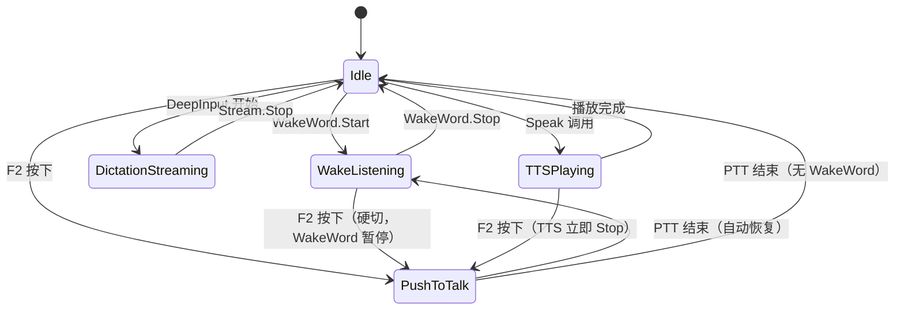

# DeepBase.Speech 能力扩展 — Design Document

> 版本：2.0（基于两轮专家评审 + 开发规范 v2.0）
> 约束：DeepBase 铁律（ConfigDB + DPAPI + Governance + 无 UI）
> 测试框架：DUnitX（单元测试）+ PBT（属性测试，Delphi 原生）

---

## 1. Architecture Overview

### 1.1 现有架构（保持不变）

```
DeepBase/Features/
  DeepBase.Speech.Types.pas          ← 数据类型、接口定义
  DeepBase.Speech.Service.pas        ← 门面 TDeepBaseSpeechService
  DeepBase.Speech.Audio.WinMM.pas    ← ISpeechAudioCapture 实现
  DeepBase.Speech.VAD.pas            ← TDeepBaseSpeechVAD
  DeepBase.Speech.ASR.Baidu.pas      ← ISpeechRecognizer 实现（百度云）
```

### 1.2 扩展后架构（Registry/Config/Policy/Runtime/Schema 五拆）

```
DeepBase/Features/
  ── 现有（不改签名）──
  DeepBase.Speech.Types.pas          ← 扩展新类型（TTS/WakeWord/Voiceprint/Intent）
  DeepBase.Speech.Service.pas        ← 扩展 TSpeechService 类级门面
  DeepBase.Speech.Audio.WinMM.pas    ← 不变
  DeepBase.Speech.VAD.pas            ← 不变
  DeepBase.Speech.ASR.Baidu.pas      ← 不变

  ── 运行时骨架（M1）──
  DeepBase.Speech.Registry.pas       ← Backend 注册、发现、覆盖、禁用
  DeepBase.Speech.Config.pas         ← ConfigDB 键定义、默认值、读写、BCP-47 归一化
  DeepBase.Speech.Policy.pas         ← Governance + Commerce.Permissions 统一策略
  DeepBase.Speech.Runtime.pas        ← 降级链、AudioSession 仲裁、Trace
  DeepBase.Speech.Schema.pas         ← voice_profiles 表迁移（版本 speech_v1）

  ── Phase 1 新增 ──
  DeepBase.Speech.ASR.SAPI.pas       ← SAPI 5.4 Dictation + Grammar ASR
  DeepBase.Speech.TTS.SAPI.pas       ← SAPI 5.4 SpVoice TTS

  ── Phase 2 新增 ──
  DeepBase.Speech.WakeWord.pas       ← SAPI Grammar 长时监听

  ── Phase 4 新增（M7）──
  DeepBase.Speech.MFCC.pas           ← 纯 Delphi MFCC 特征提取（39 维）
  DeepBase.Speech.DTW.pas            ← DTW 距离计算（Sakoe-Chiba 约束）
  DeepBase.Speech.Voiceprint.pas     ← 声纹档案管理 + 验证门面

  ── Phase 5（M8 可选）──
  DeepBase.Speech.ASR.WinRT.pas      ← WinRT SpeechRecognizer（Win10+）
  DeepBase.Speech.Intent.pas         ← 规则 + 可选 LLM 意图解析

DeepBase/Tests/Speech/
  Test.DeepBase.Speech.Types.pas     ← PCM round-trip PBT
  Test.DeepBase.Speech.ASR.SAPI.pas
  Test.DeepBase.Speech.TTS.SAPI.pas
  Test.DeepBase.Speech.WakeWord.pas
  Test.DeepBase.Speech.MFCC.pas      ← MFCC 确定性 PBT
  Test.DeepBase.Speech.DTW.pas       ← DTW 对称性/非负/自距离 PBT
  Test.DeepBase.Speech.Voiceprint.pas← Voiceprint 往返 PBT
```

### 1.3 层次关系

```
消费方（DeepLaunch / DeepInput）
        │
        ▼
  TSpeechService（类级门面，静态方法）
        │
   ┌────┴────────────────────────────────────────────┐
   │                                                 │
   ▼                                                 ▼
Speech.Registry ──── Speech.Runtime ──── Speech.Policy
   │                      │                    │
   │              AudioSession 仲裁       Governance +
   │              降级链 + Trace          Commerce.Permissions
   │
ISpeechRecognizerEx  ITTSBackend  IWakeWordDetector  IVoiceprint  IIntentParser
   │                   │               │                │
SAPI / Baidu /    SAPI / Cloud    SAPI Grammar    MFCC+DTW+ConfigDB
WhisperLocal
        │
  ISpeechAudioCapture（WinMM）
  TDeepBaseSpeechVAD
        │
  Speech.Config（ConfigDB 键管理 + BCP-47 归一化）
  Speech.Schema（voice_profiles 表迁移）
  DeepBase.Security.DPAPI（密钥/声纹加密）
```

### 1.4 AudioSession 仲裁状态机



调度策略：

| 抢占规则 | 决策 |
|---|---|
| WakeWord 常驻中，用户按 F2 | PTT 优先级更高，硬切（WakeWord 暂停） |
| PTT 结束后 | 自动恢复 WakeWord |
| TTS 播报中，用户按 F2 | TTS 立即 Stop（best-effort 150ms / hard-limit 800ms），进入 PTT |
| 两个下游应用同时想抢麦克风 | 先到先得，后到者失败 |

### 1.5 并发模型

- **一个 process 只有一个 SAPI worker thread**，所有 SAPI 调用串行化
- 外部接口只投递命令到 worker thread，不跨线程直接调用 COM 对象
- 回调默认在后台线程触发，消费方负责 `TThread.Synchronize`
- Grammar 热更新必须在 worker thread 内串行执行：停用 → 更新 → commit → 启用

---

## 2. Components and Interfaces

### 2.1 扩展 Types（`DeepBase.Speech.Types.pas`）

```pascal
const
  SPEECH_API_LEVEL = 1;

type
  // ── ASR 扩展 ──
  TASRMode = (asrDictation, asrGrammar, asrCommand);
  TASRBackendKind = (abkBaidu, abkSAPI, abkWhisperLocal, abkWinRT, abkAzure);

  TASROptions = record
    Language: string;
    Mode: TASRMode;
    MaxSilenceMs: Integer;
    MaxDurationMs: Integer;
    class function Create(const ALang: string;
      AMode: TASRMode = asrDictation): TASROptions; static;
  end;

  TASRPartialResult = record
    Text: string;
    IsFinal: Boolean;
  end;

  IASRStream = interface
    ['{A1B2C3D4-0001-0001-0001-000000000001}']
    procedure FeedAudio(const AChunk: TSpeechAudioData);
    procedure SetOnPartial(ACallback: TProc<TASRPartialResult>);
    procedure SetOnFinal(ACallback: TProc<TSpeechRecognitionResult>);
    procedure Stop;
    function IsActive: Boolean;
  end;

  ISpeechRecognizerEx = interface(ISpeechRecognizer)
    ['{A1B2C3D4-0001-0001-0001-000000000002}']
    function Kind: TASRBackendKind;
    function IsAvailable: Boolean;
    function SupportsStreaming: Boolean;
    function StartStreaming(const AOptions: TASROptions): IASRStream;
    procedure LoadGrammar(const AWords: TArray<string>);
  end;

  // ── TTS ──
  TTTSVoice = record
    Id: string;
    Name: string;
    Language: string;
    Gender: string;
  end;

  TTTSOptions = record
    Language: string;
    VoiceId: string;
    Rate: Integer;    // -10..10
    Volume: Integer;  // 0..100
    class function Default: TTTSOptions; static;
  end;

  ITTSBackend = interface
    ['{A1B2C3D4-0002-0001-0001-000000000001}']
    function Name: string;
    function IsAvailable: Boolean;
    function SupportedLanguages: TArray<string>;
    function SupportedVoices(const ALanguage: string): TArray<TTTSVoice>;
    procedure Speak(const AText: string; const AOptions: TTTSOptions);
    procedure SpeakAsync(const AText: string; const AOptions: TTTSOptions;
      ACallback: TProc);
    procedure Stop;
  end;

  // ── WakeWord ──
  TWakeEvent = record
    MatchedWord: string;
    Confidence: Double;
    Timestamp: TDateTime;
    AudioSnippet: TSpeechAudioData;
  end;

  IWakeWordDetector = interface
    ['{A1B2C3D4-0003-0001-0001-000000000001}']
    function IsAvailable: Boolean;
    procedure SetWords(const AWords: TArray<string>);
    function GetWords: TArray<string>;
    procedure SetConfidenceThreshold(AValue: Double);
    function Start: Boolean;
    procedure Stop;
    procedure SetOnWakeDetected(ACallback: TProc<TWakeEvent>);
  end;

  // ── Voiceprint（M7）──
  TVoiceProfileId = string;

  TVoiceProfileInfo = record
    Id: TVoiceProfileId;
    UserLabel: string;
    Purpose: string;
    SampleCount: Integer;
    Threshold: Double;
    OwnerApp: string;
    CreatedAt: TDateTime;
    Enabled: Boolean;
  end;

  TVoiceFeatures = TArray<Double>;

  TVerifyResult = record
    Match: Boolean;
    Score: Double;
    Distance: Double;
  end;

  IVoiceprint = interface
    ['{A1B2C3D4-0004-0001-0001-000000000001}']
    function ExtractFeatures(const AAudio: TSpeechAudioData): TVoiceFeatures;
    function EnrollProfile(const AUserLabel, APurpose: string;
      const ASamples: TArray<TSpeechAudioData>): TVoiceProfileId;
    function DeleteProfile(const AId: TVoiceProfileId): Boolean;
    function ListProfiles(const AOwnerApp: string = ''): TArray<TVoiceProfileInfo>;
    function Verify(const AAudio: TSpeechAudioData;
      const AProfileId: TVoiceProfileId): TVerifyResult;
    function Identify(const AAudio: TSpeechAudioData): TVoiceProfileId;
  end;

  // ── IntentParser（M8）──
  TIntentSlot = record
    Name: string;
    Value: string;
  end;

  TIntentResult = record
    Intent: string;
    Slots: TArray<TIntentSlot>;
    Confidence: Double;
    class function Unknown: TIntentResult; static;
  end;

  IIntentParser = interface
    ['{A1B2C3D4-0005-0001-0001-000000000001}']
    function Name: string;
    function IsAvailable: Boolean;
    function Parse(const AText, ALocale: string): TIntentResult;
    procedure RegisterRule(const APattern, AIntent: string;
      ASlotExtractor: TFunc<string, TArray<TIntentSlot>>);
  end;
```

### 2.2 门面扩展（`DeepBase.Speech.Service.pas`）

```pascal
type
  TSpeechService = class
  public
    class function AudioCapture: ISpeechAudioCapture;
    class function VAD: IVAD;
    class function ASR(AKind: TASRBackendKind = abkBaidu): ISpeechRecognizerEx;
    class function TTS: ITTSBackend;
    class function WakeWord: IWakeWordDetector;
    class function Voiceprint: IVoiceprint;
    class function IntentParser: IIntentParser;

    class function TranscribeFromMic(const ALanguage: string;
      AMaxSeconds: Integer = 30;
      ASilenceTimeoutMs: Integer = 3000): TSpeechRecognitionResult;
    class procedure Speak(const AText: string; const ALanguage: string = '');

    // Backend 注册（initialization 段自注册，下游仅覆盖/禁用/测试替身）
    class procedure RegisterASRBackend(AKind: TASRBackendKind;
      AFactory: TFunc<ISpeechRecognizerEx>);
    class procedure RegisterTTSBackend(AFactory: TFunc<ITTSBackend>);
    class procedure RegisterWakeWordDetector(AFactory: TFunc<IWakeWordDetector>);
    class procedure RegisterVoiceprint(AFactory: TFunc<IVoiceprint>);
    class procedure RegisterIntentParser(AFactory: TFunc<IIntentParser>);
  end;
```

### 2.3 Registry（`DeepBase.Speech.Registry.pas`）

```pascal
type
  TBackendMeta = record
    Kind: TASRBackendKind;
    Name: string;
    IsCloud: Boolean;
    RequiresMic: Boolean;
    SupportsBatch: Boolean;
    SupportsStreaming: Boolean;
    SupportsGrammar: Boolean;
  end;

  TSpeechRegistry = class
  public
    class procedure Register(const AMeta: TBackendMeta; AFactory: TFunc<ISpeechRecognizerEx>);
    class procedure Disable(AKind: TASRBackendKind);
    class procedure Override(AKind: TASRBackendKind; AFactory: TFunc<ISpeechRecognizerEx>);
    class function Discover: TArray<TBackendMeta>;
  end;
```

Backend 自注册在各单元 `initialization` 段完成，下游只做覆盖/禁用/测试替身。

### 2.4 Config（`DeepBase.Speech.Config.pas`）

- ConfigDB 键定义与默认值管理
- BCP-47 归一化：`zh-Hans-CN → zh-CN`、`zh_CN → zh-CN`、`zh → 报错`
- Fallback 策略：未命中已知 locale 时返回错误，不静默 fallback
- 语言键拆分：`speech.asr.language` + `speech.tts.language`

### 2.5 Policy（`DeepBase.Speech.Policy.pas`）

- 统一封装 `Governance.ConfigRegistrar` + `Commerce.Permissions`
- 对上层暴露单一 `IsAllowed(key): Boolean` 查询
- 保守模式：ConfigRegistrar 未初始化时，所有云 Backend 和生物识别能力自动禁用

### 2.6 Runtime（`DeepBase.Speech.Runtime.pas`）

- ASR/TTS 降级链执行
- AudioSession 仲裁状态机
- Trace 日志（高精度时钟 `QueryPerformanceCounter`）
- Stop 时限管理（best-effort + hard-limit 双轨）

---

## 3. Data Models

### 3.1 ConfigDB Settings 键

| 键 | 默认值 | 说明 |
|---|---|---|
| `speech.default.asr_backend` | `auto` | auto/sapi/winrt/baidu/whisper |
| `speech.default.tts_backend` | `sapi` | sapi/cloud |
| `speech.asr.language` | `zh-CN` | BCP-47，ASR 语言 |
| `speech.tts.language` | `zh-CN` | BCP-47，TTS 语言（可独立于 ASR） |
| `speech.wake_word.enabled` | `0` | Governance 门禁 |
| `speech.wake_word.threshold` | `0.7` | 置信度阈值 |
| `speech.wake_word.defer_to_voice_access` | `1` | 检测到 Voice Access 时不启动 |
| `speech.voiceprint.enabled` | `0` | Governance 门禁 |
| `speech.intent.llm_enabled` | `0` | Governance 门禁 |
| `speech.intent.llm_timeout_ms` | `3000` | LLM 超时 |
| `speech.asr.cloud_enabled` | `0` | 云 ASR 门禁 |
| `speech.tts.cloud_enabled` | `0` | 云 TTS 门禁 |
| `speech.tts.defer_to_screen_reader` | `1` | 屏幕阅读器运行时 TTS 静默 |
| `speech.trace.audio_payload_enabled` | `0` | 禁止 Trace 记录 PCM payload |
| `speech.baidu.app_key` | `` | DPAPI 加密 |
| `speech.baidu.secret_key` | `` | DPAPI 加密 |

### 3.2 voice_profiles 表（`DeepBase.Speech.Schema.pas`）

```sql
CREATE TABLE IF NOT EXISTS voice_profiles (
  profile_id    TEXT PRIMARY KEY,
  user_label    TEXT NOT NULL,
  purpose       TEXT NOT NULL,
  sample_count  INTEGER NOT NULL,
  features      BLOB NOT NULL,          -- DPAPI 加密的 MFCC 向量
  features_hmac BLOB,                   -- 预留：HMAC(features||profile_id||owner_app, K_local)
  threshold     REAL NOT NULL DEFAULT 15.0,
  owner_app     TEXT NOT NULL,
  created_at    TEXT NOT NULL,
  updated_at    TEXT NOT NULL,
  enabled       INTEGER NOT NULL DEFAULT 1
);
CREATE INDEX IF NOT EXISTS idx_vp_app     ON voice_profiles(owner_app);
CREATE INDEX IF NOT EXISTS idx_vp_purpose ON voice_profiles(purpose);
```

Schema 通过 `DeepBase.Manager.Schema` 迁移机制注册（版本 `speech_v1`）。`features_hmac` 列 M1 就位，校验逻辑 M7 启用。

### 3.3 DPAPI 存储路径

- API Key：`TDPAPIHelper.ProtectString(AKey)` → `settings.speech.baidu.app_key`
- 声纹特征：`TDPAPIHelper.ProtectBytes(SerializeFeatures(AFeatures))` → `voice_profiles.features`

---

## 4. Backend Implementations

### 4.1 SAPI ASR Backend（`DeepBase.Speech.ASR.SAPI.pas`）

- COM 接口：`ISpRecognizer / ISpRecoContext / ISpRecoGrammar`
- 所有 SAPI 调用在唯一 worker thread 内串行执行
- SAPI 三级能力：
  - **Batch Recognize**（M1）：`Recognize(TSpeechAudioData)` → final result
  - **Live Streaming**（M2）：SAPI 自采麦克风，SAPI events 产生 partial/final
  - **FeedAudio Streaming**（Spike 后决定）：自定义 PCM chunk queue/IStream
- `IsAvailable`：`CoCreateInstance(CLSID_SpInprocRecognizer)` + 枚举 `SPCAT_RECOGNIZERS` 找 zh 开头 token
- Grammar 模式：动态生成 SRGS XML → `LoadCmdFromMemory`

### 4.2 SAPI TTS Backend（`DeepBase.Speech.TTS.SAPI.pas`）

- COM 接口：`ISpVoice`
- `SpeakAsync`：`ISpVoice.Speak(SPF_ASYNC)` + 完成事件线程
- `Stop`：`ISpVoice.Speak(nil, SPF_PURGEBEFORESPEAK)`（best-effort 150ms / hard-limit 800ms）
- Voice 枚举：`ISpObjectTokenCategory` 遍历 `SPCAT_VOICES`，跳过被占用的 voice
- 屏幕阅读器检测：`SystemParametersInfo(SPI_GETSCREENREADER)` → 静默

### 4.3 WakeWord（`DeepBase.Speech.WakeWord.pas`）

- 基于 SAPI Grammar 模式的 `ISpRecoContext`，常驻后台线程
- 词表 → 归一化（全/半角统一、零宽字符剥离）→ SRGS XML → `LoadCmdFromMemory`
- 触发时截取前后 500 ms 音频（环形缓冲区）
- Governance 门禁：`speech.wake_word.enabled`
- Voice Access 检测：进程名 `VoiceAccess.exe`
- Stop：best-effort 300ms / hard-limit 1500ms

### 4.4 MFCC（`DeepBase.Speech.MFCC.pas`）— M7

| 参数 | 值 |
|---|---|
| 帧长 | 25 ms |
| 帧移 | 10 ms |
| 窗函数 | 汉明窗 |
| Mel 滤波器数 | 40 |
| MFCC 系数 | 13 |
| 差分 | 一阶 + 二阶 |
| 总维度 | 39 |
| 输入格式 | 16 kHz PCM16 单声道 |

### 4.5 DTW（`DeepBase.Speech.DTW.pas`）— M7

- Sakoe-Chiba 带宽约束（带宽 = 序列长度 × 0.1）
- 距离度量：欧氏距离
- 归一化距离（除以路径长度）

### 4.6 Voiceprint（`DeepBase.Speech.Voiceprint.pas`）— M7

- `EnrollProfile`：≥3 段样本 → MFCC 提取 → 均值向量 → DPAPI 加密 → 写 `voice_profiles`
- `Verify`：提取 MFCC → DTW 距离 vs 档案均值向量 → `Match = Distance < Threshold`
- `Identify`：遍历所有档案，返回距离最小且 `Match=True` 的 ProfileId
- 定位：本地 speaker check，不用于身份认证

---

## 5. ASR Fallback Chain

```
ConfigDB speech.default.asr_backend = 'auto' 时：
  1. WinRT（Win10+，本地）
  2. SAPI 5.4（Win7+，本地）
  3. WhisperLocal（需 whisper.dll）
  4. Baidu（需 speech.asr.cloud_enabled=Enabled + API Key）
  5. 全部不可用 → EDeepBaseSpeechProviderError

显式指定时：直接尝试，不可用则按上述链回退，记录 Trace 日志。
云 ASR 必须同时满足：门禁 Enabled + 密钥可用。
```

TTS 降级链：
```
  1. SAPI 5.4（默认）
  2. 云 TTS（需 speech.tts.cloud_enabled=Enabled）
  3. 全部不可用 → EDeepBaseSpeechProviderError
```

---

## 6. Threat Model（STRIDE）

| 威胁 | 场景 | 缓解 |
|---|---|---|
| **Spoofing** | 攻击者录音回放触发 WakeWord + Voiceprint | v1 不开 Voiceprint，唤醒后不直接执行高危动作；v2 使用挑战短语 + 随机性 |
| **Tampering** | 篡改 `voice_profiles.features`（DPAPI 加密但可删除/替换） | ConfigDB SQLite 加密为主防线；`features_hmac` 列预留，M7 启用 HMAC 校验 |
| **Repudiation** | 用户否认语音触发的操作 | Trace 日志带 trace_id + 哈希（不记原始音频） |
| **Information Disclosure** | 日志或崩溃 dump 泄漏 PCM / 密钥 / 特征向量 | 禁止 `TSpeechAudioData` 进 Log/Trace；`speech.trace.audio_payload_enabled=0`；SEH dump 过滤 |
| **Denial of Service** | 恶意应用独占麦克风让 WakeWord 饿死 | AudioSession 记录资源抢占，超过阈值触发 Trace 告警；不做强抢 |
| **Elevation of Privilege** | 语音唤醒 → 模拟按键 → 执行管理员操作 | DeepLaunch 语音版明确声明"不执行 UAC/提权操作" |

---

## 7. i18n / Locale Handling

### 7.1 BCP-47 归一化

| 输入 | 归一化结果 |
|---|---|
| `zh-CN` | `zh-CN`（不变） |
| `zh-Hans-CN` | `zh-CN` |
| `zh_CN` | `zh-CN` |
| `zh`（不带区域） | **报错**（要求显式选择） |
| `en-US` | `en-US`（不变） |

### 7.2 SAPI Locale 映射

- SAPI 内部用 LCID（`0x0804` for zh-CN），门面层做 BCP-47 → LCID 转换
- `IsAvailable` 判定：不只看 `CoCreateInstance`，还要枚举 `SPCAT_RECOGNIZERS` 找 zh 开头 token

### 7.3 语言键拆分

- `speech.asr.language`：ASR 识别语言
- `speech.tts.language`：TTS 合成语言（默认等于 asr.language，但可独立）
- 场景：用户输入中文，想听英文回读学习发音

### 7.4 混合语言声明

- Dictation 模式下英文词识别依赖 Backend 能力，不保证
- Grammar 模式下允许中英文混合词表
- Whisper.cpp（M8 后）天然支持混合语言

---

## 8. Accessibility Coexistence

### 8.1 屏幕阅读器冲突

- NVDA/JAWS/Narrator 使用 SAPI TTS
- DeepBase TTS 播报时可能打断屏幕阅读器
- 缓解：`speech.tts.defer_to_screen_reader=1`（默认），检测到屏幕阅读器时 TTS 静默
- 检测方式：`SystemParametersInfo(SPI_GETSCREENREADER)`

### 8.2 Voice Access 冲突

- Win11 Voice Access 与 WakeWord 竞争同一麦克风
- 缓解：`speech.wake_word.defer_to_voice_access=1`（默认），检测到 Voice Access 时不启动
- 检测方式：进程名 `VoiceAccess.exe`

### 8.3 SAPI Voice 占用

- 默认 voice 选择规则：跳过被其他进程占用的 voice，选第一个 idle 的

---

## 9. Packaging（dpk 切分）

| dpk | 内容 | 谁用 |
|---|---|---|
| `DeepBaseFeatures.dpk` | Core: Types / Service / Registry / Config / Policy / Runtime / AudioCapture / VAD | 所有下游 |
| `DeepBaseFeaturesASR.dpk` | ASR Backend（SAPI/Baidu/WinRT） | DeepInput / DeepLaunch |
| `DeepBaseFeaturesTTS.dpk` | TTS Backend | DeepLaunch |
| `DeepBaseFeaturesWake.dpk` | WakeWord + AudioSession 仲裁扩展 | DeepLaunch（语音版） |
| `DeepBaseFeaturesVoice.dpk` | MFCC + DTW + Voiceprint | DeepLaunch v2.0（M7） |

ABI 规则：
- 所有 interface 声明 GUID
- 新增方法走新接口（如 `IASRStream2 = interface(IASRStream)`）
- `const SPEECH_API_LEVEL = 1` 供下游检查
- 不在已发布 record 上加新字段，扩展用新 record 类型
- 最低 Delphi 版本：`CompilerVersion >= 37.0`

---

## 10. Correctness Properties

*A property is a characteristic or behavior that should hold true across all valid executions of a system — essentially, a formal statement about what the system should do. Properties serve as the bridge between human-readable specifications and machine-verifiable correctness guarantees.*

### P1: PCM16 往返
*For any* byte array `B` of even length, `FloatToPCM16(PCM16ToFloat(B))` should produce a byte array identical to `B`.
**Validates: Requirements 15.1**

### P2: Float 往返量化误差
*For any* `Single` array `S` with values in `[-1.0, 1.0)`, each element of `PCM16ToFloat(FloatToPCM16(S))` should differ from the corresponding element of `S` by less than `1/32768`.
**Validates: Requirements 15.2**

### P3: DurationMs 公式
*For any* valid `TSpeechAudioData` with non-zero SampleRate, `DurationMs` should equal `round(Length(PCMData) * 1000 / BytesPerSecond)`.
**Validates: Requirements 9.4**

### P4: PCM16ToFloat 范围
*For any* byte array `B` of even length, `PCM16ToFloat(B)` should produce an array of length `Length(B) div 2` where every value is in `[-1.0, 1.0]`.
**Validates: Requirements 9.3**

### P5: ExtractFeatures 确定性
*For any* valid PCM16 audio of duration ≥ 100ms, two calls to `ExtractFeatures` with the same input should produce identical feature vectors.
**Validates: Requirements 5.6**

### P6: DTW 对称性
*For any* two non-empty feature vectors `X` and `Y`, `|DTW(X, Y) - DTW(Y, X)| < 1e-9`.
**Validates: Requirements 5.5 (indirect)**

### P7: DTW 非负性与自距离
*For any* non-empty feature vectors `X` and `Y`, `DTW(X, Y) ≥ 0` and `DTW(X, X) = 0`.
**Validates: Requirements 5.5 (indirect)**

### P8: Verify Match 等价于 Distance < Threshold
*For any* registered profile `P` and audio `A`, `Verify(A, P.Id).Match` should equal `Verify(A, P.Id).Distance < P.Threshold`.
**Validates: Requirements 5.5**

### P9: Verify 确定性
*For any* audio `A` and profile ID, two calls to `Verify(A, ProfileId)` should produce identical results.
**Validates: Requirements 5.7**

### P10: IntentParser 幂等
*For any* text string and locale, two calls to `Parse(text, locale)` should produce identical `TIntentResult`.
**Validates: Requirements 6.4**

### P11: IntentParser 增量注册不影响已有规则
*For any* registered rule set `R` and new rule `r` (non-conflicting), after `RegisterRule(r)`, `Parse(text)` for text matching a rule in `R` should still return the same result.
**Validates: Requirements 6.7**

### P12: 配置读写幂等
*For any* Speech config key and valid value, `WriteConfig(key, value)` then `ReadConfig(key)` should return `value`.
**Validates: Requirements 7.6**

### P13: 热词词表往返
*For any* array of valid Chinese words (each length ≥ 2, no control characters), `SetWords(words)` followed by `GetWords()` should return a set equal to the input set.
**Validates: Requirements 16.1**

### P14: 声纹特征 DPAPI 往返
*For any* non-empty `TVoiceFeatures`, serializing → DPAPI encrypting → storing → reading → DPAPI decrypting → deserializing should produce a vector element-wise equal to the original.
**Validates: Requirements 15.3**

---

## 11. Error Handling

| 场景 | 行为 |
|---|---|
| Backend 不可用 | `IsAvailable=False`，`CheckStatus` 返回可读原因（含缺失 token 名） |
| 密钥缺失/解密失败 | `IsAvailable=False`，不透露密钥内容 |
| 麦克风不可用 | `StartRecording=False`，`LastError` 含 "no input device" |
| 云 HTTP 超时 | `Status=srsHttpError`，`ErrorMessage` 含超时秒数 |
| Governance 门禁拒绝 | 抛出 `EDeepBaseGovernanceError` |
| 空音频 | `Status=srsEmptyAudio`，不调用云 API |
| DPAPI 失败 | 抛出 `EDeepBaseSpeechError`，不落盘明文 |
| Stop 超时（超过 hard-limit） | 强制终止（WakeWord: TerminateThread; TTS: CoDisconnectObject; ASR: OnFinal(Error=Timeout)） |
| AudioSession 冲突 | 后到者获得失败结果，Trace 记录冲突 |

---

## 12. Testing Strategy

### 12.1 CI 分层

| 测试线 | 内容 | 频次 |
|---|---|---|
| `speech-headless` | Types PBT / Registry / Config / Policy / Schema 迁移 / DPAPI 往返（mock）/ fake Backend | PR 必跑 |
| `speech-windows-sapi-nightly` | 真 SAPI ASR batch / SAPI TTS / 语言包探测 / 空数据路径 | 每日 |
| `speech-hardware-manual` | WakeWord 误触率 / 设备并发 / PTT 时延 / AudioSession 状态切换 | Manual/验收 |

### 12.2 单元测试（DUnitX）

- 每个 Backend 的 `IsAvailable / CheckStatus` 在有/无 SAPI 环境下的行为
- `TSpeechAudioData.DurationMs` 边界值
- `TTTSOptions.Default` 字段完整性
- `TIntentResult.Unknown` 字段值
- Governance 门禁拒绝路径（mock ConfigRegistrar）
- AudioSession 状态切换
- BCP-47 归一化

### 12.3 属性测试（PBT）

- P1–P4：音频编解码往返（无需硬件）
- P5–P9：MFCC/DTW/Voiceprint 数学属性（M7）
- P10–P11：IntentParser 幂等/增量（M8）
- P12：ConfigDB 读写幂等
- P13：热词词表往返
- P14：DPAPI 往返（需 Windows 环境）

每个 PBT 最少 100 次迭代。Tag 格式：`Feature: deepbase-speech, Property N: {property_text}`

### 12.4 Phase Gate

| 里程碑 | 发布门槛 |
|---|---|
| M1 | 现有测试全通过 + Backend contract fake + SAPI 不存在时不可用路径 + 云 ASR 默认禁用 + ConfigDB 默认键幂等 |
| M2 | FeedAudio 可行性结论 + 低延迟采集不影响 batch + AudioSession 仲裁单元测试 + Trace 覆盖 |
| M5 | WakeWord fake 测试 + 真实麦克风验收（CPU/内存/误触率/漏触率/Stop 时延） |
| M7 | MFCC/DTW PBT + Golden speech set + features 加密验证 + owner_app 隔离 + 删除可撤回 |

---

## 13. Migration Notes

### 13.1 现有 Baidu 使用方
- `TDeepBaseSpeechService.CreateBaidu` 签名不变
- `ISpeechRecognizer` 接口不变
- 新增 `ISpeechRecognizerEx` 扩展接口

### 13.2 DeepInput 完全重构（Strategy A，D2 已决策）
- DeepInput 拆掉所有内部语音代码，直接调用 `TSpeechService`
- M3 任务：列出 DeepInput 语音单元 → 逐一替换 → 删除旧代码 → 回归测试
- 无 Adapter 层，无双层维护（DeepInput 未发布，无回归压力）

### 13.3 依赖图

```
DeepBase.Speech.*
  ├─ DeepBase.Core.*                    （ConfigDB、Schema、Logger）
  ├─ DeepBase.Security.DPAPI            （密钥/声纹加密）
  ├─ DeepBase.Governance.ConfigRegistrar（门禁注册）
  ├─ DeepBase.Commerce.Permissions      （共存，Speech.Policy 统一封装）
  └─ DeepBase.LLM.Client                （M8 IntentParser 可选）
```
