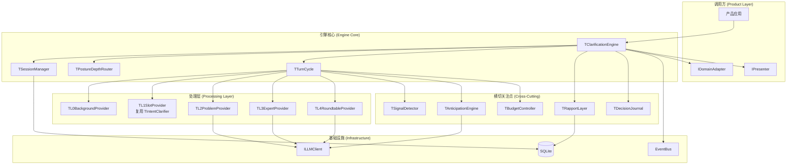
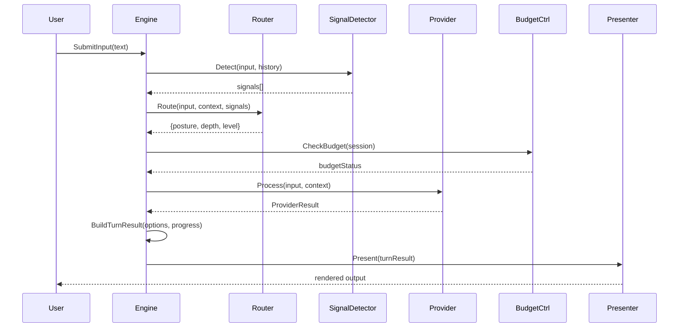
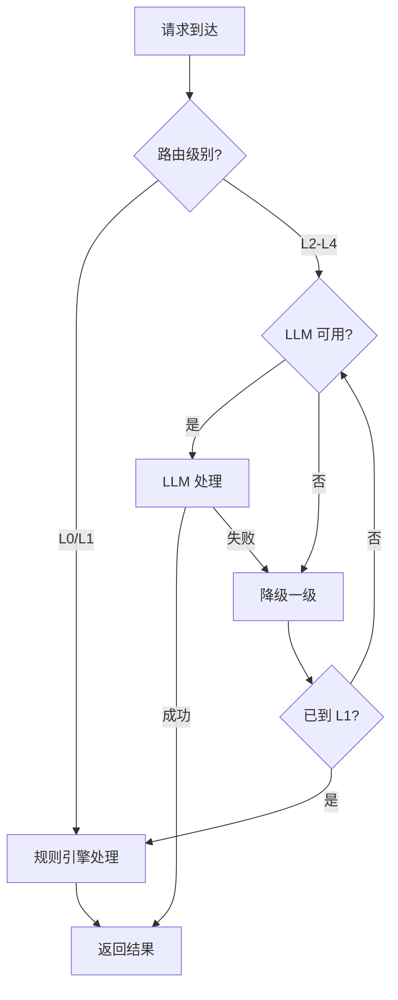

# 设计文档：意图澄清模块 (Intent Clarification Module)

## 概述

意图澄清模块是 DeepBase 框架的核心可插拔引擎，基于"姿态×深度"内部模型对外呈现 L0-L4 五级澄清体系。引擎采用 Fan-out/Fan-in 并行处理架构，多个分析器并发运行后由 Merger 决定最终输出。

现有 `DeepBase.IntentClarification.pas` 中的 `TIntentClarifier` 将作为 L1 Provider 保留，新引擎在其上层构建统一的会话管理和多级别路由能力。

### 设计目标

- L0/L1 零 LLM 依赖（纯规则引擎）
- L2-L4 通过 ILLMClient 接口调用，支持降级
- 插件化架构，产品通过实现 IDomainAdapter + IPresenter 即可接入
- 会话可序列化、可恢复、可跨天续接
- 与现有 EventBus、Governance、LLM.Client 模块无缝集成

## 架构

### 整体架构图



### 轮次循环 (Turn Cycle)



## 组件与接口

### 核心接口

```pascal
type
  // === 引擎主接口 ===
  IClarificationEngine = interface
    ['{E1A2B3C4-D5E6-7890-ABCD-111111111111}']
    function StartSession(const ARequest: TClarificationStartRequest): TSessionHandle;
    function SubmitInput(const AHandle: TSessionHandle; const AInput: string): TTurnResult;
    function SuspendSession(const AHandle: TSessionHandle): TSuspendResult;
    function ResumeSession(const AHandle: TSessionHandle): TResumeResult;
    function CancelSession(const AHandle: TSessionHandle): TCancelResult;
    function GetSessionState(const AHandle: TSessionHandle): TSessionState;
  end;

  // === 领域适配器 ===
  IDomainAdapter = interface
    ['{E1A2B3C4-D5E6-7890-ABCD-222222222222}']
    function GetDomainName: string;
    function GetMaxLevel: TClarificationLevel;
    function GetContextForSession(const ASessionId: string): TDomainContext;
    function GetDomainKnowledge(const ATopic: string): string;
    function GetPresetSlots(const AIntentName: string): TArray<TIntentClarificationSlot>;
  end;

  // === 呈现器 ===
  IPresenter = interface
    ['{E1A2B3C4-D5E6-7890-ABCD-333333333333}']
    procedure PresentTurn(const ATurnResult: TTurnResult);
    procedure PresentExit(const AExitResult: TExitResult);
    procedure PresentError(const AError: TClarificationError);
  end;

  // === 可选接口 ===
  IPersonaRegistry = interface
    ['{E1A2B3C4-D5E6-7890-ABCD-444444444444}']
    function GetPersona(const AId: string): TPersonaProfile;
    function FindBestMatch(const AContext: TDomainContext): TPersonaProfile;
    function FindComplementaryPanel(const AContext: TDomainContext;
      ACount: Integer): TArray<TPersonaProfile>;
  end;

  IAnticipationEngine = interface
    ['{E1A2B3C4-D5E6-7890-ABCD-555555555555}']
    function Predict(const AContext: TAnticipationContext): TAnticipationResult;
    procedure FeedbackPositive(const APredictionId: string);
    procedure FeedbackNegative(const APredictionId: string);
  end;

  IFeasibilityChecker = interface
    ['{E1A2B3C4-D5E6-7890-ABCD-666666666666}']
    function Check(const AIntent: TResolvedIntent): TFeasibilityResult;
  end;

  ILearningAdapter = interface
    ['{E1A2B3C4-D5E6-7890-ABCD-777777777777}']
    procedure RecordPattern(const APattern: TUserPattern);
    function ShouldAutoFill(const ASlotName: string; const AContext: TDomainContext): TAutoFillSuggestion;
  end;
```

### 级别处理器接口

```pascal
type
  ILevelProvider = interface
    ['{E1A2B3C4-D5E6-7890-ABCD-888888888888}']
    function GetLevel: TClarificationLevel;
    function CanHandle(const AContext: TProcessingContext): Boolean;
    function Process(const AContext: TProcessingContext): TProviderResult;
    function RequiresLLM: Boolean;
  end;
```

## 数据模型

### 会话状态

```pascal
type
  TSessionStatus = (
    ssActive,
    ssSuspended,
    ssCompleted,
    ssArchived
  );

  TClarificationLevel = (
    clL0,  // 背景识别
    clL1,  // 指令型
    clL2,  // 问题识别型
    clL3,  // 单专家指导
    clL4   // 多专家决策
  );

  TPosture = (
    posExecutive,
    posClarifying,
    posExploring,
    posAdvisory,
    posReflective
  );

  TSessionState = record
    SessionId: string;
    Status: TSessionStatus;
    CurrentPosture: TPosture;
    CurrentDepth: Double;        // 0.0-1.0
    CurrentLevel: TClarificationLevel;
    TurnCount: Integer;
    CreatedAt: TDateTime;
    LastActiveAt: TDateTime;
    UserId: string;
    DomainName: string;
    IntentName: string;
    Slots: TArray<TIntentClarificationSlot>;
    Hypotheses: TArray<THypothesis>;
    Signals: TArray<TDetectedSignal>;
    CheckpointJson: string;
  end;
```

### 轮次结果

```pascal
type
  TOptionItem = record
    Number: Integer;           // 1-8
    Text: string;
    Value: string;
    IsRecommended: Boolean;
  end;

  TProgressHint = record
    CurrentTurn: Integer;
    EstimatedRemaining: Integer;
    Message: string;           // e.g. "再问一个问题就可以开始了"
  end;

  TTurnResult = record
    SessionId: string;
    TurnNumber: Integer;
    Status: TSessionStatus;
    Level: TClarificationLevel;
    Posture: TPosture;
    Question: string;
    Options: TArray<TOptionItem>;  // 1-8 实质选项
    RecommendedOption: Integer;    // 推荐选项编号
    Scaffolds: TArray<string>;     // 假设/脚手架
    ProgressHint: TProgressHint;
    EchoConfirmation: string;      // 回声确认
    DegradationInfo: string;       // 降级信息（如有）
    Signals: TArray<TDetectedSignal>;
    AcceptsFreeText: Boolean;      // 始终为 True
    Source: string;                // 'rule' | 'llm' | 'rule_fallback'
    ErrorCode: string;
    ErrorMessage: string;
  end;
```

### 信号模型

```pascal
type
  TSignalKind = (
    skHesitation,
    skContradiction,
    skFrustration,
    skAvoidance,
    skBreakthrough
  );

  TDetectedSignal = record
    Kind: TSignalKind;
    Confidence: Double;        // 0.0-1.0
    Evidence: string;
    DetectedAt: TDateTime;
  end;
```

### 融洽度模型

```pascal
type
  TRapportProfile = record
    UserId: string;
    TrustLevel: Double;        // 0.0-1.0
    Familiarity: Double;       // 0.0-1.0
    PreferredDepth: Double;    // 0.0-1.0
    CommunicationStyle: string; // 'direct' | 'exploratory' | 'empathetic'
    Boundaries: TArray<string>;
    LastUpdated: TDateTime;
  end;
```

### 预判模型

```pascal
type
  TAnticipationSource = (
    asTemporalPattern,
    asOperationSequence,
    asContextualState,
    asHistoricalPattern
  );

  TAnticipationResult = record
    PredictionId: string;
    PredictedIntent: string;
    Confidence: Double;
    Sources: TArray<TAnticipationSource>;
    Evidence: string;          // 透明证据说明
  end;
```

### 预算模型

```pascal
type
  TBudgetConfig = record
    MaxTurns: Integer;
    MaxTimeSeconds: Integer;
    MaxCognitiveLoad: Integer;  // 1-10 scale
    UserPatienceThreshold: Double;
  end;

  TBudgetStatus = record
    TurnsUsed: Integer;
    TurnsRemaining: Integer;
    TimeElapsedMs: Int64;
    IsExhausted: Boolean;
    ShouldExit: Boolean;
  end;
```

### 会话序列化

```pascal
type
  TSessionCheckpoint = record
    Version: Integer;          // 序列化版本号
    SessionState: TSessionState;
    RapportSnapshot: TRapportProfile;
    TurnHistory: TArray<TTurnRecord>;
    OpenQuestions: TArray<string>;
    ResumeHint: string;
    SerializedAt: TDateTime;

    function ToJson: string;
    class function FromJson(const AJson: string): TSessionCheckpoint; static;
  end;
```

### 预设模板

```pascal
type
  TPresetTemplate = record
    Name: string;              // 'tool-command' | 'creative-assistant' | 'decision-advisor'
    MaxLevel: TClarificationLevel;
    DefaultPosture: TPosture;
    Style: string;             // 'direct' | 'exploratory' | 'empathetic'
    BudgetConfig: TBudgetConfig;
    EnableAnticipation: Boolean;
    EnablePersonas: Boolean;
    PersonaPack: string;       // 专家包名称

    class function ToolCommand: TPresetTemplate; static;
    class function CreativeAssistant: TPresetTemplate; static;
    class function DecisionAdvisor: TPresetTemplate; static;
  end;
```


## 正确性属性 (Correctness Properties)

*属性是系统在所有有效执行中应保持为真的特征或行为——本质上是关于系统应该做什么的形式化陈述。属性作为人类可读规范与机器可验证正确性保证之间的桥梁。*

### Property 1: 会话 ID 唯一性
*For any* 两次 StartSession 调用（无论请求参数是否相同），返回的 SessionId SHALL 互不相同。
**Validates: Requirements 1.1**

### Property 2: 新会话不变量
*For any* 有效的 TClarificationStartRequest，创建的 Session 状态 SHALL 满足：Status = ssActive，CreatedAt ≤ Now，TurnCount = 0。
**Validates: Requirements 1.2**

### Property 3: 轮次循环完备性
*For any* Active 状态的 Session 和任意非空字符串输入，SubmitInput SHALL 返回一个有效的 TTurnResult（不抛出异常，不返回 nil）。
**Validates: Requirements 1.3, 3.5**

### Property 4: 选项 0 触发退出
*For any* Active 状态的 Session，当用户输入 "0" 时，Session 状态 SHALL 转为 Completed 或向上一层退出。
**Validates: Requirements 1.4, 3.4**

### Property 5: 挂起-恢复往返
*For any* Active 状态的 Session，执行 Suspend 后再 Resume，Session 状态 SHALL 恢复为 Active 且关键上下文（Slots、Hypotheses、TurnCount）与挂起前等价。
**Validates: Requirements 1.6**

### Property 6: 错误弹性
*For any* 导致内部处理异常的输入，Engine SHALL 返回包含 ErrorCode 和 ErrorMessage 的 TTurnResult 而非抛出未处理异常。
**Validates: Requirements 1.7, 14.4**

### Property 7: 深度-级别映射正确性
*For any* Depth 值 d ∈ [0.0, 1.0]，DepthToLevel(d) SHALL 返回：d < 0.2 → L0，d < 0.4 → L1，d < 0.6 → L2，d < 0.8 → L3，d ≥ 0.8 → L4。
**Validates: Requirements 2.2, 2.3, 2.4, 2.5, 2.6**

### Property 8: MaxLevel 钳制
*For any* Depth 值和 DomainAdapter 配置的 MaxLevel，路由结果的 Level SHALL 不超过 MaxLevel。
**Validates: Requirements 2.8**

### Property 9: 选项数量不变量
*For any* 需要用户响应的 TTurnResult，Options 数量 SHALL 在 [1, 8] 范围内，且恰好有一个 IsRecommended = True 的选项。
**Validates: Requirements 3.1, 3.2, 3.7**

### Property 10: 重新生成产生不同输出
*For any* Session 状态，连续两次输入 "9" 产生的 TTurnResult.Question SHALL 不完全相同。
**Validates: Requirements 3.3**

### Property 11: 进度提示始终存在
*For any* TTurnResult，ProgressHint.Message SHALL 为非空字符串。
**Validates: Requirements 3.6, 15.4**

### Property 12: L0/L1 零 LLM 依赖
*For any* 路由到 L0 或 L1 的请求，处理过程中 ILLMClient 的调用次数 SHALL 为 0。
**Validates: Requirements 4.1**

### Property 13: L1 委托给 TIntentClarifier
*For any* L1 级别请求，Engine 产生的槽位填充结果 SHALL 与直接调用 TIntentClarifier.Clarify 的结果等价。
**Validates: Requirements 4.2**

### Property 14: 优雅降级路径
*For any* LLM 不可用时的 L2-L4 请求，Engine SHALL 返回有效的 TTurnResult 且 DegradationInfo 非空，实际处理级别 SHALL 低于请求级别。
**Validates: Requirements 4.4, 4.5, 14.1, 14.2, 14.3**

### Property 15: L2 至少产生一个脚手架
*For any* L2 级别的 TTurnResult，Scaffolds 数组长度 SHALL ≥ 1。
**Validates: Requirements 5.2**

### Property 16: 否认假设排除
*For any* 被用户否认的假设 H，后续轮次的 Scaffolds SHALL 不包含与 H 语义等价的假设。
**Validates: Requirements 5.3**

### Property 17: 预算限制轮次数
*For any* Session 配置了 BudgetConfig.MaxTurns = N，该 Session 的实际轮次数 SHALL ≤ N，超出时自动触发退出。
**Validates: Requirements 5.5, 10.3**

### Property 18: L3 专家角色一致性
*For any* L3 Session 中连续的轮次序列（无切换请求），所有轮次使用的专家角色 SHALL 相同。
**Validates: Requirements 6.4**

### Property 19: L4 面板规模
*For any* L4 级别的处理，选择的专家面板人数 SHALL 在 [2, 4] 范围内。
**Validates: Requirements 7.1**

### Property 20: L4 发言者标识
*For any* L4 TTurnResult 中的每个观点条目，SHALL 包含非空的发言者身份标识。
**Validates: Requirements 7.2**

### Property 21: 信号检测每轮运行
*For any* Active Session 的轮次，TTurnResult.Signals SHALL 被填充（可以为空数组但不为 nil/未初始化）。
**Validates: Requirements 8.1**

### Property 22: 信号置信度范围
*For any* TDetectedSignal，Confidence SHALL 在 [0.0, 1.0] 范围内。
**Validates: Requirements 8.6**

### Property 23: 犹豫增加脚手架
*For any* 检测到 Hesitation 信号的轮次，Scaffolds 数量 SHALL ≥ 未检测到 Hesitation 时的基准数量。
**Validates: Requirements 8.2**

### Property 24: 挫败触发 Executive 姿态
*For any* 检测到 Frustration 信号的轮次，结果 Posture SHALL 向 Executive 方向偏移（Posture = posExecutive 或 EstimatedRemaining 减少）。
**Validates: Requirements 8.3**

### Property 25: 突破减少剩余轮次
*For any* 检测到 Breakthrough 信号的轮次，ProgressHint.EstimatedRemaining SHALL 小于前一轮的值。
**Validates: Requirements 8.5**

### Property 26: 高置信预判进入选项
*For any* AnticipationResult 置信度超过配置阈值时，该预判 SHALL 出现在 TTurnResult.Options 中。
**Validates: Requirements 9.2**

### Property 27: 预判证据非空
*For any* 呈现给用户的 AnticipationResult，Evidence 字段 SHALL 为非空字符串。
**Validates: Requirements 9.3**

### Property 28: 无可选组件时引擎正常运行
*For any* 未注册 IAnticipationEngine、IPersonaRegistry、IFeasibilityChecker 的 Engine 实例，StartSession 和 SubmitInput SHALL 正常返回有效结果。
**Validates: Requirements 9.5, 12.4, 12.5**

### Property 29: 退出产生恢复提示
*For any* 退出路径（用户取消、预算耗尽、自动完成），结果中 ResumeHint SHALL 为非空字符串。
**Validates: Requirements 10.1, 10.5**

### Property 30: 槽位全满触发自动完成
*For any* Session 中所有 Required Slot 的 Confidence ≥ MinSlotConfidence，Engine SHALL 将 Session 状态转为 Completed。
**Validates: Requirements 10.2**

### Property 31: 持续挫败触发退出提议
*For any* 连续 N 轮（N ≥ 配置阈值）检测到 Frustration 信号的 Session，Engine SHALL 在 TTurnResult 中包含退出提议。
**Validates: Requirements 10.4**

### Property 32: 无死循环
*For any* 长度为 M 的随机输入序列，Engine 处理每个输入 SHALL 在有限时间内返回（不阻塞），且最终 Session 状态为 Completed 或 Suspended。
**Validates: Requirements 10.6**

### Property 33: 融洽度字段有效性
*For any* TRapportProfile，TrustLevel、Familiarity、PreferredDepth SHALL 在 [0.0, 1.0] 范围内，CommunicationStyle SHALL 为预定义值之一。
**Validates: Requirements 11.1**

### Property 34: 会话完成更新融洽度
*For any* 完成的 Session，对应用户的 RapportProfile.LastUpdated SHALL 大于 Session 开始时的值。
**Validates: Requirements 11.2**

### Property 35: 融洽度影响初始状态
*For any* 具有高 PreferredDepth 的用户，新 Session 的初始 Depth SHALL 高于默认值；具有低 PreferredDepth 的用户，初始 Depth SHALL 低于默认值。
**Validates: Requirements 11.3**

### Property 36: 低信任保守策略
*For any* TrustLevel < 阈值的用户，Engine 生成的 Scaffolds 数量 SHALL ≤ 高信任用户的数量，且确认请求频率更高。
**Validates: Requirements 11.4**

### Property 37: 融洽度持久化往返
*For any* 有效的 TRapportProfile，保存到 SQLite 后再加载 SHALL 产生等价的对象。
**Validates: Requirements 11.5**

### Property 38: 模板覆盖保留非覆盖值
*For any* 预设模板和单个配置覆盖项，覆盖后的配置中未被覆盖的字段 SHALL 保持模板原始值。
**Validates: Requirements 13.4**

### Property 39: 模板验证报告缺失
*For any* 不完整的模板配置（缺少必填字段），验证 SHALL 返回包含缺失字段名称的错误列表。
**Validates: Requirements 13.5**

### Property 40: 确认时回声复述
*For any* 用户确认意图的轮次，TTurnResult.EchoConfirmation SHALL 为非空字符串。
**Validates: Requirements 15.1**

### Property 41: 会话序列化往返
*For any* 有效的 TSessionCheckpoint，ToJson 后再 FromJson SHALL 产生等价的对象。
**Validates: Requirements 16.3**

### Property 42: 损坏 JSON 返回错误
*For any* 非法或损坏的 JSON 字符串，FromJson SHALL 返回描述性错误而非抛出异常或产生无效状态。
**Validates: Requirements 16.4**

### Property 43: Session SQLite 持久化往返
*For any* 有效的 TSessionCheckpoint，写入 SQLite 后再读取 SHALL 产生等价的对象。
**Validates: Requirements 16.5**

## 错误处理

### 错误分类

| 错误类型 | 处理策略 | 用户影响 |
|---------|---------|---------|
| LLM 调用失败 | 逐级降级 L4→L0 | 功能降级但不中断 |
| LLM 响应超时 | 配置超时后降级 | 短暂延迟后降级 |
| LLM 响应格式错误 | 回退到规则引擎 | 透明降级 |
| Session 序列化失败 | 返回错误，不丢失内存状态 | 提示保存失败 |
| Session 反序列化失败 | 返回错误，建议新建 | 提示恢复失败 |
| DomainAdapter 异常 | 使用默认适配器 | 功能可能受限 |
| 预算耗尽 | 最佳猜测+安全措施退出 | 提供当前最佳理解 |
| 信号检测异常 | 跳过信号，继续处理 | 无感知 |

### 错误传播规则

1. 引擎核心层永不抛出异常到调用方——所有异常在内部捕获并转为 TTurnResult.ErrorCode/ErrorMessage
2. 横切关注点（信号检测、预判、融洽度）的失败不影响主流程
3. 级别处理器的失败触发降级而非中断
4. 持久化层的失败不影响当前会话的内存操作

### 降级决策流程



## 测试策略

### 属性测试 (Property-Based Testing)

使用 **DUnitX + 自定义 PBT 框架**（基于 QuickCheck 思想的 Delphi 实现）进行属性测试。

**配置**：
- 每个属性测试最少运行 100 次迭代
- 每个测试标注对应的设计属性编号
- 标签格式：`Feature: intent-clarification, Property N: {property_text}`

**重点属性测试领域**：
- 深度-级别映射（Property 7）：生成随机 Double 值验证映射正确性
- 会话序列化往返（Property 41）：生成随机 SessionCheckpoint 验证 JSON 往返
- 融洽度持久化往返（Property 37）：生成随机 RapportProfile 验证 SQLite 往返
- 选项数量不变量（Property 9）：生成随机 TurnResult 验证选项约束
- 错误弹性（Property 6）：生成随机异常场景验证不崩溃
- MaxLevel 钳制（Property 8）：生成随机 Depth + MaxLevel 组合验证钳制
- 模板覆盖（Property 38）：生成随机覆盖组合验证保留性

### 单元测试

**重点单元测试领域**：
- 预设模板具体配置值（Requirements 13.1-13.3）
- L0 规则路由具体场景（Requirements 4.3）
- 信号检测具体模式识别
- 降级路径具体场景
- 现有 TIntentClarifier 集成兼容性

### 集成测试

- Engine + SQLite 持久化层端到端
- Engine + Mock LLM 完整轮次循环
- Engine + EventBus 事件发布验证
- 多 Session 并发操作

### 测试分层

```
┌─────────────────────────────────┐
│     集成测试 (Integration)       │  Engine + 外部依赖
├─────────────────────────────────┤
│     属性测试 (Property-Based)    │  核心逻辑正确性
├─────────────────────────────────┤
│     单元测试 (Unit)              │  具体场景和边界
└─────────────────────────────────┘
```
