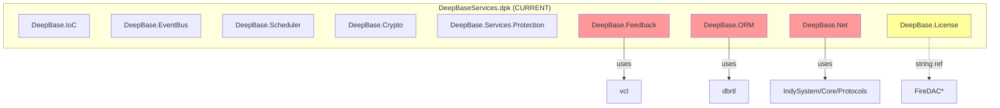
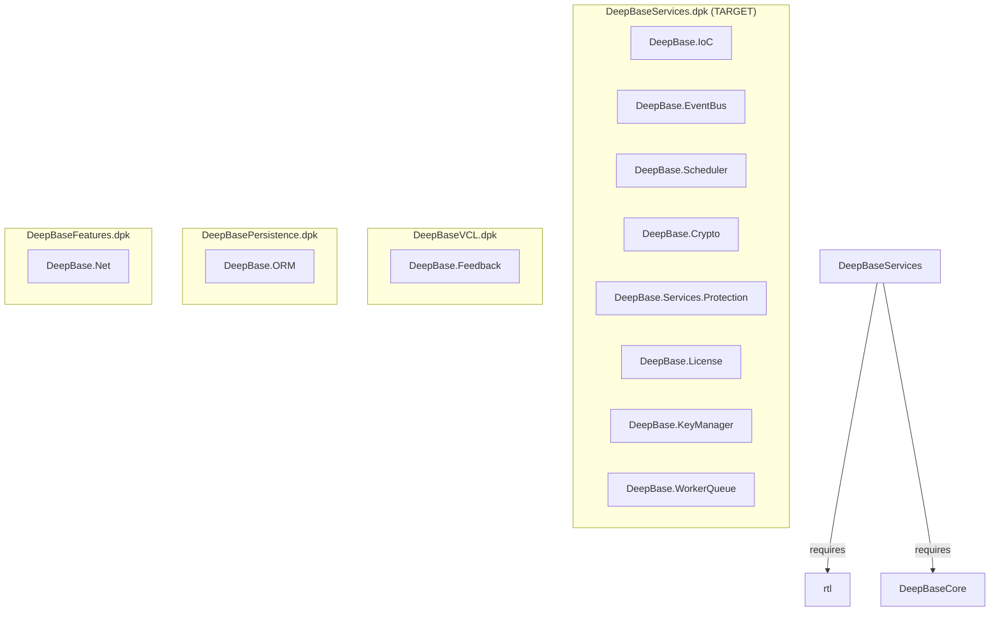
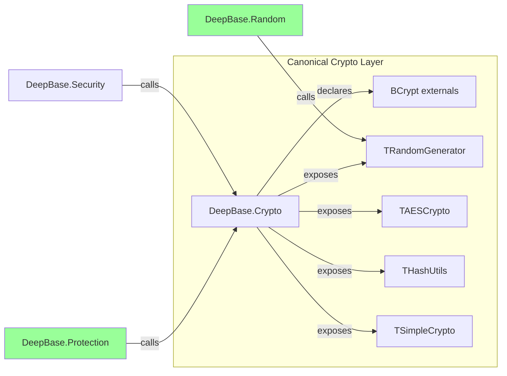

# Design Document: Services/Crypto/Config Refactor

## Overview

This refactoring addresses three tightly coupled architectural issues in the DeepBase framework:

1. **Services Package Boundary Split (BASIC-001)**: Remove VCL, Indy, dbrtl, and FireDAC dependencies from `DeepBaseServices.dpk` by relocating violating units to their natural package homes.
2. **Crypto Primitive Unification (BASIC-016)**: Consolidate three independent Windows CryptoAPI/CNG external declarations into a single canonical layer in `DeepBase.Crypto`.
3. **Config API Breaking Change (BASIC-026)**: Remove deprecated `GetConfigEncrypted`/`SetConfigEncrypted` from `IDeepBaseConfig` and direct callers to `ISecuritySecretStorage`.

The changes are sequenced so that crypto unification happens first (enabling `DeepBase.Protection` and `DeepBase.Random` to shed their own externals), then the config interface cleanup (removing dead code), and finally the package boundary split (moving units to their correct packages).

## Architecture

### Current State



### Target State



### Crypto Consolidation Architecture



## Components and Interfaces

### 1. Unit Relocation Map

| Unit | Current Package | Target Package | Reason |
|------|----------------|----------------|--------|
| `DeepBase.Feedback` | Services | VCL | Uses `Vcl.Graphics`, `Vcl.Forms` for screenshots |
| `DeepBase.ORM` | Services | Persistence | Uses `Data.DB` in interface section |
| `DeepBase.Net` | Services | Features | Uses Indy units in interface section |
| `DeepBase.License` | Services | Services (stays) | Remove FireDAC string references |

### 2. Crypto Layer Refactoring

**Current duplication:**
- `DeepBase.Random.pas`: Declares `CryptAcquireContext`, `CryptReleaseContext`, `CryptGenRandom` from `advapi32.dll`
- `DeepBase.Protection.pas`: Declares all of the above PLUS full BCrypt/CNG externals (BCryptOpenAlgorithmProvider, BCryptGenRandom, BCryptEncrypt, BCryptDecrypt, etc.)
- `DeepBase.Crypto.pas`: Declares BCrypt externals independently (BCryptOpenAlgorithmProvider, BCryptGenRandom, BCryptEncrypt, BCryptDecrypt, etc.)

**Target:**
- `DeepBase.Crypto.pas` becomes the single source of truth for all CNG/BCrypt externals and the `TRandomGenerator.RandomBytes` function
- `DeepBase.Random.pas` removes its own CryptoAPI externals and calls `TRandomGenerator.RandomBytes` from `DeepBase.Crypto`
- `DeepBase.Protection.pas` removes its own BCrypt externals and calls `DeepBase.Crypto` for AES-GCM and random byte generation

### 3. Config Interface Change

**Remove from `IDeepBaseConfig`:**
```pascal
// REMOVED:
function GetConfigEncrypted(const Key: string; const Default: string = ''): string;
procedure SetConfigEncrypted(const Key, Value: string; const Category: string = 'General');
```

**New GUID** (signals breaking change to any code holding an `IDeepBaseConfig` reference):
```pascal
IDeepBaseConfig = interface
  ['{NEW-GUID-HERE}']  // Changed from original GUID
  // ... remaining methods unchanged
end;
```

**Migration path:** Callers use `ISecuritySecretStorage.SaveSecret` / `LoadSecret` instead.

### 4. Package Requires Changes

**DeepBaseServices.dpk (after):**
```pascal
requires
  rtl,
  DeepBaseCore;
```

**DeepBasePersistence.dpk (after):**
```pascal
requires
  rtl,
  dbrtl,
  FireDAC,
  FireDACCommonDriver,
  FireDACSqliteDriver,
  FireDACPGDriver,
  DeepBaseCore,
  DeepBaseServices;

contains
  // ... existing units ...
  DeepBase.ORM in 'Core\DeepBase.ORM.pas';  // relocated from Services
```

**DeepBaseVCL.dpk (after):**
```pascal
contains
  // ... existing units ...
  DeepBase.Feedback in 'Core\DeepBase.Feedback.pas';  // relocated from Services
```

**DeepBaseFeatures.dpk (after):**
```pascal
contains
  // ... existing units ...
  DeepBase.Net in 'Core\DeepBase.Net.pas';  // relocated from Services
```

## Data Models

### IDeepBaseConfig (revised)

```pascal
IDeepBaseConfig = interface
  ['{A1B2C3D4-E5F6-4A5B-8C9D-0E1F2A3B4C5E}']  // New GUID (last char changed)
  
  // String config
  function GetConfig(const Key: string; const Default: string = ''): string;
  procedure SetConfig(const Key, Value: string; const Category: string = 'General');
  
  // Integer config
  function GetConfigInt(const Key: string; Default: Integer = 0): Integer;
  procedure SetConfigInt(const Key: string; Value: Integer; const Category: string = 'General');
  
  // Boolean config
  function GetConfigBool(const Key: string; Default: Boolean = False): Boolean;
  procedure SetConfigBool(const Key: string; Value: Boolean; const Category: string = 'General');
  
  // Float config
  function GetConfigFloat(const Key: string; Default: Double = 0): Double;
  procedure SetConfigFloat(const Key: string; Value: Double; const Category: string = 'General');
  
  // Utility
  procedure DeleteConfig(const Key: string);
  function ConfigExists(const Key: string): Boolean;
  procedure ClearCache;
  procedure PreloadCache;
end;
```

### ISecuritySecretStorage (existing, canonical)

```pascal
ISecuritySecretStorage = interface
  ['{BB6B7D5A-6E07-4BF7-8F74-8DBD82F9170A}']
  procedure EnsureSecretsTable;
  procedure SaveSecret(const AKey: string; const AValue: string);
  function LoadSecret(const AKey: string; const ADefault: string = ''): string;
  function SecretExists(const AKey: string): Boolean;
  procedure DeleteSecret(const AKey: string);
end;
```

### DeepBase.Random Refactored Interface

```pascal
// After refactoring - no more local CryptoAPI externals
unit DeepBase.Random;

interface

uses
  System.SysUtils, System.Classes, Winapi.Windows, System.Hash,
  DeepBase.Exceptions;

type
  TSecureRandom = class
  public
    class function Instance: TSecureRandom;
    function NextBytes(const ALength: Integer): TBytes;
    function NextInt(const AMax: Integer): Integer;
    function NextIntRange(const AMin, AMax: Integer): Integer;
    function NextDouble: Double;
    function NextString(const ALength: Integer; const ACharSet: string = '...'): string;
    function NextGuid: TGUID;
  end;

implementation

uses
  DeepBase.Crypto,  // <-- single dependency for random bytes
  DeepBase.Logging;

function TSecureRandom.NextBytes(const ALength: Integer): TBytes;
begin
  Result := TRandomGenerator.RandomBytes(ALength);  // delegate to canonical layer
end;
```

### DeepBase.Protection Refactored Dependencies

```pascal
// After refactoring - no more local BCrypt externals
unit DeepBase.Protection;

interface

uses
  Winapi.Windows, System.SysUtils, System.Classes, System.Hash, System.NetEncoding,
  System.IOUtils, System.AnsiStrings, System.DateUtils, System.Math,
  DeepBase.Logging, DeepBase.Exceptions;

// All BCrypt type declarations and constants REMOVED from this unit
// All BCrypt external function declarations REMOVED from this unit

type
  TBasicProtection = class
  public
    class function EncryptSensitiveData(const AData: string; const APassword: string): string; static;
    class function DecryptSensitiveData(const AEncryptedData: string; const APassword: string): string; static;
    // ... other public methods unchanged
  end;

implementation

uses
  DeepBase.Crypto;  // <-- single dependency for AES-GCM, random bytes, HMAC
```

## Correctness Properties

*A property is a characteristic or behavior that should hold true across all valid executions of a system — essentially, a formal statement about what the system should do. Properties serve as the bridge between human-readable specifications and machine-verifiable correctness guarantees.*

### Property 1: Services Package Interface Purity

*For any* unit listed in the `DeepBaseServices.dpk` `contains` clause, parsing its interface `uses` clause shall yield zero references to VCL units (`Vcl.*`), database units (`Data.DB`), Indy units (`Id*`), or FireDAC units (`FireDAC.*`).

**Validates: Requirements 1.3, 1.4, 1.5**

### Property 2: No Duplicate Crypto Externals

*For any* `.pas` file in the codebase that is not `DeepBase.Crypto.pas`, the file shall contain zero `external 'bcrypt.dll'` declarations and zero `external 'advapi32.dll'` declarations of `CryptGenRandom`, `CryptAcquireContext`, `BCryptGenRandom`, `BCryptEncrypt`, or `BCryptDecrypt`.

**Validates: Requirements 6.1, 6.5**

### Property 3: RandomBytes Length Correctness

*For any* positive integer N where 1 ≤ N ≤ 1048576, calling `TRandomGenerator.RandomBytes(N)` shall return a `TBytes` array of exactly length N.

**Validates: Requirements 7.1**

### Property 4: AES-256-GCM Round-Trip

*For any* non-empty byte sequence D and any non-empty password P, `TSimpleCrypto.DecryptBytes(TSimpleCrypto.EncryptBytes(D, P), P)` shall produce a byte sequence equal to D.

**Validates: Requirements 7.2**

### Property 5: HMAC-SHA256 Determinism and Length

*For any* key K and data D (both non-empty byte sequences), `THashUtils.HMAC(K, D, haSHA256)` shall always return exactly 32 bytes, and calling it twice with the same inputs shall produce identical output.

**Validates: Requirements 7.3**

### Property 6: Crypto Consumer Independence

*For any* unit in `DeepBaseCore.dpk` or `DeepBaseServices.dpk` that calls cryptographic operations (random generation, AES encryption, HMAC), its `uses` clause shall reference `DeepBase.Crypto` and shall NOT directly reference `Winapi.Windows` for crypto-specific types (`BCRYPT_ALG_HANDLE`, `HCRYPTPROV`, etc.) in its own type declarations.

**Validates: Requirements 7.4**

### Property 7: Package Contains Path Integrity

*For any* unit entry in a `.dpk` `contains` clause of the form `UnitName in 'RelativePath'`, the file at that relative path shall exist on disk and its `unit` declaration shall match `UnitName`.

**Validates: Requirements 10.3**

## Error Handling

### Compilation Errors from Interface Removal

When `GetConfigEncrypted`/`SetConfigEncrypted` are removed from `IDeepBaseConfig`:
- Any unit calling these methods will get a compile-time error `E2003 Undeclared identifier`
- The GUID change ensures that any code casting to the old interface will fail at runtime with an interface-not-supported error
- Migration: Replace calls with `TDeepBaseSecurity.Create(Connection).LoadSecret(Key)` / `.SaveSecret(Key, Value)`

### Crypto Layer Errors

- `TRandomGenerator.RandomBytes` raises `ECryptoException` if `BCryptGenRandom` returns a non-zero NTSTATUS
- `TSimpleCrypto.Encrypt/Decrypt` raises `ECryptoException` on BCrypt API failures
- `TBasicProtection` methods propagate `EEncryptionException` / `EDecryptionException` from the crypto layer (unchanged behavior)

### Package Compilation Order

If packages are compiled out of order after relocation:
- `DeepBasePersistence` requires `DeepBaseServices` — ORM relocation is safe since Persistence already depends on Services
- `DeepBaseFeatures` requires `DeepBaseServices` — Net relocation is safe since Features already depends on Services
- `DeepBaseVCL` requires `DeepBaseServices` — Feedback relocation is safe since VCL already depends on Services

### License Unit FireDAC Removal

- Any FireDAC type references in error messages are replaced with plain string literals
- No functional change to license validation logic — only cosmetic error message changes

## Testing Strategy

### Unit Tests (Example-Based)

Unit tests verify specific structural and compilation outcomes:

1. **Package structure tests**: Parse `.dpk` files and verify `requires`/`contains` clauses match expected state
2. **Interface absence tests**: Verify `IDeepBaseConfig` no longer declares encrypted config methods
3. **Compilation smoke tests**: Verify the project group compiles cleanly (manual/CI gate)
4. **Migration path tests**: Verify `ISecuritySecretStorage` provides `SaveSecret`, `LoadSecret`, `SecretExists`, `DeleteSecret`

### Property-Based Tests

Property-based tests use [DUnitX](https://github.com/VSoftTechnologies/DUnitX) with a custom randomized test helper to generate inputs. Each property test runs a minimum of 100 iterations.

| Property | Test Approach | Library |
|----------|--------------|---------|
| P1: Interface Purity | Parse all Services units, check uses clauses | DUnitX + file parser |
| P2: No Duplicate Externals | Grep/scan all .pas files for external declarations | DUnitX + file scanner |
| P3: RandomBytes Length | Generate random lengths [1..65536], verify output length | DUnitX + randomized |
| P4: AES Round-Trip | Generate random byte arrays and passwords, verify encrypt/decrypt identity | DUnitX + randomized |
| P5: HMAC Determinism | Generate random keys/data, verify length=32 and idempotent | DUnitX + randomized |
| P6: Crypto Consumer Independence | Parse crypto-consuming units, verify no direct Windows crypto types | DUnitX + file parser |
| P7: Path Integrity | Parse all .dpk files, verify each contains path exists on disk | DUnitX + file system |

### Test Configuration

- Framework: DUnitX with `[Test]` attributes
- Randomized tests: Custom `TRandomTestHelper` generating inputs via `TRandomGenerator.RandomBytes`
- Minimum iterations for property tests: 100
- Tag format: `Feature: services-crypto-config-refactor, Property N: <title>`
- CI gate: All tests must pass before package group compilation is considered green
