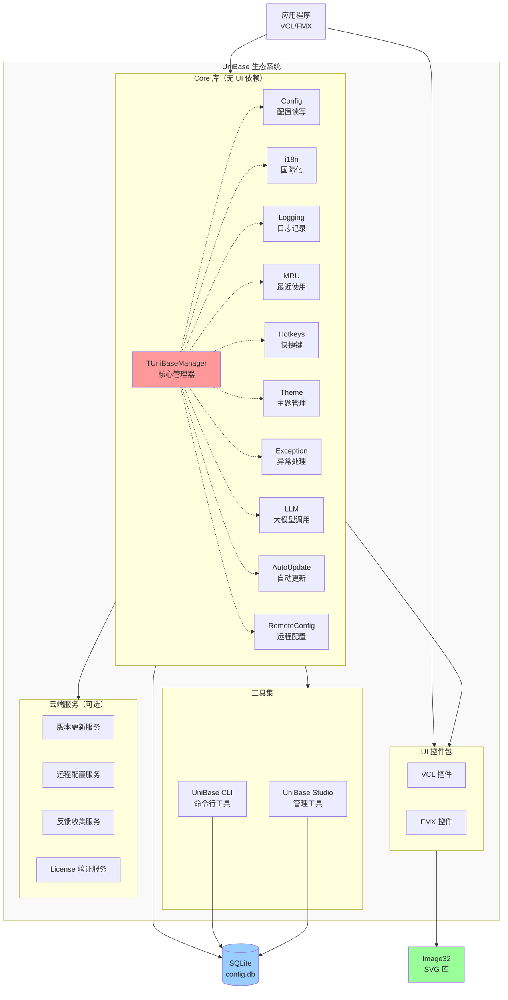
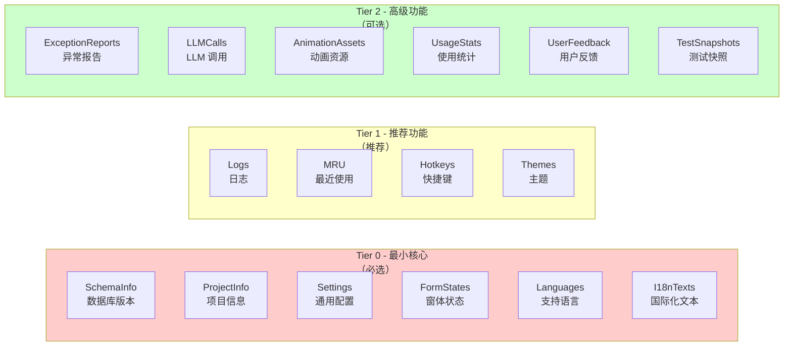
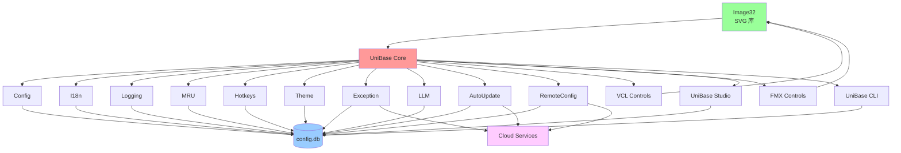
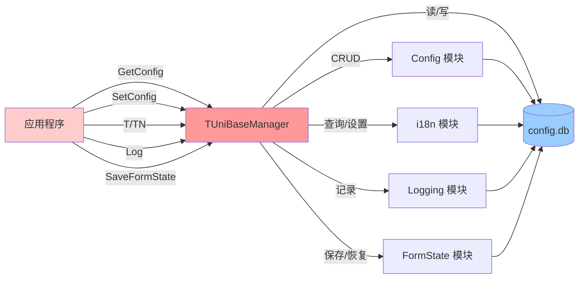
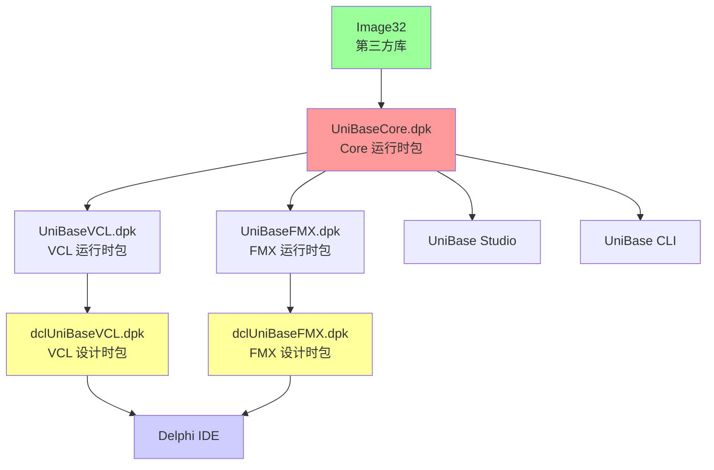

# 01 - UniBase 架构总览图

## 1. 整体架构概览

```mermaid
graph TB
    subgraph Ecosystem["UniBase 生态系统"]
        subgraph Core["Core 库（无 UI 依赖）"]
            Manager["TUniBaseManager<br/>核心管理器"]
            Config["Config<br/>配置读写"]
            I18n["i18n<br/>国际化"]
            Logging["Logging<br/>日志记录"]
            MRU["MRU<br/>最近使用"]
            Hotkeys["Hotkeys<br/>快捷键"]
            Theme["Theme<br/>主题管理"]
            Exception["Exception<br/>异常处理"]
            LLM["LLM<br/>大模型调用"]
            AutoUpdate["AutoUpdate<br/>自动更新"]
            RemoteConfig["RemoteConfig<br/>远程配置"]
            
            Manager -.-> Config
            Manager -.-> I18n
            Manager -.-> Logging
            Manager -.-> MRU
            Manager -.-> Hotkeys
            Manager -.-> Theme
            Manager -.-> Exception
            Manager -.-> LLM
            Manager -.-> AutoUpdate
            Manager -.-> RemoteConfig
        end
        
        subgraph UI["UI 控件包"]
            VCL["VCL 控件"]
            FMX["FMX 控件"]
        end
        
        subgraph Tools["工具集"]
            Studio["UniBase Studio<br/>管理工具"]
            CLI["UniBase CLI<br/>命令行工具"]
        end
        
        subgraph Cloud["云端服务（可选）"]
            UpdateSvc["版本更新服务"]
            ConfigSvc["远程配置服务"]
            FeedbackSvc["反馈收集服务"]
            LicenseSvc["License 验证服务"]
        end
        
        Core --> UI
        Core --> Tools
        Core --> Cloud
    end
    
    Database[(SQLite<br/>config.db)]
    Image32["Image32<br/>SVG 库"]
    
    Core --> Database
    UI --> Image32
    Studio --> Database
    CLI --> Database
    
    App["应用程序<br/>VCL/FMX"]
    App --> Core
    App --> UI
    
    style Manager fill:#ff9999
    style Database fill:#99ccff
    style Image32 fill:#99ff99
    style Ecosystem fill:#f9f9f9
```

## 2. 分层结构（Tier 体系）

```mermaid
graph LR
    subgraph Tier0["Tier 0 - 最小核心<br/>（必选）"]
        SchemaInfo["SchemaInfo<br/>数据库版本"]
        ProjectInfo["ProjectInfo<br/>项目信息"]
        Settings["Settings<br/>通用配置"]
        FormStates["FormStates<br/>窗体状态"]
        Languages["Languages<br/>支持语言"]
        I18nTexts["I18nTexts<br/>国际化文本"]
    end
    
    subgraph Tier1["Tier 1 - 推荐功能<br/>（推荐）"]
        Logs["Logs<br/>日志"]
        MRUTable["MRU<br/>最近使用"]
        HotkeysTable["Hotkeys<br/>快捷键"]
        Themes["Themes<br/>主题"]
    end
    
    subgraph Tier2["Tier 2 - 高级功能<br/>（可选）"]
        ExceptionReports["ExceptionReports<br/>异常报告"]
        LLMCalls["LLMCalls<br/>LLM 调用"]
        AnimationAssets["AnimationAssets<br/>动画资源"]
        UsageStats["UsageStats<br/>使用统计"]
        UserFeedback["UserFeedback<br/>用户反馈"]
        TestSnapshots["TestSnapshots<br/>测试快照"]
    end
    
    style Tier0 fill:#ffcccc
    style Tier1 fill:#ffffcc
    style Tier2 fill:#ccffcc
```

## 3. 模块依赖关系

```mermaid
graph TD
    Image32["Image32<br/>SVG 库"] --> Core["UniBase Core"]
    
    Core --> Config
    Core --> I18n
    Core --> Logging
    Core --> MRU
    Core --> Hotkeys
    Core --> Theme
    Core --> Exception
    Core --> LLM
    Core --> AutoUpdate
    Core --> RemoteConfig
    
    Config --> Database[(config.db)]
    I18n --> Database
    Logging --> Database
    MRU --> Database
    Hotkeys --> Database
    Theme --> Database
    Exception --> Database
    LLM --> Database
    AutoUpdate --> Database
    RemoteConfig --> Database
    
    Core --> VCLControls["VCL Controls"]
    Core --> FMXControls["FMX Controls"]
    
    VCLControls --> Image32
    FMXControls --> Image32
    
    Core --> Studio["UniBase Studio"]
    Core --> CLI["UniBase CLI"]
    
    Studio --> Database
    CLI --> Database
    
    AutoUpdate --> CloudServices["Cloud Services"]
    RemoteConfig --> CloudServices
    Exception --> CloudServices
    
    style Image32 fill:#99ff99
    style Core fill:#ff9999
    style Database fill:#99ccff
    style CloudServices fill:#ffccff
```

## 4. 数据流向

```mermaid
graph LR
    App["应用程序"]
    
    App -->|GetConfig| Manager["TUniBaseManager"]
    App -->|SetConfig| Manager
    App -->|T/TN| Manager
    App -->|Log| Manager
    App -->|SaveFormState| Manager
    
    Manager -->|读/写| DB[(config.db)]
    Manager -->|CRUD| Config["Config 模块"]
    Manager -->|查询/设置| I18n["i18n 模块"]
    Manager -->|记录| Logging["Logging 模块"]
    Manager -->|保存/恢复| FormState["FormState 模块"]
    
    Config --> DB
    I18n --> DB
    Logging --> DB
    FormState --> DB
    
    style App fill:#ffcccc
    style Manager fill:#ff9999
    style DB fill:#99ccff
```

## 5. 编译依赖关系

```mermaid
graph TD
    Image32["Image32<br/>第三方库"]
    
    Image32 --> UniBaseCore["UniBaseCore.dpk<br/>Core 运行时包"]
    
    UniBaseCore --> UniBaseVCL["UniBaseVCL.dpk<br/>VCL 运行时包"]
    UniBaseCore --> UniBaseFMX["UniBaseFMX.dpk<br/>FMX 运行时包"]
    
    UniBaseVCL --> dclUniBaseVCL["dclUniBaseVCL.dpk<br/>VCL 设计时包"]
    UniBaseFMX --> dclUniBaseFMX["dclUniBaseFMX.dpk<br/>FMX 设计时包"]
    
    UniBaseCore --> Studio["UniBase Studio"]
    UniBaseCore --> CLI["UniBase CLI"]
    
    dclUniBaseVCL --> DelphinIDE["Delphi IDE"]
    dclUniBaseFMX --> DelphinIDE
    
    style Image32 fill:#99ff99
    style UniBaseCore fill:#ff9999
    style dclUniBaseVCL fill:#ffff99
    style dclUniBaseFMX fill:#ffff99
    style DelphinIDE fill:#ccccff
```

---

**生成日期**：2025-11-26  
**版本**：v0.3  
**用途**：架构设计参考、团队沟通、开发规划
