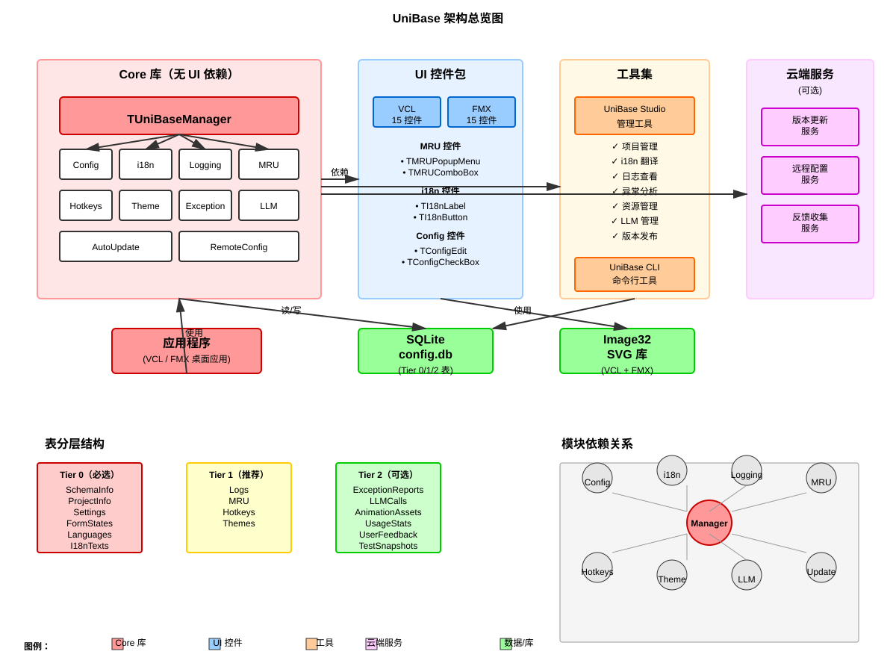

# DeepBase SVG 图表�?

本目录包�?DeepBase 框架的所有关�?SVG 图表，这些图表可以直接在任何支持 SVG 的工具中打开�?

---

## 📊 可用图表

### 1. **01-Architecture-Overview.svg** - 架构总览�?
**尺寸**: 1200 × 900 px  
**内容**:
- DeepBase 整体架构（Core、UI、Tools、Cloud�?
- Tier 0/1/2 表分层结构（6 �?Tier 0 表，4 �?Tier 1 表，6 �?Tier 2 表）
- 10 个核心模块的依赖关系
- 数据流向�?
- 编译依赖链（Image32 �?Core �?UI/Tools �?应用�?

**使用场景**:
- 项目启动会议演示
- 架构文档
- 新开发人员培�?
- 系统设计评审

---

### 2. **02-UI-Controls-System.svg** - UI 控件体系�?
**尺寸**: 1400 × 1000 px  
**内容**:
- 15 �?UI 控件�?5 大分�?
  - MRU 控件�?个）
  - i18n 控件�?个）
  - Config 控件�?个）
  - Selection 控件�?个）
  - Utility 控件�?个）
- VCL 继承树示�?
- 控件功能映射矩阵
- TI18nLabel 数据流示�?
- VCL vs FMX 兼容性对�?
- 控件生命周期（设计时→编译时→运行时→销毁）

**使用场景**:
- UI 开发规范文�?
- 控件使用培训
- 集成工程师参�?
- 架构设计审查

---

### 3. **04-Integration-Workflow.svg** - 渐进式集成流程图
**尺寸**: 1600 × 1000 px  
**内容**:
- 8 阶段集成流程（从 root.txt 到自动更新）
- 每个阶段的风险等级（�?�?高）
- 8 个阶段的详细检查清�?
- 风险等级说明
- 推荐 4 周集成时间表
- 关键指标（代码改动量、回滚难度）
- 集成建议和最佳实�?

**使用场景**:
- 项目集成计划制定
- QA 验证清单
- 风险评估和规�?
- 团队沟通和进度跟踪

---

## 🎨 设计特点

### 颜色编码系统

| 颜色 | 含义 | RGB |
|------|------|-----|
| 红色 (#ff9999) | Core �?/ 高风�?| 关键组件 |
| 绿色 (#99ff99) | 数据�?/ 完成 | 数据存储/里程�?|
| 蓝色 (#99ccff) | UI 控件 | 用户界面 |
| 黄色 (#ffffcc) | 配置/中等风险 | 中间�?中等风险 |
| 紫色 (#ffccff) | 云端服务 / Utility | 扩展功能 |
| 灰色 (#e6e6e6) | 基类 / 中�?| 通用组件 |

### 箭头说明

- **实心箭头 (�?** - 直接依赖或数据流
- **虚线箭头** - 间接依赖或可选关�?
- **双向箭头** - 相互通信

---

## 💻 打开和编�?

### 查看 SVG

1. **浏览�?*（推荐）
   ```bash
   # 直接打开任何浏览�?
   open 01-Architecture-Overview.svg
   # 或双击文�?
   ```

2. **VS Code**
   - 安装扩展：`SVG Viewer` �?`SVG`
   - 右键点击 SVG 文件 �?`Preview SVG`

3. **在线查看�?*
   - https://www.svgviewer.dev/
   - 上传或粘�?SVG 代码

4. **其他工具**
   - Adobe Illustrator
   - Inkscape（开源）
   - Figma（协作）

### 编辑 SVG

1. **文本编辑�?*（简单修改）
   ```
   # 使用 VS Code 或其他文本编辑器
   # SVG 本质上是 XML，可以直接编辑文�?
   ```

2. **设计工具**（完整编辑）
   - Inkscape（开源，完全功能�?
   - Figma（云端协作）
   - Adobe Illustrator（专业）

---

## 🔄 导出为其他格�?

### 导出�?PNG/JPG

**使用 ImageMagick**�?
```bash
# 安装 ImageMagick
# Windows: choco install imagemagick
# macOS: brew install imagemagick
# Linux: apt-get install imagemagick

# 转换�?PNG（高质量�?
convert -density 150 01-Architecture-Overview.svg -quality 95 01-Architecture-Overview.png

# 转换�?JPG
convert -density 150 01-Architecture-Overview.svg -quality 90 01-Architecture-Overview.jpg
```

**使用 Inkscape**�?
```bash
# 命令行转�?
inkscape -D --export-filename=output.png input.svg

# 带缩�?
inkscape -D --export-filename=output.png --export-width=1920 input.svg
```

**使用在线工具**�?
- https://cloudconvert.com/（支持多种格式）
- https://convertio.co/svg-png/

### 导出�?PDF

```bash
# 使用 Inkscape
inkscape input.svg --export-filename=output.pdf

# 使用在线工具
# 访问 https://cloudconvert.com/svg-pdf
```

---

## 📐 响应式缩�?

所�?SVG 都使�?`viewBox` 属性，可以自动缩放�?

```html
<!-- �?HTML 中使�?SVG -->


<!-- 或嵌�?-->
<object data="01-Architecture-Overview.svg" type="image/svg+xml" style="width: 100%;"></object>
```

---

## 🎯 快速参�?

### 按角色查�?

| 角色 | 推荐查看 | 用�?|
|------|---------|------|
| **项目经理** | 04-Integration | 制定计划和时间表 |
| **架构�?* | 01-Architecture + 02-UI | 系统设计和控件架�?|
| **前端开�?* | 02-UI-Controls | 控件使用和继�?|
| **后端开�?* | 01-Architecture | 模块依赖和数据流 |
| **QA/测试** | 04-Integration | 验证清单和风险评�?|
| **集成工程�?* | 04-Integration + 02-UI | 集成计划和控件集�?|

### 按用途查�?

| 用�?| 图表 | 说明 |
|------|------|------|
| 架构理解 | 01-Architecture | 整体系统架构 |
| 代码开�?| 02-UI-Controls | 控件实现和继�?|
| 集成实施 | 04-Integration | 分阶段集成步�?|
| 会议展示 | 01-Architecture | �?stakeholder 讲解 |
| 培训教材 | 全部 | 新员工入�?|

---

## 📝 文件清单

```
svg/
├── README.md                          # 本文�?
├── 01-Architecture-Overview.svg        # 架构总览�?200×900�?
├── 02-UI-Controls-System.svg           # UI 控件体系�?400×1000�?
└── 04-Integration-Workflow.svg         # 集成工作流（1600×1000�?
```

**总大�?*：约 150 KB（原�?SVG 文本格式�? 
**建议存储**：版本控制系统（Git）中

---

## 🔗 相关文档

这些 SVG 图表对应以下 Markdown 文档中的 Mermaid 图：

- `../01-Architecture-Overview.md` - 架构总览详细描述
- `../02-UI-Controls-System.md` - UI 控件详细规范
- `../04-Integration-Workflow.md` - 集成流程详细说明

**推荐**：结�?SVG 图表�?Markdown 文档使用，获得最佳理解�?

---

## 🔧 技术细�?

### SVG 特�?

- **无损缩放**：任意尺寸显示不失真
- **可编�?*：所有元素通过 XML 定义
- **搜索友好**：文本内容可被搜�?
- **文件�?*：相比位图节省空�?
- **动画支持**：可添加 CSS/JavaScript 动画

### 浏览器兼容�?

- �?Chrome/Edge 100%
- �?Firefox 100%
- �?Safari 100%
- �?IE 11（部分支持）
- �?移动浏览�?100%

---

## 💡 最佳实�?

### 使用 SVG �?

1. **保持高纵横比**：显示时使用 `max-width: 100%; height: auto`
2. **链接到源文件**：在文档中引�?SVG �?GitHub 链接
3. **版本控制**：使�?Git 追踪 SVG 变更
4. **导出备份**：定期导�?PNG 用于备份和演�?

### 编辑 SVG �?

1. **保持一致�?*：使用相同的颜色编码和字�?
2. **验证视图�?*：确�?viewBox 覆盖所有内�?
3. **测试兼容�?*：在多个浏览器中验证
4. **压缩文件**：使�?SVGO 减小文件大小（可选）

---

## 📞 支持和反�?

- 问题？检�?SVG 是否正确渲染
- 建议？在�?Markdown 文件中提出改�?
- 错误？提�?Issue �?Pull Request

---

**最后更�?*�?025-11-26  
**版本**：v0.3  
**格式**：SVG 1.1 Compatible  
**许可�?*：与 DeepBase 相同
